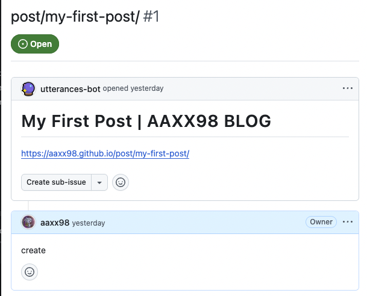
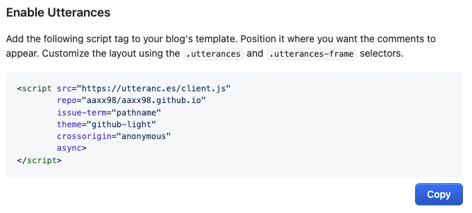

# Utterances 소개

Utterances는 GitHub Issues 기반의 댓글 위젯으로, 별도의 서버를 구축할 필요 없이 깔끔하게 댓글 시스템을 붙일 수 있다.
댓글이 달리면 지정한 GitHub 저장소의 Issues에 등록되고, Issues에서 댓글을 관리할 수 있다.

Github 계정으로 로그인하고 댓글을 작성하면 아래와 같이 Issue에 등록된다.



## 설정 방법

아래와 같은 형식인데 utterances 사이트에서 설정 값을 선택하면 스크립트를 생성해준다.

[Utterances 공식 사이트](https://utteranc.es/) - configuration 항목에서 옵션을 선택한다.

- Repository: username/repo명, 공개 레포지토리만 사용 가능하다. 블로그 레포가 비공개인 경우 댓글 Issue를 등록할 공개 레포지토리를 만들어서 사용하면 된다.

- Blog Post ↔️ Issue Mapping: 포스트별로 구분할 기준, pathname을 선택했다.

- Theme: 디자인 테마 선택

- Repository에 권한 설정 - [utterances app](https://github.com/apps/utterances)에서 Issue 등록을 위해 utterances에서 사용할 레파지토리 권한을 설정해준다.

일반 HTML 파일이나 정적 페이지에서는 Enable Utterances에 생성된 스크립트를 복사하여 붙여넣으면 되지만, Gatsby에서 사용하기 위해서는 React 컴포넌트 형식으로 변환해주어야한다.



## React 컴포넌트로 변환

Gatsby는 SSR을 수행하므로 빌드 시점에 DOM이 없어 `<script`>가 실행되지 않는다.

React는 가상 DOM을 관리하므로 외부 스크립트가 직접 DOM을 건드리면 충돌이 발생한다.

useEffect를 사용해 브라우저 환경에서만 스크립트를 삽입해 정상적으로 동작하게 해야한다.

- Comment 컴포넌트 생성

  ```TypeScript
  import React, { useEffect, useRef, useState } from "react";

  const Comment = () => {
  const commentsEl = useRef<HTMLDivElement | null>(null);
  const [status, setStatus] = useState<"pending" | "success" | "failed">(
      "pending"
  );

  useEffect(() => {
      const existingScript = commentsEl.current?.querySelector("script");
      if (existingScript) {
      existingScript.remove();
      }

      const scriptEl = document.createElement("script");
      scriptEl.onload = () => setStatus("success");
      scriptEl.onerror = () => setStatus("failed");
      scriptEl.async = true;
      scriptEl.src = "https://utteranc.es/client.js";
      scriptEl.setAttribute("repo", "aaxx98/aaxx98.github.io");
      scriptEl.setAttribute("issue-term", "pathname");
      scriptEl.setAttribute("theme", "github-light");
      scriptEl.setAttribute("crossorigin", "anonymous");

      if (commentsEl.current) {
      commentsEl.current.appendChild(scriptEl);
      }

      // cleanup function
      return () => {
      if (commentsEl.current) {
          const script = commentsEl.current.querySelector("script");
          if (script) {
          script.remove();
          }
      }
      };
  }, []);

  return (
      <div className="w-full max-w-[850px] mx-auto px-8 mt-8">
      {status === "failed" && (
          <div className="text-red-500 text-center p-4">
          댓글을 불러오는 중 오류가 발생했습니다. 새로고침 후 다시 시도해주세요.
          </div>
      )}
      {status === "pending" && (
          <div className="text-gray-500 text-center p-4">
          댓글을 불러오는 중...
          </div>
      )}
      <div
          ref={commentsEl}
          className="utterances-container"
          style={{
          minHeight: "200px",
          width: "100%",
          display: "block",
          }}
      />
      </div>
  );
  };

  export default Comment;
  ```

위에서 생성한 Comment를 원하는 위치에서 사용하면 된다.

처음 작성하고 댓글이 표시되지 않았었는데, repo 경로에 오타가 있었다.

잘 나타나지 않는 경우 repo를 제대로 지정했는지, 권한 설정을 했는지 확인해보자.
