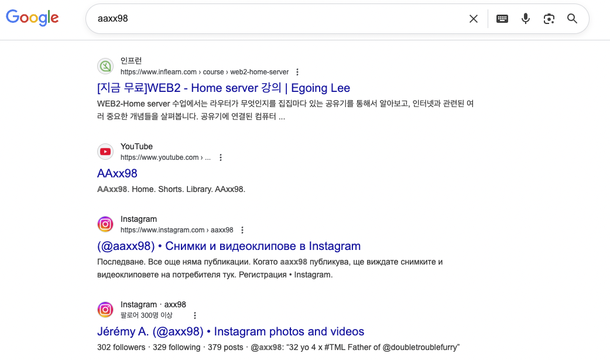
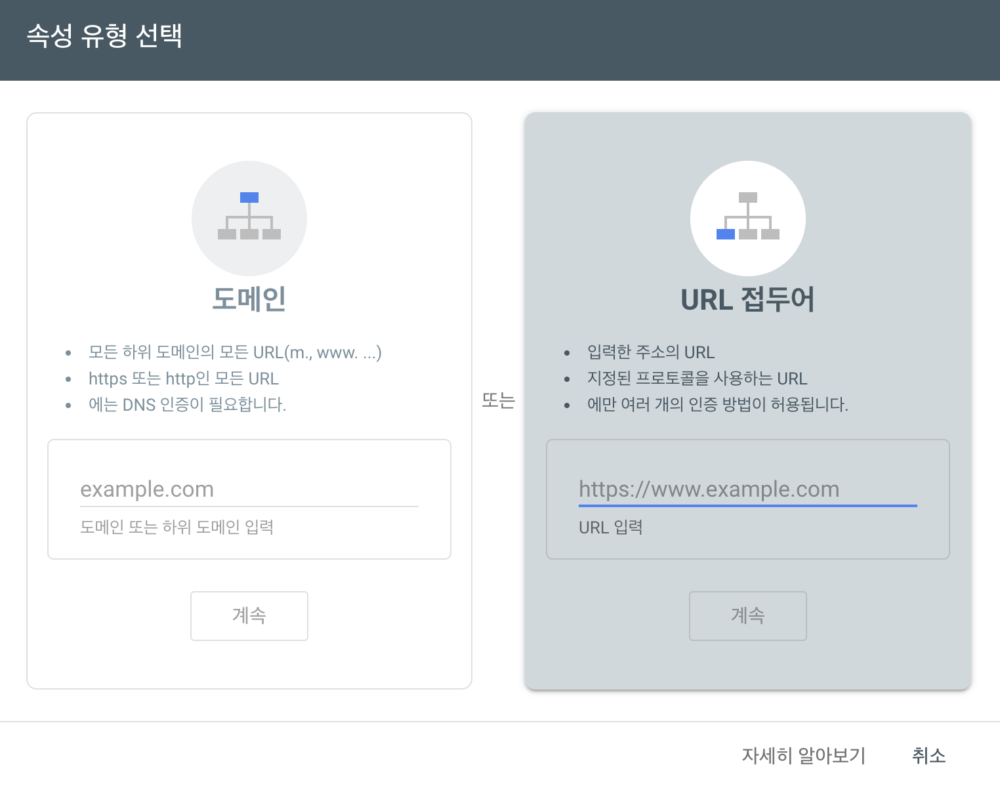
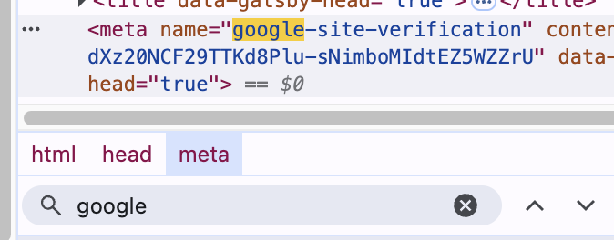
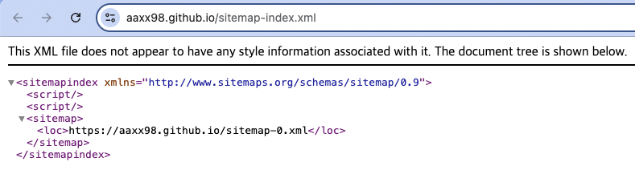
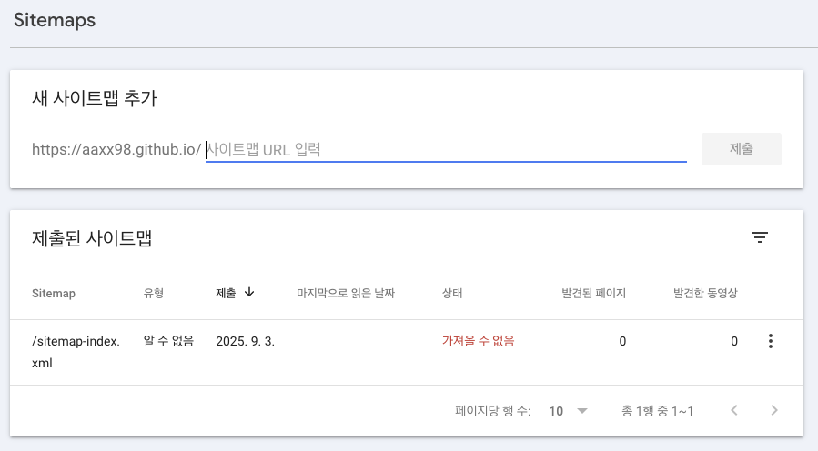
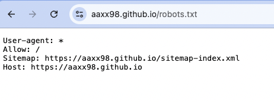
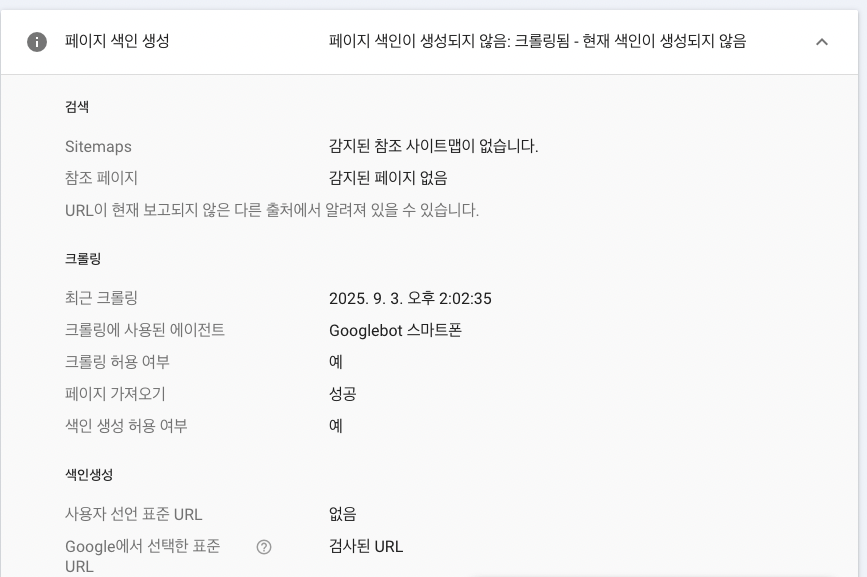

블로그를 배포하고, 글을 몇 개 작성했다. 그리고 페이지 별 title 메타 태그 같은것도 설정해주었다.

하지만 아이디를 검색해보면, 내 블로그가 나오지 않고 전혀 다른 컨텐츠들이 노출된다. (여기 검색 된 인스타와 유튜브 계정은 다른 사람의 계정인 것 같다.)

검색 결과에 내 블로그를 노출시키려면 검색엔진에 요청해야한다.

나의 Gatsby 블로그가 검색 엔진에 검색 될 수 있도록 여러가지 설정을 해 주었다.

Google Search Console과 플러그인으로 간단하게 설정 할 수 있다.

# 검색 노출을 위한 Google Search Console 연동

## [Google Search Console](https://search.google.com/search-console)



- Google Search Console에 접속하여 URL 접두어에 블로그 url을 입력한다.
- 이제 입력한 url의 웹페이지에 대한 소유권 확인이 필요하다. 소유권 확인 창에서, 다른 확인 방법 > HTML 태그를 열어서 코드를 복사한다.
  - google-site-verification 메타 태그를 받아서 `<head>` 태그 내부에 삽입해주면, Google 크롤러가 해당 태그를 읽어 사이트 소유권을 확인해준다.
  - `<head>` 요소를 `Seo 컴포넌트`에서 관리하고 있어서 내부에 메타 태그를 추가해주었다.
  - 적용한 후에 `<head>`내부에서 메타 태그를 찾아보자.
    
  - 등록한 url 페이지에 배포해야한다. 변경사항을 배포하고, 배포가 완료 되었으면 소유권 확인을 완료하자.

## 사이트맵(sitemap) 생성

- 필요 플러그인: `gatsby-plugin-sitemap`

- 설치

  ```console
  npm install gatsby-plugin-sitemap
  ```

- `gatsby-config.js` 설정
  ```TypeScript
  plugins: [
    'gatsby-plugin-sitemap',
  ]
  ```

설정 후, 빌드하면 `public/sitemap-index.xml`, `public/sitemap-0.xml`이 생성된다.

- `/sitemap-index.xml`로 접근 할 수 있다.
  

이 파일을 Google Search Console에 제출하면, 구글이 블로그 전체 페이지 구조를 한 번에 파악할 수 있다.

- Google Search Console > 색인생성 > Sitemaps에서 사이트맵 링크를 추가해주자.
  

## robots.txt 구성

- 필요 플러그인: `gatsby-plugin-robots-txt`

- 설치

  ```console
  npm install gatsby-plugin-robots-txt
  ```

- `gatsby-config.js` 설정

  ```TypeScript
  plugins: [
    {
      resolve: "gatsby-plugin-robots-txt",
      options: {
        policy: [{ userAgent: "*", allow: "/" }],
      },
    }
  ]
  ```

`robots.txt`가 있으면 크롤러가 사이트 접근 정책과 사이트맵 위치를 쉽게 알 수 있게 된다.

설정 후, 빌드하면 `public/robots.txt`가 생성된다.

- `/robots.txt`로 접근 할 수 있다.
  

`{ userAgent: "*", allow: "/" }`에서, userAgent는 검색 엔진 크롤러의 종류이고, allow는 크롤링을 허용할 경로를 의미한다.

모든 크롤러, 모든 경로로 설정한 것이므로, 모든 검색엔진 크롤러는 이 사이트의 모든 경로를 자유롭게 크롤링해도 된다는 뜻이다.

---

# 뭔가 잘 안됨😅

2025/09/03 13시 46분에 Google Search Console을 먼저 연동하고, 15시 쯤 사이트맵 플러그인을 적용하여 사이트맵 설정을 했습니다.

그런데... 사이트맵을 읽을 수 없음 상태로 아직 색인되지 않고있습니다.

`sitemap-index.xml`이 정상적으로 생성되고 있는데, 최근 크롤링 시간이 14시로 아직 검색엔진에 크롤링이 안된 것 같아서 좀 더 기다려보겠습니다.



