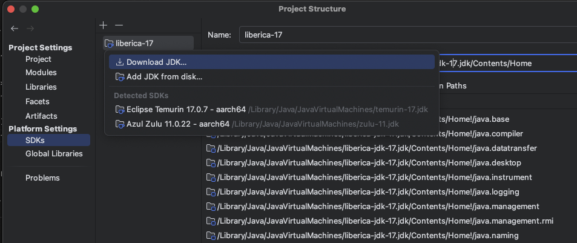
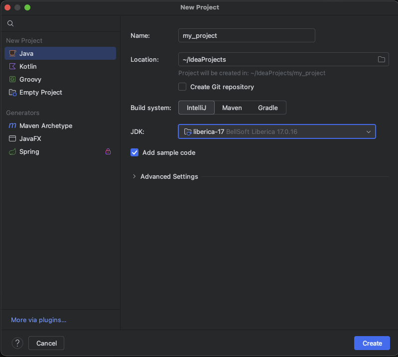
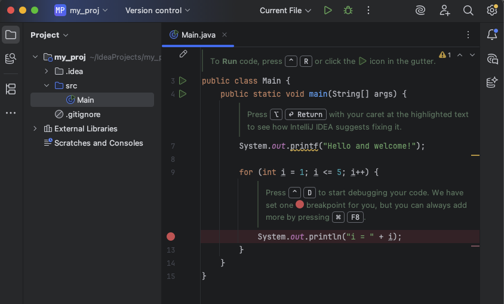
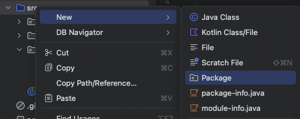
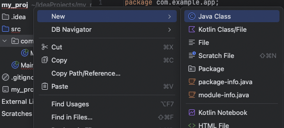
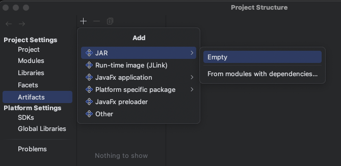
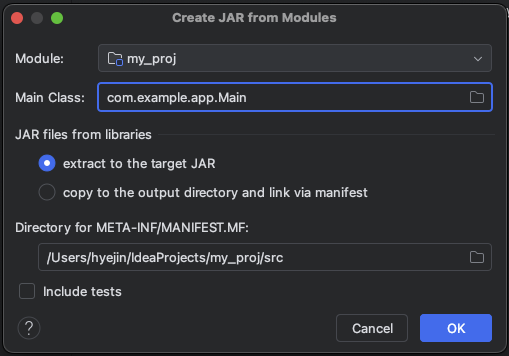
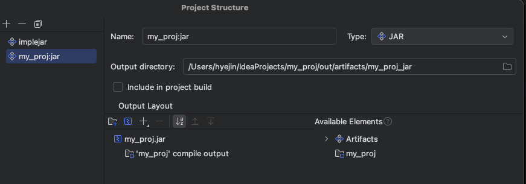
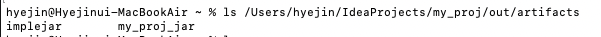
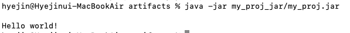

# TIL 챌린지를 시작하며

첫번째 TIL 글로 IntelliJ에서 패키지/클래스 생성법과, JAR 파일 만들고 실행하는 방법을 정리해보려고 한다.

> Java IDE로 **Eclipse**도 많이 쓰지만, **IntelliJ**를 설치하여 사용중이었기 때문에 수업에서 사용하지 않아도 그대로 사용하고있다.
> 수업 시간에 JAR 만들기를 Eclipse로 진행하고 있어서 급히 다른 블로그 글을 보고 처리했는데,
> 다른 IntelliJ를 사용하는 분들이 질문하셨던 것에 링크만 공유하고 자세히 답을 못 드렸어서 이번 TIL에 남겨보았다.

---

## IntelliJ Community 소개


**IntelliJ Community**는 무료 버전이지만, Java/Kotlin/Groovy, Maven/Gradle, JUnit 등 순수 자바 개발에 필요한 기능은 충분히 사용할 수 있다.

다만 **Spring/Java EE, Web 프레임워크, 공식 Database Tools**는 **IntelliJ Ultimate**에서 사용할 수 있다.

---

### 설치 방법 (macOS 기준)

1. **[IntelliJ IDEA Community 다운로드 (JetBrains)](https://www.jetbrains.com/ko-kr/idea/download)**
   - 스크롤을 내리면 Community 에디션 다운로드 버튼이 보인다. OS에 맞는 파일을 다운로드한다.
     
2. IntelliJ 실행 후, `File > Project Structure > SDKs > JDK` 설정
   
   - JDK를 별도로 설치 하지 않았다면, Download JDK에서 다운로드 할 수 있다. 경로 연결은 알아서 설정된다.
   - 이미 설치되어 있다면, `Add JDK from disk`를 선택하고 Java Home path 경로를 설정해준다.

---

## Java 코드 작성하기

### 1. 프로젝트 생성

- New Project → Java 선택 → JDK 선택 후, `Create`
  

  
  - 다음과 같이 프로젝트가 생성되고, **기본 프로젝트 루트 경로인 `src`** 안에 **Main 클래스**가 생성된다. 이제 자바 코드를 작성 할 수 있다.

### 2. 패키지 생성

- 프로젝트 내부에서 패키지를 생성하고자 하는 경로 우클릭 → New → Package
  - 기본 프로젝트 루트 경로인 `src` 안에 생성해야한다.
    
- `com.example.app`와 같이 패키지 명 설정

#### 패키지란?

> Java 클래스들을 묶는 이름공간(namespace)으로,
> 실제로는 폴더 구조와 1:1 대응된다.
>
> 같은 이름의 클래스라도 패키지가 다르면 구분 가능하다.

### 3. 클래스 생성

- 프로젝트 내부에서 클래스를 생성하고자 하는 경로 우클릭 → New → Java Class
  - 기본 프로젝트 루트 경로인 `src` 안에 생성해도 된다.
    
- 코드 작성

  ```java
  package com.example.app;

  public class Main {
      public static void main(String[] args) {
          System.out.println("Hello world!");
      }
  }
  ```

  - 실행 ▶️ 버튼을 클릭하면 `main`메소드가 실행횐다.

---

## JAR 파일 만들고 실행하기

### JAR(Java ARchive)이란?

> Java 클래스 파일(.class), 리소스 파일(.xml, .properties, 이미지 등)을 하나로 묶은 압축 파일

- 여러 개의 .class와 리소스를 한 번에 배포하기 편하게 묶음

- 라이브러리(JAR 파일)를 다른 프로젝트에서 import해서 재사용

- Main Class가 지정된 경우, 실행 가능한 프로그램으로 사용

### IntelliJ Artifacts로 JAR 만들기

1. **File → Project Structure → Artifacts**
   
   - **`+` → JAR → Empty**
     - Main Class가 없는 경우(main 메소드 실행 코드가 없을 경우) 선택한다.
     - Output Layout 탭에서 어떤 .class와 리소스를 넣을지 설정해야한다.
   - **`+` → JAR → From modules with dependencies…**
     - **Main Class**에 Main Class 지정
       
       - main 메소드가 있는 클래스를 지정해준다. jar 실행 시, 이 클래스의 main 메소드가 실행된다.
         
         - Output Directory 설정한 경로에 jar 파일이 생성 될 것이다.

2. **Build → Build Artifacts… → Build**
3. `out/artifacts/.../앱이름.jar` 확인
   

이렇게 생성된 jar 파일을 아래와 같이 실행해 볼 수 있다.

```bash
java -jar 앱이름.jar
```

위의 [Java 코드 작성하기 - 3. 클래스 생성]에서 작성한 `Hello world!`를 출력하는 코드를 jar을 생성하여 실행해보았다.

main 메소드에 작성한 내용이 실행되어 Hello world!가 잘 출력되고있다.
