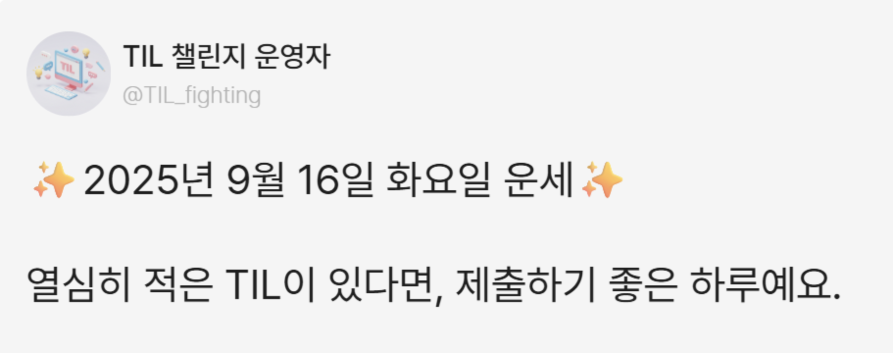
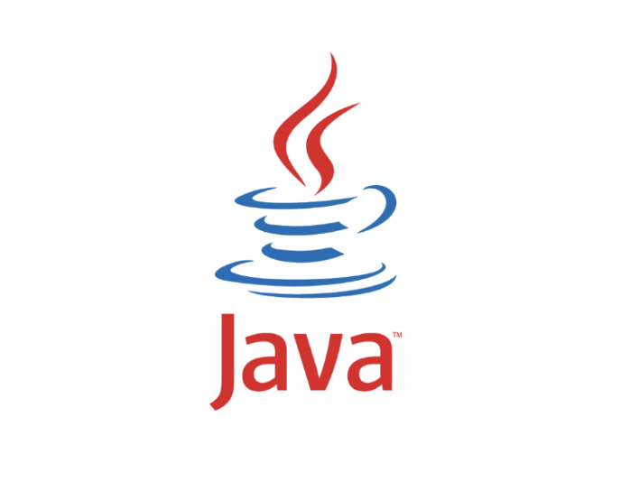
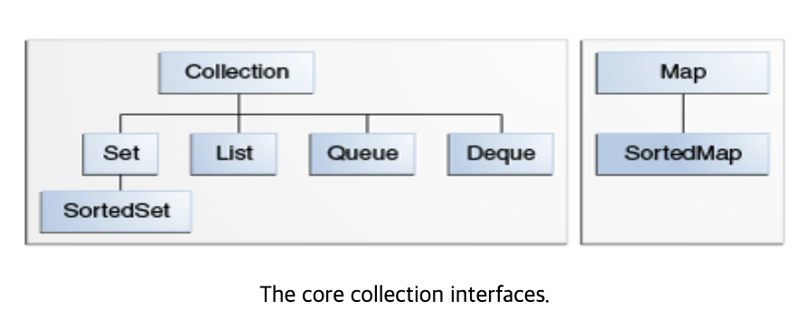
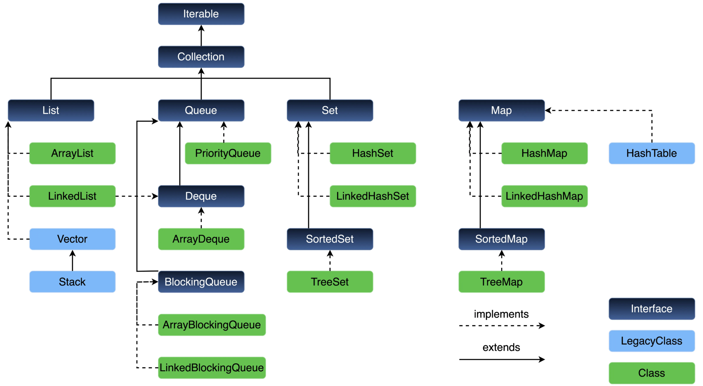
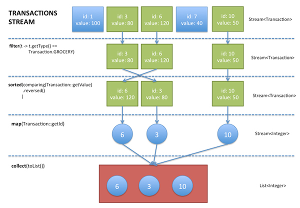
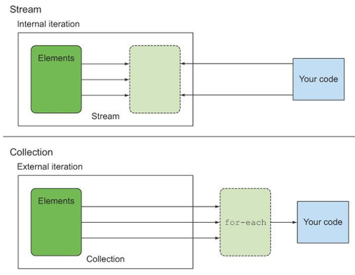
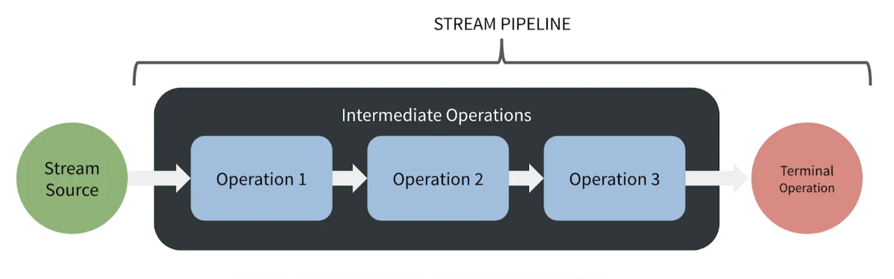

# TIL 챌린지 주제 선정

> 지금까지 웹개발을 하면서, 주로 JavaScript, PHP, Go 같은 언어를 사용해왔다.
> 이런 언어들은 슬라이스(slice)나 딕셔너리(dictionary)처럼 데이터를 다루기 편리한 문법을 기본으로 제공한다.
>
> 반면 Java는 배열을 선언하면 고정 길이를 가지기 때문에, 슬라이스나 딕셔너리 처럼 사용하기에는 불편함이 있다.
> 리스트, 맵, 집합 등 다양한 자료구조를 다루려면 `java.util`의 컬렉션 패키지를 사용하는 것이 보편적인 듯 하다.
>
> 이번주 TIL 챌린지에서는 Java에서 데이터를 다루는 기본 도구인 컬렉션(Collection)과, 데이터를 선언적이고 함수형 스타일로 처리할 수 있는 스트림(Stream)에 대해 살펴보았다.



# Java의 Collections

> Java 플랫폼에는 Collections 프레임워크가 포함되어 있다.
>
> 컬렉션은 객체 그룹을 나타내는 객체로, 기본적인 자료구조에 대한 인터페이스와 구현체를 제공한다.
>
> primitive 타입의 배열이 아닌 경우, Object의 배열, 집합, 큐 등을 사용하게 된다면 Collections를 사용하게 되므로 알아보자.

## Collections의 인터페이스



### 1. Collection 인터페이스

`Collection` 인터페이스는 모든 컬렉션의 루트 인터페이스로, 기본적인 컬렉션 연산을 정의한다.

**주요 메서드**

- `add(E e)`: 요소 추가
- `remove(Object o)`: 요소 제거
- `contains(Object o)`: 요소 포함 여부 확인
- `size()`: 컬렉션 크기 반환
- `isEmpty()`: 빈 컬렉션 여부 확인
- `iterator()`: Iterator 반환

```java
Collection<String> collection = new ArrayList<>();
collection.add("Java");
collection.add("Python");
System.out.println(collection.size()); // 2
System.out.println(collection.contains("Java")); // true
```

### 2. List 인터페이스

`List`는 순서가 있는 컬렉션으로, 중복 요소를 허용하며 인덱스로 요소에 접근할 수 있다.

**특징**

- 순서 보장 (insertion order)
- 중복 허용
- 인덱스 기반 접근

**주요 구현체**

- `ArrayList`: 동적 배열, 빠른 조회
- `LinkedList`: 이중 연결 리스트, 삽입과 삭제가 빠름
- `Vector`: 동기화된 ArrayList (legacy 클래스로 사용하지 않는 것을 추천)

```java
List<Integer> numbers = new ArrayList<>();
numbers.add(10);
numbers.add(20);
numbers.add(10); // 중복 허용

// 인덱스 기반 접근
System.out.println(numbers.get(0)); // 10
numbers.set(1, 25); // 인덱스 1의 값을 25로 변경

// 특정 위치에 삽입
numbers.add(1, 15); // {10, 15, 25, 10}
```

### 3. Set 인터페이스

`Set`은 중복 요소를 허용하지 않는 컬렉션이다.

**특징:**

- 중복 불허
- 수학적 집합의 개념

**주요 구현체**

- `HashSet`: 해시 테이블 기반, O(1) 성능
- `LinkedHashSet`: 삽입 순서를 보장하는 HashSet
- `TreeSet`: 정렬된 집합, Red-Black Tree 구조

```java
Set<String> languages = new HashSet<>();
languages.add("Java");
languages.add("Python");
languages.add("Java"); // {"Java", "Python"}

System.out.println(languages.size()); // 2

// TreeSet 사용 시 자동 정렬
Set<Integer> sortedNumbers = new TreeSet<>();
sortedNumbers.add(30);
sortedNumbers.add(10);
sortedNumbers.add(20);
System.out.println(sortedNumbers); // [10, 20, 30]
```

### 4. Queue 인터페이스

`Queue`는 FIFO(First-In-First-Out) 방식으로 요소를 처리하는 컬렉션이다.

**주요 메서드**

- `offer(E e)`: 큐에 요소 추가
- `poll()`: 큐에서 요소 제거하고 반환
- `peek()`: 큐의 첫 번째 요소 조회 (제거하지 않음)

**주요 구현체**

- `LinkedList`: Queue 인터페이스도 구현
- `PriorityQueue`: 우선순위 큐
- `ArrayDeque`: 양방향 큐

```java
Queue<String> queue = new LinkedList<>();
queue.offer("First");
queue.offer("Second");
queue.offer("Third");

System.out.println(queue.poll()); // "First"
System.out.println(queue.peek()); // "Second" (제거되지 않음)
```

### 5. Deque 인터페이스

`Deque`(Double-ended Queue)는 양쪽 끝에서 삽입과 삭제가 가능한 큐이다.

**특징**

- 양방향 큐 (Double-ended Queue)
- 스택과 큐의 기능을 모두 제공
- LIFO와 FIFO 모두 지원

**주요 구현체**

- `ArrayDeque`: 동적 배열 기반, 성능이 뛰어남
- `LinkedList`: 이중 연결 리스트, 메모리 오버헤드 존재
- `ConcurrentLinkedDeque`: 동시성 지원하는 링크 기반 덱

```java
Deque<Integer> deque = new ArrayDeque<>();

// 양쪽 끝에 요소 추가
deque.addFirst(1);
deque.addLast(2);
deque.addFirst(0); // [0, 1, 2]

// 스택처럼 사용
deque.push(3); // [3, 0, 1, 2]
System.out.println(deque.pop()); // 3, [0, 1, 2]

// 큐처럼 사용
deque.offer(4); // [0, 1, 2, 4]
System.out.println(deque.poll()); // 0, [1, 2, 4]

// 양쪽 끝 요소 조회
System.out.println(deque.peekFirst()); // 1
System.out.println(deque.peekLast()); // 4

// 양쪽 끝에서 제거
System.out.println(deque.removeFirst()); // 1
System.out.println(deque.removeLast()); // 4
```

### 6. Map 인터페이스

`Map`은 키-값 쌍으로 데이터를 저장하는 인터페이스로, Collection을 상속하지 않지만 컬렉션 프레임워크의 일부이다.

**특징:**

- 키-값 매핑
- 키는 중복 불허, 값은 중복 허용

**주요 구현체**

- `HashMap`: 해시 테이블 기반
- `LinkedHashMap`: 삽입 순서 보장
- `TreeMap`: 키로 정렬된 맵

```java
Map<String, Integer> scores = new HashMap<>();
scores.put("Alice", 95);
scores.put("Bob", 87);
scores.put("Charlie", 92);

System.out.println(scores.get("Alice")); // 95
System.out.println(scores.containsKey("Bob")); // true

// 모든 키-값 쌍 순회
for (Map.Entry<String, Integer> entry : scores.entrySet()) {
    System.out.println(entry.getKey() + ": " + entry.getValue());
}
```

## Collections 클래스 계층 구조 한눈에 보기



---

# Stream

> Stream API는 Java 8에서 도입된 함수형 프로그래밍 패러다임을 지원하는 기능으로, 컬렉션 데이터를 선언적 방식으로 처리할 수 있게 해준다.
>
> 스트림을 사용하면 컬렉션이나 배열을 반복문(`for`, `while`) 없이 처리 할 수 있는데,
> JavaScript에서 자주 사용하는 라이브러리인 lodash나 Rxjs와 비슷한 패러다임으로 느꼈다.



- 위와 같이 Stream은 컬렉션이나 배열 등의 여러 데이터 묶음을 처리한다. 순회, 필터링, 집계와 같은 처리에 사용하며, 병렬 처리를 지원하기도 한다.

## Stream의 특징

### 선언적(Declarative)

- 직접 반복문이나 조건문을 쓰지 않고, 람다나 메서드를 전달하여 처리 - 함수형 프로그래밍

```java
List<String> names = Arrays.asList("Alice", "Bob", "Charlie");
names.stream()
     .filter(n -> n.length() <= 4)  // 필터 조건 정의
     .map(String::toUpperCase)      // 변환 방식 정의
     .forEach(System.out::println);

```

### 파이프라이닝(Pipelining)

- 여러 중간 연산을 연결하여 하나의 연속적인 처리 과정을 구성
- Stream 연산을 마치 파이프처럼 이어 붙여 복합 연산을 간결하게 작성

```java
List<Integer> numbers = Arrays.asList(1, 2, 3, 4, 5);
int sum = numbers.stream()
                 .filter(n -> n % 2 == 0)   // 짝수만 필터
                 .map(n -> n * n)           // 제곱으로 변환
                 .reduce(0, Integer::sum);  // 합계 계산
System.out.println(sum); // 20
```

- filter → map → reduce가 연속적으로 연결되어 하나의 처리 흐름이 됨

### 내부 반복(Internal Iteration)

- Stream이 요소를 반복 처리하는 로직을 내부에서 수행하여 반복문을 작성할 필요가 없음
- 기존 컬렉션 반복(Iterator, for-each)은 외부 반복(External Iteration)
- 내부의 모든 요소에 대해 전달한 동작을 실행한다고 생각하자.



```java
List<String> list = Arrays.asList("a", "b", "c");
list.stream().forEach(System.out::println); // 내부 반복, 전체 요소 출력
```

```bash
출력 결과
---
a
b
c
```

### 지연 실행(Lazy Evaluation)

- 중간 연산은 바로 실행되지 않고, 최종 연산이 호출될 때 실행됨
- 불필요한 연산을 줄여 성능 최적화 가능

```java
List<String> names = Arrays.asList("Alice", "Bob", "Charlie");

Stream<String> stream = names.stream()
                             .filter(n -> {
                                 System.out.println("filter 호출: " + n);
                                 return n.length() <= 4;
                             });
System.out.println("아직 filter 실행 안됨");

List<String> result = stream.collect(Collectors.toList()); // 여기서 filter가 실제로 실행된다.
```

## Stream의 사용 방법



- Stream의 사용 방식은 스트림 생성, 중간 연산, 최종 연산 세 단계로 분류 할 수 있다.

### 1. 스트림 생성

- 연산 파이프라인을 붙일 스트림을 생성해야한다. 스트림 생성에 사용된 컬렉션 객체 또는 배열은 스트림 연산이 실행되어도 변경되지 않는다.
- 컬렉션, 배열로부터 생성할 수 있고, 원본이 없는 경우 of로 스트림을 생성할 수 있다.
- 무한스트림은 끝이 없는 Stream으로, 요소를 계속 생성할 수 있으며 주로 계산, 난수 생성, 시퀀스 생성 등에서 사용한다.

```java
// 컬렉션에서 생성
List<String> list = Arrays.asList("a", "b", "c");
Stream<String> stream1 = list.stream();

// 배열에서 생성
String[] array = {"x", "y", "z"};
Stream<String> stream2 = Arrays.stream(array);

// 직접 생성
Stream<String> stream3 = Stream.of("hello", "world");

// 무한 스트림 생성
Stream<Integer> infiniteStream = Stream.iterate(0, n -> n + 1);
Stream<Double> randomStream = Stream.generate(Math::random);
```

### 2. 중간 연산

- 중간 연산은 Stream을 반환하므로, 계속해서 여러 연산을 연결해서 파이프라인을 만들 수 있다.
- 중간 연산은 **지연 실행(lazy)**되므로 최종 연산이 호출될 때까지 실제로 실행되지 않는다.
- 중간 연산의 종류 몇 가지
  - `filter`: 필터링, 조건에 맞는 요소만 남김
  - `map`: 매핑, 요소를 다른 값으로 변환
  - `sorted`: 정렬
  - `distinct`: 중복 제거
  - `limit`: 최대 n개 요소만 남김
  - `skip`: 처음 n개 요소 제외

```java
List<String> names = Arrays.asList("Alice", "Bob", "Charlie");

Stream<String> stream = names.stream()
                             .filter(n -> n.length() <= 4)  // 4글자 이하인 것만 필터링
                             .map(String::toUpperCase);     // 대문자로 변환

Stream<Integer> sortedStream = Stream.of(3,1,4,2).sorted(); // 1,2,3,4
Stream<Integer> distinctStream = Stream.of(1,2,2,3,1).distinct(); // 1,2,3

Stream<Integer> limited = Stream.iterate(1, n -> n + 1).limit(5); // 1,2,3,4,5
Stream<Integer> skipped = Stream.iterate(1, n -> n + 1).skip(3).limit(3); // 4,5,6
```

### 3. 최종 연산

- 최종 연산이 실행 될 때, 모든 중간 연산이 실행된다.
- 결과를 반환한다.
- 최종 연산의 종류 몇 가지
  - `collect`: 스트림의 결과를 컬렉션, 맵, 문자열 등으로 모아서 변환
  - `forEach`: 스트림의 각 요소를 순회하며 주어진 동작 실행
  - `reduce`: 스트림의 요소를 하나의 값으로 누적
  - `count`: 스트림 요소의 개수 반환

```java
List<String> result = stream.collect(Collectors.toList()); // stream 연산 결과를 result 리스트에 할당

Stream.of(1,2,3).forEach(System.out::println); // 1 2 3 출력

int sum = Stream.of(1,2,3,4).reduce(0, Integer::sum); // 10
Optional<Integer> max = Stream.of(1,2,3,4).reduce(Integer::max); // 4

long evenCount = Stream.of(1,2,3,4,5)
                       .filter(n -> n % 2 == 0)
                       .count(); // 2
```

---

# 참고

## 공식 문서

- [Oracle Java Collections Tutorial](https://docs.oracle.com/javase/tutorial/collections/index.html)
- [Stream API Documentation](https://docs.oracle.com/javase/8/docs/api/java/util/stream/Stream.html)
- [Processing Data with Java SE 8 Streams - Oracle](https://www.oracle.com/technical-resources/articles/java/ma14-java-se-8-streams.html)
- [Java SE Stream API - Dev.java](https://dev.java/learn/api/streams/)
