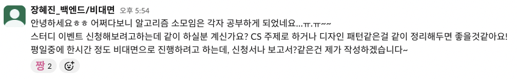
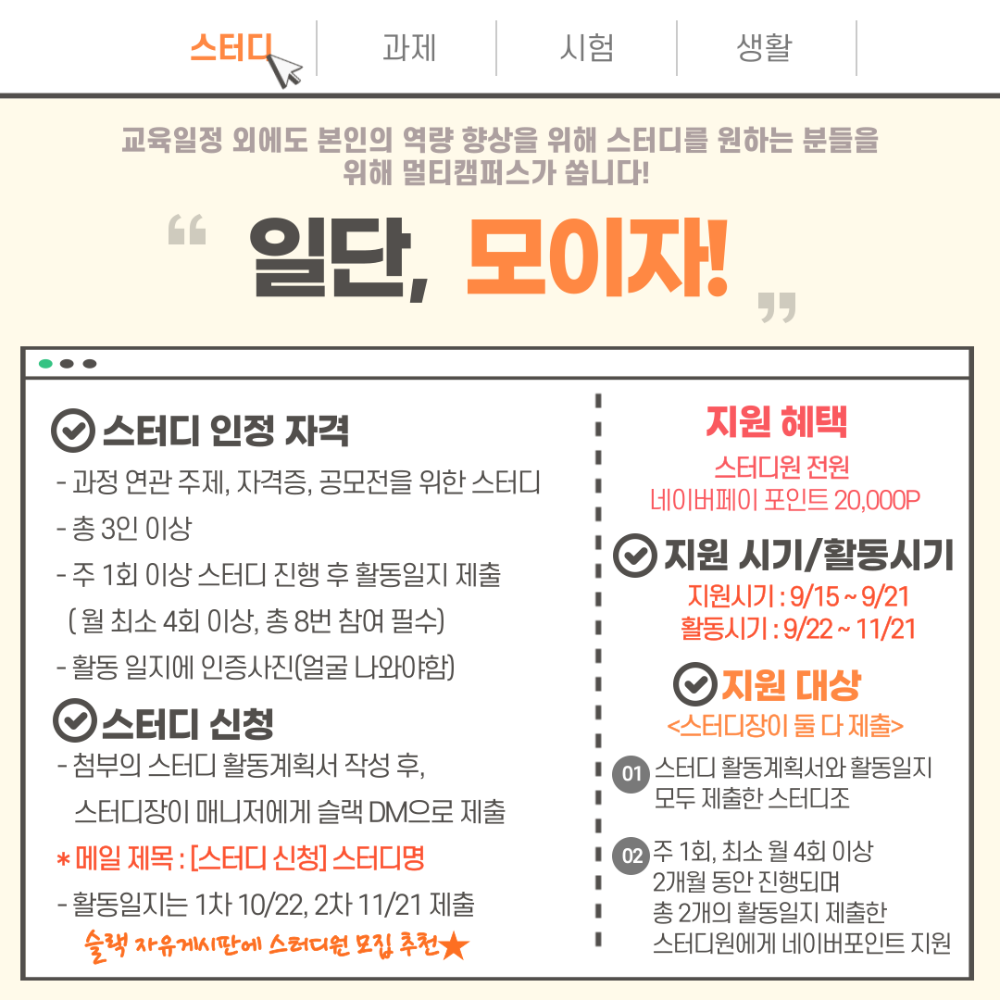
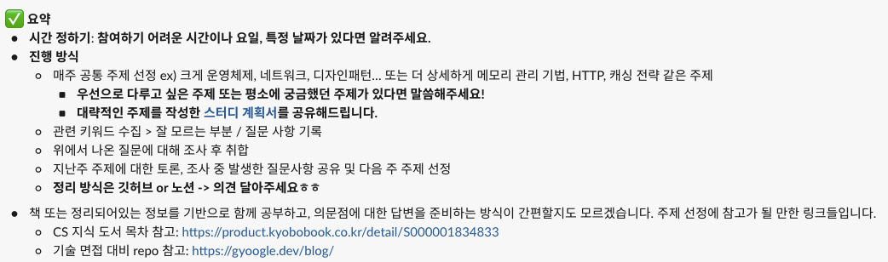
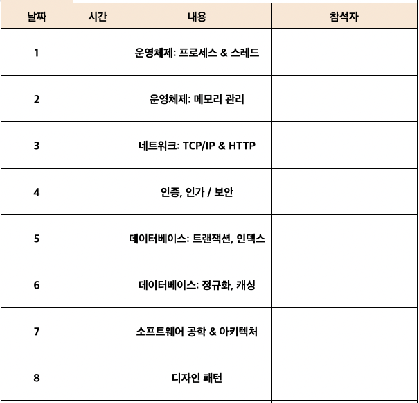
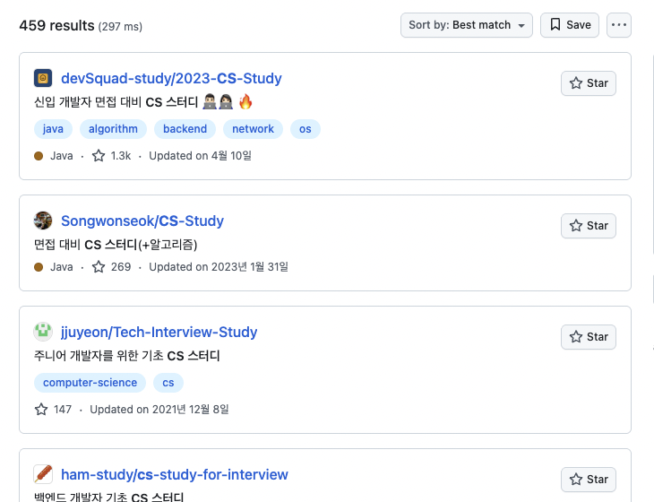
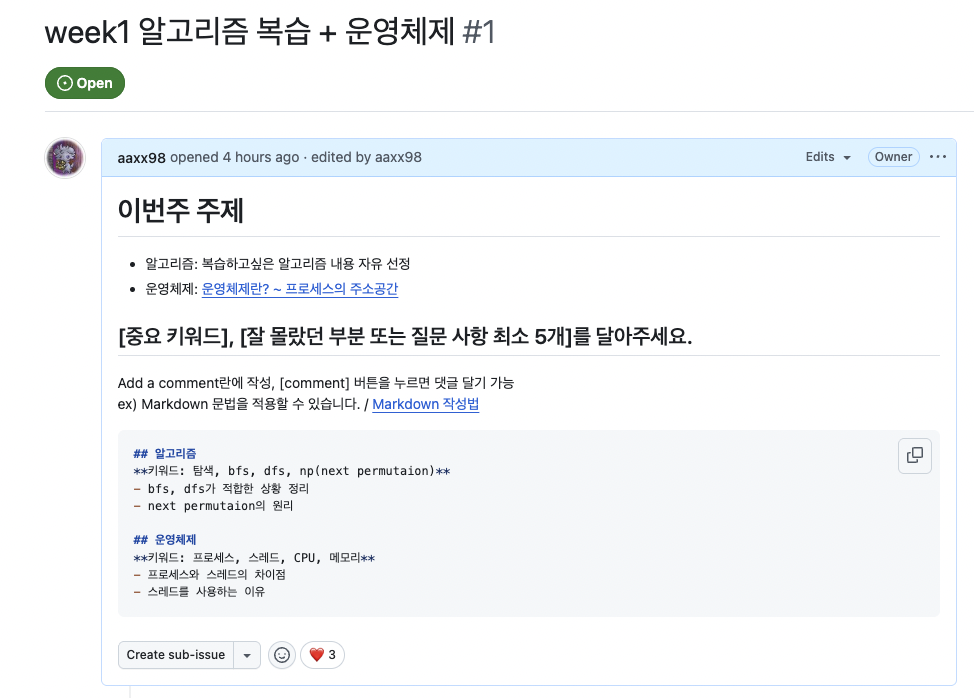

# TIL 챌린지 주제 선정

> 스터디 팀원으로 참여해 본 적은 많지만 주도적으로 운영해 본 적은 없던 것 같다.
>
> 이번에 멀티캠퍼스에서 스터디 이벤트를 열었는데, 대면 스터디가 대부분이었다. 비대면 학습을 진행하다보니 같은 반 수강생들과 교류할 기회가 부족해서 아쉬운 마음에 비대면 스터디를 열어보았다.
>
> 사실 운영해야 하는 것에 부담을 느끼고 있었는데, 고민 끝에 친분이 좀 생긴 비대면반 모임에 제안을 해보았다. 전부 참여하고 싶다고 해 주셨다! (정말 기뻤습니다🥹)
>
> 경기도민으로써 체력을 아낄 수 있도록 비대면으로 잘 진행 해 보려고 한다.

---

# 스터디 운영 기획

## 주제 선정

스터디 주제는 CS(Computer Science) 기본 지식으로 결정했다.

### 스터디 운영 방식

운영 방식에 대해서 고민이 많았는데, 문서를 편집하느라 무의미한 시간을 보내지 않았으면 좋겠다고 생각했다.

그래서 주제를 정하고 중요 키워드 위주로, 부족한 부분만 함께 정리해보는 방식을 제안했다.

- 매주 공통 주제 선정
- 관련 키워드 조사, 각자 내용 학습: [tech-interview-for-developer](https://github.com/gyoogle/tech-interview-for-developer) 참고
- 스터디 전날까지 발생한 질문사항 공유
- 키워드와 질문사항에 대해 스터디 시간에 답변하고, 빠르게 정리

> **질문 확인 및 답변, 정리 -> 다음 주 주제 선정 -> 과제: 키워드 조사 및 학습, 질문 사항 공유**

위와 같은 방식으로 진행하기로 했다.

주제 선정 방식은 매주 다음 주제를 선정하도록 했지만, 틀이 될만한 주제들을 미리 정해두었다.

- 다른 스터디 레포의 목차, CS 도서 목차 등을 참고해서 선정했다.
  

정리 방식은 두 가지를 제안했는데, Github Repository를 활용하는 것과, 노션의 공동 편집 기능을 사용하는 것이다.
각각의 장점은 아래와 같다.

**1. GitHub Repository 활용**

- Git/GitHub 사용을 연습할 기회
- Issue/Pull Request와 같은 기능을 사용해 볼 수 있음

**2. Notion 공동편집**

- 모두에게 익숙한 툴이기 때문에 정리 시간이 적게 소요됨
- 실시간으로 함께 편집 가능

> 이번 기회에 Git/GitHub를 익히고싶다는 의견이 많아서 Github Repository를 활용하기로 결정했다. 스터디 레파지토리이기 때문에 실수해도 걱정 없다.

## CS 스터디 레파지토리 운영 방식들

Github에 `CS 스터디`로 검색하여 다른 스터디 레파지토리의 운영 방식을 참고해 보았다.

- `README.md`에 스터디 규칙을 작성한다.
- Issue에 주제를 올리고, Comment로 각자 질문을 달아 둔다.
- 주제별 디렉토리를 만들고 Markdown 형식으로 정리한다. `[경로]/README.md`에 작성하면 Github 웹 뷰에서 보기 편하다.
- 같은 주제에서 각자 이름으로 파일을 만들어 내용을 정리하거나, 한 주제를 여러 파트로 나눠서 각자 정리한다.

---

## 기대 효과 및 앞으로의 계획

이번 CS 스터디는 아래와 같은 목표를 가지고 있다.

- 체계적인 CS 지식 습득: 단순 암기가 아닌 이해 중심의 학습
- 협업 도구 숙련도 향상: Git/GitHub 활용 능력 개발
- 질문하는 습관 형성: 모르는 것을 부끄러워하지 않고 적극적으로 질문하는 문화 조성
- 지식 공유와 토론: 각자의 관점에서 바라본 내용을 공유하며 더 깊이 있게 이해

이번 주 스터디는 목요일에 예정되어 있다. 스터디 Repository에 첫 주 Issue 등록을 완료하고, 키워드 및 질문 작성 가이드를 남겨 두었다.

첫 스터디 시간 전 까지 간략한 스터디 소개와 규칙을 작성하고, 첫 시간에는 `fork`하여 `pull request`하는 법 등에 대해 정리하여 공유하려고 한다.

또, 아직 내용 정리에 대해서는 돌아가며 한 사람이 할 지, 매 주 여러 사람이 할지, 각자 파트를 정리할 지... 갈피를 잡지 못했는데 첫 시간을 진행해 본 뒤 편집 방식을 결정하려고 한다.

나아가서 CS 주제 이외에도, 새로 스터디 하고 싶은 내용이 생긴다면 다른 주제로, 다른 팀원을 모집하여 진행해보고 싶기도 하다.
