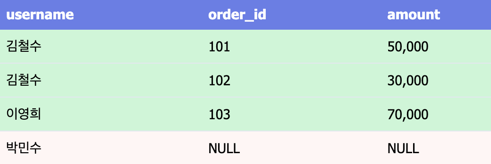
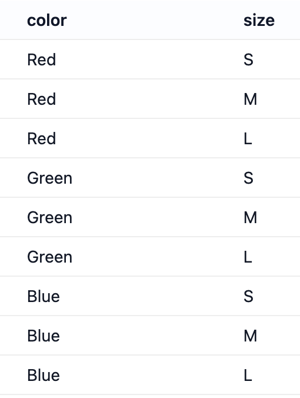

# TIL 챌린지 주제 선정

> MySQL을 사용하면서 자주 찾아보게 되는 명령어들과 핵심 개념들을 정리해봤다.


# 데이터베이스 기본 조작

## 권한 관리

```sql
-- 사용자 생성
CREATE USER 'newuser'@'localhost' IDENTIFIED BY 'password';
CREATE USER 'newuser'@'%' IDENTIFIED BY 'password';  -- 모든 호스트 허용

-- 권한 부여
GRANT ALL PRIVILEGES ON mydb.* TO 'newuser'@'localhost';
GRANT SELECT, INSERT, UPDATE ON mydb.users TO 'newuser'@'localhost';
GRANT SELECT ON mydb.* TO 'readonly'@'localhost';

-- 권한 확인
SHOW GRANTS FOR 'newuser'@'localhost';

-- 권한 적용
FLUSH PRIVILEGES;

-- 권한 제거
REVOKE ALL PRIVILEGES ON mydb.* FROM 'newuser'@'localhost';

-- 사용자 삭제
DROP USER 'newuser'@'localhost';

-- 비밀번호 변경
ALTER USER 'newuser'@'localhost' IDENTIFIED BY 'newpassword';
```

## 데이터베이스 생성 및 조회

```sql
-- 데이터베이스 목록 확인
SHOW DATABASES;

-- 데이터베이스 생성
CREATE DATABASE mydb;
CREATE DATABASE IF NOT EXISTS mydb CHARACTER SET utf8mb4 COLLATE utf8mb4_unicode_ci;

-- 데이터베이스 선택
USE mydb;

-- 데이터베이스 삭제
DROP DATABASE mydb;
```

## 테이블 생성 및 관리

```sql
-- 테이블 생성
CREATE TABLE users (
    id INT AUTO_INCREMENT PRIMARY KEY,
    username VARCHAR(50) NOT NULL UNIQUE,
    email VARCHAR(100) NOT NULL,
    created_at TIMESTAMP DEFAULT CURRENT_TIMESTAMP,
    INDEX idx_email (email)
);

-- 테이블 목록 확인
SHOW TABLES;

-- 테이블 구조 확인
DESCRIBE users;
SHOW CREATE TABLE users;

-- 테이블 삭제
DROP TABLE users;
TRUNCATE TABLE users;  -- 데이터만 삭제, 구조는 유지
```

## 테이블 구조 변경 (ALTER)

```sql
-- 컬럼 추가
ALTER TABLE users ADD COLUMN age INT;
ALTER TABLE users ADD COLUMN phone VARCHAR(20) AFTER email;

-- 컬럼 수정
ALTER TABLE users MODIFY COLUMN username VARCHAR(100);
ALTER TABLE users CHANGE old_name new_name VARCHAR(50);

-- 컬럼 삭제
ALTER TABLE users DROP COLUMN age;

-- 인덱스 추가/삭제
ALTER TABLE users ADD INDEX idx_username (username);
ALTER TABLE users DROP INDEX idx_username;

-- PRIMARY KEY 추가
ALTER TABLE users ADD PRIMARY KEY (id);

-- FOREIGN KEY 추가
ALTER TABLE orders ADD CONSTRAINT fk_user
    FOREIGN KEY (user_id) REFERENCES users(id);
```

---

# CRUD 기본 쿼리

## 데이터 삽입 (INSERT)

```sql
-- 단일 행 삽입
INSERT INTO users (username, email) VALUES ('john', 'john@example.com');

-- 여러 행 한번에 삽입
INSERT INTO users (username, email) VALUES
    ('jane', 'jane@example.com'),
    ('bob', 'bob@example.com');

-- 중복 시 무시
INSERT IGNORE INTO users (username, email) VALUES ('john', 'john@example.com');

-- 중복 시 업데이트
INSERT INTO users (username, email) VALUES ('john', 'john@example.com')
ON DUPLICATE KEY UPDATE email = VALUES(email);
```

## 데이터 조회 (SELECT)

```sql
-- 전체 조회
SELECT * FROM users;

-- 특정 컬럼만 조회
SELECT username, email FROM users;

-- 조건부 조회 (WHERE)
SELECT * FROM users WHERE id = 1;
SELECT * FROM users WHERE username LIKE 'j%';
SELECT * FROM users WHERE created_at > '2024-01-01';

-- 정렬 (ORDER BY)
SELECT * FROM users ORDER BY created_at DESC;
SELECT * FROM users ORDER BY username ASC, created_at DESC;

-- 상위 n개 컬럼 조회 (LIMIT n)
SELECT * FROM users LIMIT 10;

-- 중복 제거
SELECT DISTINCT username FROM users;
```

## 데이터 수정 (UPDATE)

```sql
UPDATE users SET email = 'newemail@example.com' WHERE id = 1;
UPDATE users SET username = 'newname', email = 'new@example.com' WHERE id = 1;

UPDATE users SET email = CONCAT(username, '@newdomain.com')
WHERE email LIKE '%@olddomain.com';
```

### 데이터 삭제 (DELETE)

```sql
DELETE FROM users WHERE id = 1;
DELETE FROM users WHERE created_at < '2023-01-01';
```

---

# 조인 (JOIN)

다음과 같이 `users`, `orders` 두 테이블이 있을 때


## INNER JOIN

양쪽 테이블에 모두 존재하는 데이터만 가져온다.

```sql
SELECT u.username, o.order_id, o.amount
FROM users u
INNER JOIN orders o ON u.id = o.user_id;
```


## LEFT JOIN

왼쪽 테이블의 모든 데이터를 포함하고, 오른쪽 테이블에 매칭되는 데이터가 있으면 가져온다.

```sql
-- 주문이 없는 사용자도 포함
SELECT u.username, o.order_id
FROM users u
LEFT JOIN orders o ON u.id = o.user_id;
```



---

# 집계 함수 (Aggregation)

## 기본 집계 함수

```sql
-- 개수 세기
SELECT COUNT(*) FROM users;
SELECT COUNT(DISTINCT email) FROM users;

-- 합계, 평균, 최대, 최소
SELECT SUM(amount) FROM orders;
SELECT AVG(amount) FROM orders;
SELECT MAX(amount) FROM orders;
SELECT MIN(amount) FROM orders;
```

## GROUP BY

```sql
SELECT user_id, COUNT(*) as order_count, SUM(amount) as total_amount
FROM orders
GROUP BY user_id;
```

## HAVING (그룹화 후 조건)

```sql
SELECT user_id, COUNT(*) as order_count
FROM orders
GROUP BY user_id
HAVING COUNT(*) > 5;
```

---

# 그 외

## WITH 절 (CTE)

- WITH 절의 **CTE(Common Table Expression)** 는 임시 결과 집합을 만든다.

### 기본 사용법

```sql
WITH
user_stats AS (
    SELECT user_id, COUNT(*) as order_count
    FROM orders
    GROUP BY user_id
),
revenue_stats AS (
    SELECT user_id, SUM(amount) as total_revenue
    FROM orders
    GROUP BY user_id
)

-- 테이블처럼 SELECT에 사용할 수 있다.
SELECT
    u.username,
    us.order_count,
    rs.total_revenue
FROM users u
LEFT JOIN user_stats us ON u.id = us.user_id
LEFT JOIN revenue_stats rs ON u.id = rs.user_id;
```

## CROSS JOIN

- **CROSS JOIN**은 두 테이블의 모든 가능한 조합 - 카티션 프로덕트를 만든다.

### 기본 사용법

```sql
-- 모든 색상과 모든 크기의 조합
SELECT c.color, s.size
FROM colors c
CROSS JOIN sizes s;

-- 카티션 프로덕트와 같다.
SELECT c.color, s.size
FROM colors c, sizes s;
```




# mysqldump 백업 및 복원

```cmd
-- 단일 데이터베이스
mysqldump -u root -p mydb > backup.sql

-- 여러 데이터베이스
mysqldump -u root -p --databases db1 db2 > backup.sql

-- 모든 데이터베이스
mysqldump -u root -p --all-databases > backup.sql

-- 특정 테이블만
mysqldump -u root -p mydb users orders > backup.sql

-- sql 파일 적용
mysql -u root -p mydb < backup.sql
```
