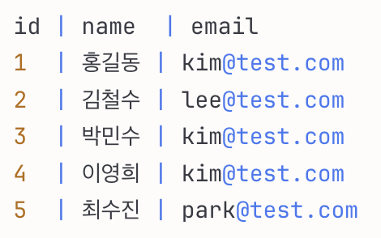

## 📌 인덱스란?

인덱스는 데이터베이스에서 데이터 검색 속도를 향상시키기 위한 자료구조입니다. 책의 뒷부분에 있는 색인처럼, 특정 데이터를 빠르게 찾을 수 있도록 도와주는 역할을 합니다.

인덱스가 없으면 데이터베이스는 원하는 데이터를 찾기 위해 테이블의 모든 행을 처음부터 끝까지 검색(Full Table Scan)해야 하지만 인덱스가 있으면 정렬된 구조를 통해 훨씬 빠르게 데이터를 찾을 수 있습니다.

## 🏗️ 인덱스의 내부 구조

### B-Tree 트리


대부분의 데이터베이스는 **B-Tree(Balanced Tree)** 구조를 사용합니다.

B-Tree는 균형 잡힌 트리 구조로, 다음과 같은 특징이 있습니다.

> 1. 모든 노드들은 최대 m개의 자식을 가짐
> 2. 리프 노드를 제외하고, k개의 자식을 가진 노드는 k-1개의 키를 가짐
> 3. 모든 리프 노드를 제외하고, 최소 m//2 + 1개의 자식을 가져야 함(최소 2개 이상)
> 4. 모든 리프 노드는 같은 레벨에 있어야 함

- **루트 노드**: 트리의 최상단
- **브랜치 노드**: 중간 단계 노드들
- **리프 노드**: 실제 데이터의 위치(포인터)를 가진 최하단 노드

트리 생성 시 최악의 경우 트리가 한쪽으로 치우쳐 O(n) 시간이 걸리는 탐색 구조를 갖게 되는데,

B-Tree는 모든 리프 노드가 동일한 깊이에 있도록 균형을 유지하기 때문에,
아래와 같이 선형으로 트리가 생성되는 것을 방지합니다.


### 인덱스 생성 예시

다음과 같은 users 테이블이 있다고 가정합니다.



인덱스를 생성하면, 원본 테이블과는 별개의 공간에 정렬된 트리 구조로 데이터를 저장합니다. 값으로 정렬되며, 값과 키(id 또는 행 위치)가 저장되어있어 검색에 용이합니다.

users 테이블에 대해 email 컬럼으로 인덱스를 생성하면 다음과 같은 트리구조가 생성됩니다.


인덱스 트리를 저장함으로써 데이터 검색 시간이 O(log n)으로 줄어들어, 데이터가 많아져도 검색 속도가 크게 느려지지 않습니다.

하지만 별도의 저장공간이 추가로 필요하며, INSERT, UPDATE, DELETE 작업 시 인덱스 트리를 재정렬 해야하기 때문에 CUD 작업 속도가 느려질 수 있습니다.

읽기가 많은 테이블에서, 자주 조회하는 컬럼만 인덱스를 생성하는 것이 좋습니다.

## 🔍 인덱스 활용

### 1. WHERE 절을 사용한 검색

```
SELECT * FROM users WHERE email = 'kim@test.com';
```

다음과 같이 Select 했을 때, `users` 테이블에 대한 인덱스가 없으면 첫번째 행 부터 끝까지 탐색하여 O(n)의 시간이 걸립니다.

하지만 `users.email`에 대한 인덱스가 있는 경우 정렬된 트리에서 값을 찾으므로 검색 시간을 O(log n)으로 줄일 수 있습니다.

### 2. JOIN 연산

```
SELECT u.name, o.product_name, o.price
FROM users u
JOIN orders o ON u.id = o.user_id
WHERE u.email = 'kim@test.com';
```

Nested Loop Join 방식으로 동작한다고 할 때, 인덱스가 없다면 `users` 테이블의 모든 행 전체 탐색, `orders` 테이블의 모든 행 전체 탐색으로 O(n\*m)의 시간이 걸립니다.

`users.email`, `orders.user_id`에 인덱스가 있는 경우, 검색 시간을 O(log n + log m)로 줄일 수 있습니다.

### ORDER BY 정렬

이미 정렬되어 저장되어있으므로, 결과 반환만 하면 됩니다. 별도의 정렬을 실행할 필요가 없습니다.

### GROUP BY 그룹화

이미 정렬되어 저장되어있으며, 같은 값에 연속으로 접근할 수 있으므로, 순차적으로 읽으면서 연산 작업을 하면 됩니다.

추가 그룹핑 작업이 필요하지 않습니다.

## 💡 인덱스 사용이 불가능한 경우

인덱스는 특정 컬럼값에 따라 정렬되어 있기 때문에 예상이 불가능한 값으로 조회하려고 할 때는 사용할 수 없습니다.

### ❌ 컬럼에 함수를 사용할 때

```sql
-- ❌ 함수 연산 결과물은 인덱스로 접근 불가
SELECT * FROM users WHERE YEAR(created_at) = 2024;

-- ✅
SELECT * FROM users WHERE created_at >= '2024-01-01' AND created_at < '2025-01-01';
```

### ❌ LIKE 앞에 % 사용할 때

```sql
-- ❌ 문자열 첫번째 요소를 알 수 없는 경우 인덱스로 접근 불가
SELECT * FROM users WHERE name LIKE '%김%';

-- ✅
SELECT * FROM users WHERE name LIKE '김%';
```

### 카디널리티(Cardinality) 고려

> 카디널리티는 특정 컬럼의 중복되지 않는 값의 개수를 의미합니다.
>
> **인덱스는 카디널리티가 높을수록 효과적**입니다.

- **높은 카디널리티**: 이메일, 주민등록번호, 전화번호
- **낮은 카디널리티**: 성별(남/여), 나이대(10대/20대/30대), 참/거짓

## 📝 인덱스 생성 방법

### 단일 컬럼 인덱스

```sql
-- 인덱스 생성
CREATE INDEX idx_email ON users(email);

-- 인덱스 삭제
DROP INDEX idx_email ON users;
```

### 복합 인덱스 (여러 컬럼)

```sql
-- 이름과 나이를 함께 인덱싱, 정렬 우선순위는 왼쪽 컬럼 우선
CREATE INDEX idx_name_age ON users(name, age);
```

### 자동 생성되는 인덱스

- **PRIMARY KEY**: 테이블 생성 시 자동으로 인덱스 생성
- **UNIQUE 제약조건**: 고유값을 보장하기 위해 자동으로 인덱스 생성

```sql
CREATE TABLE users (
    id INT PRIMARY KEY,           -- 자동으로 인덱스 생성
    email VARCHAR(100) UNIQUE     -- 자동으로 인덱스 생성
);
```

---

## 🧪 성능 테스트


인덱스 검색 성능을 MySQL을 통해 실행해보았습니다.

### 1. 테스트 데이터 준비

```sql
-- 테스트용 테이블 생성
CREATE TABLE test_users (
    id INT AUTO_INCREMENT PRIMARY KEY,
    name VARCHAR(50),
    email VARCHAR(100),
    age INT,
    created_at DATETIME
);

-- 대용량 데이터 삽입 (100만 건)
DELIMITER $$
CREATE PROCEDURE insert_test_data()
BEGIN
    DECLARE i INT DEFAULT 1;
    WHILE i <= 1000000 DO
        INSERT INTO test_users (name, email, age, created_at)
        VALUES (
            CONCAT('User', i),
            CONCAT('user', i, '@test.com'),
            FLOOR(20 + RAND() * 50),
            NOW() - INTERVAL FLOOR(RAND() * 365) DAY
        );
        SET i = i + 1;
    END WHILE;
END$$
DELIMITER ;

-- 프로시저 실행
CALL insert_test_data();
```

`test_users` 테이블을 생성하고, 100만건의 데이터가 생성되었습니다. 데이터 생성에 시간이 몇 분 정도 소요됩니다.


### 2. 인덱스 없이 검색 테스트

```sql
-- 실행 계획 확인
EXPLAIN SELECT * FROM test_users WHERE email = 'user500000@test.com';

-- 실행 시간 측정
EXPLAIN ANALYZE
SELECT * FROM test_users WHERE email = 'user500000@test.com';
```

`EXPLAIN`으로 SELECT문 실행에 대한 정보를 확인하면 아래와 같은 결과가 나옵니다.

- type: ALL - 풀 테이블 스캔 (처음부터 끝까지 탐색)
- key: NULL - 인덱스를 사용하지 않음
- rows: 995,849 - 99만 건을 확인해야 할 것으로 추정됨
- Extra: Using where - WHERE 조건으로 필터링

`EXPLAIN ANALYZE`로 SELECT문 실행 결과를 확인하면 아래와 같은 결과가 나옵니다.
Filter 작업의 하위에 Table scan이 포함되어있기 때문에 최종 실행 시간은 Filter를 참고하면 됩니다.

```
-> Filter: (test_users.email = 'user500000@test.com')  (cost=100554 rows=99585) (actual time=215..343 rows=1 loops=1)
    -> Table scan on test_users  (cost=100554 rows=995849) (actual time=1.27..286 rows=1e+6 loops=1)
```

- Filter: 각 행을 검사할 때의 조건
  - cost=100554 rows=99585: MySQL의 쿼리 검사 예측으로, 99585개의 행이 나올것으로 예측함
  - actual time=215..343: 필터링하는 데 걸린 시간 215~343ms, 전체 실행 시간은 343ms
  - rows=1: 실제 결과 1건
  - loops=1: 필터링 1회 수행

- Table scan on test_users: `test_users` 테이블의 전체 행을 처음부터 끝까지 읽는 작업이 발생함
  - cost=100554 rows=995849: 옵티마이저가 약 99만 행을 읽을 것으로 예측함
  - actual time=1.27..286: SELECT에 걸린 시간 1.27ms ~ 286ms
  - rows=1e+6: 실제로 읽은 행 수 - 약 100만 건
  - loops=1: 테이블 전체를 1회 스캔

### 3. 인덱스 생성 후 테스트

```sql
-- 인덱스 생성
CREATE INDEX idx_email ON test_users(email);

-- 실행 계획 확인
EXPLAIN SELECT * FROM test_users WHERE email = 'user500000@test.com';

-- 실행 시간 측정
EXPLAIN ANALYZE
SELECT * FROM test_users WHERE email = 'user500000@test.com';
```

인덱스를 생성하면 100만건의 데이터가 email 값을 기준으로 B-Tree로 저장됩니다. 인덱스 생성에 3s 정도 소요되었습니다.


`EXPLAIN`으로 SELECT문 실행에 대한 정보를 확인하면 아래와 같은 결과를 확인할 수 있습니다.

- type: ref - 인덱스를 이용해 조건에 맞는 행만 탐색
- key: idx_email - email 컬럼으로 생성된 인덱스 이름
- rows: 1 - 1건을 확인해야 할 것으로 추정됨
- Extra: Using index - 테이블 데이터를 직접 읽지 않고 인덱스만으로 조회 가능

`EXPLAIN ANALYZE`로 SELECT문 실행 결과를 확인하면 아래와 같은 결과가 나옵니다.

```
-> Index lookup on test_users using idx_email (email='user500000@test.com')  (cost=0.35 rows=1) (actual time=4.38..4.39 rows=1 loops=1)
```

- Index lookup on test_users: `idx_email` 인덱스를 사용하여 조건에 맞는 행을 바로 찾음
  - cost=0.35 rows=1: 옵티마이저가 약 1건의 결과를 예측함
  - actual time=4.38..4.39: 실제 조회에 걸린 시간 — 4.38ms ~ 4.39ms
  - rows=1: 실제 결과 1건

### 4. 쿼리 실행 시간 비교

> 인덱스 사용으로 실행 시간이 343ms -> 4ms로 86배 빨라졌습니다.

---

## 🎯 요약

다음과 같은 기준으로 인덱스를 고려하면 좋습니다.

- WHERE 절에 자주 사용되는 컬럼
- JOIN에 사용되는 컬럼
- ORDER BY에 자주 사용되는 컬럼
- 카디널리티가 높은 컬럼

### 인덱스 사용 시 장점

- 검색 속도가 대폭 향상
- ORDER BY, GROUP BY 작업의 성능 개선
- MIN, MAX 같은 집계 함수가 빨라짐

### 인덱스 사용 시 단점

- 인덱스를 저장하기 위한 추가 디스크 공간이 필요 (테이블 크기의 약 10%)
- INSERT, UPDATE, DELETE 작업 시 인덱스도 함께 수정해야 하므로 성능이 저하됨
- 너무 많은 인덱스는 오히려 성능을 떨어뜨릴 수 있으므로 조회 최적화에 사용
