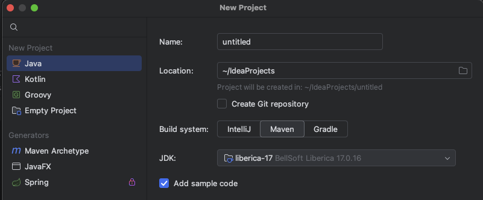
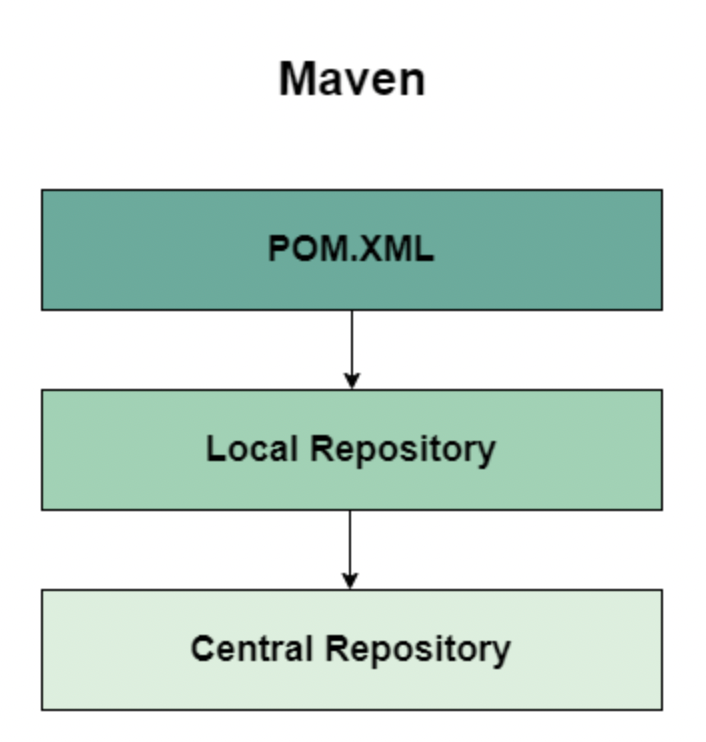
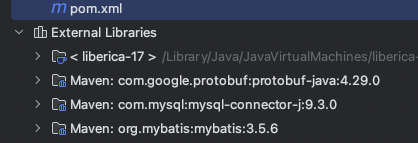
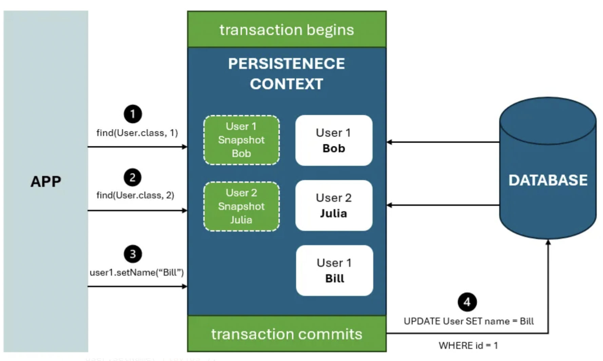
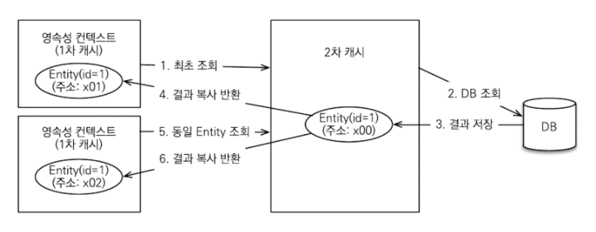

> 이번 주에는 Java 프로젝트에 데이터베이스를 연결하고, MyBatis와 JPA를 사용해보는 시간을 가졌습니다. MyBatis로 SQL을 직접 작성하며 데이터베이스와 상호작용하는 방식을 먼저 경험했고, 이후 JPA로 넘어가면서 데이터베이스 연결에 대한 서로 다른 접근 방식을 배울 수 있었습니다. 실습을 통해 Maven으로 프로젝트 의존성을 관리하면서 라이브러리 추가가 얼마나 간편해졌는지 체감했고, JPA의 영속성 컨텍스트라는 개념을 처음 접하고 이해하는 시간을 가졌습니다.

# Maven으로 JAVA 프로젝트 관리


## Maven

- 메이븐(Apache Maven)은 개발자로 하여금 자바 프로젝트 관리를 쉽게 도와주는 빌드 툴입니다.
  - 기존에는 필요한 라이브러리(jar 파일)를 수동으로 프로젝트에 추가해야 했으며, 협업 시 각 개발 환경의 라이브러리 버전을 일치시키는 작업이 어려워 버전 관리가 복잡했습니다.
  - Maven은 `pom.xml`에 필요한 라이브러리 정보만 적어주면, Maven이 알아서 중앙 저장소에서 다운로드해서 프로젝트에 추가해줍니다.
    - **POM**: "Porject Object Model"의 약어로 `pom.xml` 파일로 관리되며, 반복적으로 진행되어 왔던 프로젝트 빌드, 리포트, 문서화 작업을 지원합니다.

- 프로젝트를 생성할 때 build system을 설정할 수 있는데, 이 때 maven을 선택 할 수 있습니다.
  

### Maven Central Repository 워크플로



1. 종속성 정의: 개발자가 pom.xml에 필요한 종속성을 지정합니다.
2. 검색 및 다운로드: Maven은 먼저 로컬 저장소에서 종속성을 검색하고, 없으면 중앙 저장소에서 가져옵니다.
3. 아티팩트 가져오기: 중앙 저장소에서 가져온 종속성은 로컬 저장소에 저장되어 이후 사용됩니다.
4. 프로젝트 빌드: Maven은 다운로드된 종속성을 사용하여 프로젝트를 빌드합니다.

예를 들어, MyBatis를 사용하려면 아래와 같이 `pom.xml`을 작성합니다.

```xml
<project xmlns="http://maven.apache.org/POM/4.0.0" xmlns:xsi="http://www.w3.org/2001/XMLSchema-instance" xsi:schemaLocation="http://maven.apache.org/POM/4.0.0 https://maven.apache.org/xsd/maven-4.0.0.xsd">
  <modelVersion>4.0.0</modelVersion>
  <groupId>Mybatis</groupId>
  <artifactId>MybatisBasic</artifactId>
  <version>0.0.1-SNAPSHOT</version>
  <name>MybatisBasic</name>
  <description>MybatisBasic</description>

  <dependencies>

    <!-- https://mvnrepository.com/artifact/com.mysql/mysql-connector-j -->
    <dependency>
      <groupId>com.mysql</groupId>
      <artifactId>mysql-connector-j</artifactId>
      <version>9.3.0</version>
    </dependency>

    <!-- https://mvnrepository.com/artifact/org.mybatis/mybatis -->
    <dependency>
      <groupId>org.mybatis</groupId>
      <artifactId>mybatis</artifactId>
      <version>3.5.6</version>
    </dependency>

  </dependencies>

  <build>
    <plugins>
      <plugin>
        <groupId>org.apache.maven.plugins</groupId>
        <artifactId>maven-compiler-plugin</artifactId>
        <version>3.8.1</version>
        <configuration>
          <source>17</source>
          <target>17</target>
        </configuration>
      </plugin>
    </plugins>
  </build>
</project>
```

1. pom.xml에 **mysql-connector-j**와 mybatis 의존성을 추가합니다.
2. Maven이 로컬 저장소(~/.m2/repository)에서 해당 라이브러리를 먼저 찾습니다.
3. 로컬에 없으면 Maven 중앙 저장소에서 다운로드합니다.
4. 다운로드가 완료되면 External Libraries에 추가되어 프로젝트에서 바로 사용할 수 있습니다.
   

# MyBatis로 데이터베이스에 접근하기

MyBatis는 SQL을 직접 작성하고 Mapper 인터페이스를 통해 호출하는 방식으로, SQL문을 거의 그대로 작성하는 방식입니다.
Mapper 인터페이스를 작성하고, xml에 매핑 정보를 작성하면, MyBatis가 인터페이스 구현체를 생성하여 sql문을 연결시켜줍니다.

## Mapper 인터페이스

```java
public interface UserMapper {
    User selectById(Long id);
    void insertUser(User user);
}
```

## XML 매핑

```xml
<mapper namespace="com.example.UserMapper">
    <select id="selectById" parameterType="long" resultType="User">
        SELECT * FROM users WHERE id = #{id}
    </select>

    <update id="update" parameterType="User">
        UPDATE users SET name = #{name} WHERE id = #{id}
    </update>
    ...
</mapper>
```

# JPA로 데이터베이스에 접근하기

> JPA는 객체 상태 변화를 기반으로 SQL을 자동 생성하고 실행하는 ORM(Object-Relational Mapping) 프레임워크입니다.
>
> MyBatis와 달리, SQL을 직접 작성하지 않아도 엔티티 객체의 상태를 변경하면 데이터베이스가 자동으로 업데이트됩니다.

```java
User user = entityManager.find(User.class, 1L); // SELECT 쿼리 실행
user.setName("홍길동");                          // UPDATE 쿼리 자동 생성
```

이처럼 JPA에서 user 객체를 변경했을 때, SQL이 자동으로 실행되는 이유는 영속성 컨텍스트(Persistence Context) 때문입니다.

MyBatis에서는 개발자가 SQL을 직접 제어했다면, JPA는 객체의 상태 변화를 추적해서 자동으로 SQL을 생성해준다는 차이가 있었습니다.

## 영속성 컨텍스트(Persistence Context)

- 영속성 컨텍스트는 엔티티 객체를 영구 저장하는 환경으로, 일종의 1차 캐시 역할을 수행합니다.
- 엔티티를 조회하면 해당 객체가 영속성 컨텍스트에 저장되고, 같은 트랜잭션 내에서 동일 데이터를 다시 조회하면 DB 쿼리를 수행하지 않고 캐시에서 객체를 반환합니다.

```java
User user1 = entityManager.find(User.class, 1L); // DB 쿼리 실행
User user2 = entityManager.find(User.class, 1L); // 위에서 실행한 쿼리와 같으므로 쿼리를 실행하지 않고 context에서 가져옴
System.out.println(user1 == user2); // true: 같은 객체
```

## 엔티티의 생명주기

> 엔티티는 영속성 컨텍스트와의 관계에 따라 다음 4가지 상태를 가집니다.


1. **비영속(New/Transient)**: 영속성 컨텍스트와 전혀 관계 없는 새로운 상태
2. **영속(Managed)**: 영속성 컨텍스트에 관리되는 상태
3. **준영속(Detached)**: 영속성 컨텍스트에 저장되었다가 분리된 상태
4. **삭제(Removed)**: 삭제된 상태

```java
// 비영속
User user = new User();
user.setName("홍길동");

// 영속
entityManager.persist(user);

// 준영속
entityManager.detach(user);

// 삭제
entityManager.remove(user);
```

## 더티 체킹(Dirty Checking)

> Dirty라고 하는것은 보통 변경사항을 칭합니다. 변경사항을 추적/감지하는 것을 Dirty Checking이라고 합니다.
>
> 영속 상태의 엔티티를 수정하면, JPA가 자동으로 변경 감지를 수행하여 트랜잭션 커밋 시점에 UPDATE 쿼리를 실행합니다.

```java
@Transactional
public void updateUser(Long id, String newName) {
    User user = entityManager.find(User.class, id);
    user.setName(newName); // 트랜잭션 커밋 시 자동으로 UPDATE 실행
}
```

JPA는 엔티티를 영속성 컨텍스트에 저장할 때 **스냅샷**도 함께 저장합니다.

트랜잭션 커밋 시점에 현재 엔티티와 스냅샷을 비교해서, 변경된 부분이 있으면 UPDATE 쿼리를 자동 생성하는 것입니다.



MyBatis에서는 UPDATE 쿼리를 직접 작성하고 호출해야 했는데, JPA는 객체만 수정하면 알아서 처리해주니 정말 편리했습니다.

하지만 영속성 컨텍스트에 연결되어있는 객체(영속 상태), 연결되지 않은 객체(비영속/준영속 상태)를 어떻게 구별할지나, 일부 객체만 수정하고싶을 때는 어떻게 관리할 수 있는지 더 알아볼 필요가 있을 것 같습니다.

## 쓰기 지연(Transactional Write-behind)

> persist()를 호출해도 즉시 INSERT 쿼리를 실행하지 않고, 트랜잭션 커밋 시점에 한 번에 실행합니다.
>
> 이를 통해 DB와의 통신 횟수를 줄이고 성능을 개선할 수 있습니다.

```java
User user1 = new User("홍길동");
User user2 = new User("김철수");
User user3 = new User("이영희");

entityManager.persist(user1);
entityManager.persist(user2);
entityManager.persist(user3);

    // 커밋 시점에 INSERT 쿼리 실행 (홍길동, 김철수, 이영희)
```

- 필요 시 flush()를 호출하여 중간에 강제로 쿼리를 실행할 수도 있습니다.
  - 지금까지 영속성 컨텍스트에 쌓여 있는 변경 사항에 대한 쿼리들이 전부 실행됩니다.

## 2차 캐시 - 애플리케이션 전역 캐시

- 영속성 컨텍스트는 1차 캐시로 트랜잭션 단위로 동작합니다.
- 트랜잭션이 종료되면 캐시도 사라지므로, 다른 트랜잭션에서는 동일 데이터를 조회할 경우 다시 DB에 쿼리가 발생합니다.

```java
// 트랜잭션 1
User user1 = entityManager.find(User.class, 1L); // DB 쿼리

// 트랜잭션 2
User user2 = entityManager.find(User.class, 1L); // 또 DB 쿼리
```

다른 트랜잭션에서는 캐시를 공유하지 않기 때문에, 같은 데이터를 조회해도 매번 DB에 쿼리가 날아갑니다.

애플리케이션 전체에서 공유하는 캐시가 필요하다면 2차 캐시(Second Level Cache)를 사용할 수 있습니다.

다음과 같은 경우 2차 캐시를 사용하는 것이 적합합니다.

- 조회 성능 최적화가 필요한 경우
- 조회가 빈번하고, 데이터 변경은 드문 경우
- 여러 트랜잭션에서 동일 데이터를 반복 조회할 때



# 이번 주 TIL 요약

1. **Maven을 통한 프로젝트 관리**
   - Maven으로 의존성을 관리하면서 라이브러리 추가가 얼마나 간단해졌는지 체감했습니다.

2. **MyBatis와 JPA**
   - MyBatis를 사용하며 SQL을 직접 작성하고 데이터베이스와 상호작용하는 방식을 먼저 경험했습니다.
     - 장점: SQL을 직접 제어 가능, 복잡한 쿼리나 성능 튜닝 시 유리
     - 단점: CRUD마다 SQL을 작성해야 하는 번거로움
   - 이후 JPA로 전환하면서 객체 중심 개발 방식과 영속성 컨텍스트를 경험했습니다.
     - 장점: 객체 상태 변경만으로 SQL이 자동 생성되어 생산성이 높음
     - 단점: 영속성에 대한 이해가 없을 경우, 객체 변경 시 원치 않는 SQL이 실행될 수 있으므로 주의 필요

3. **JPA 영속성 컨텍스트와 더티 체킹**
   - 영속성 컨텍스트는 엔티티 객체를 관리하는 1차 캐시 역할을 수행하며, 동일 트랜잭션 내에서 DB 접근 없이 객체를 재사용할 수 있음
   - 더티 체킹을 통해 영속 상태 엔티티를 수정하면, 트랜잭션 커밋 시점에 자동으로 UPDATE 쿼리가 실행됨
   - MyBatis에서 직접 SQL을 작성하던 것과 달리, 개발자가 비즈니스 로직에 더 집중할 수 있어 편리함
   - 내부 동작 원리를 이해하면 예기치 못한 쿼리 발생을 예방하고, 안정적으로 활용 가능
