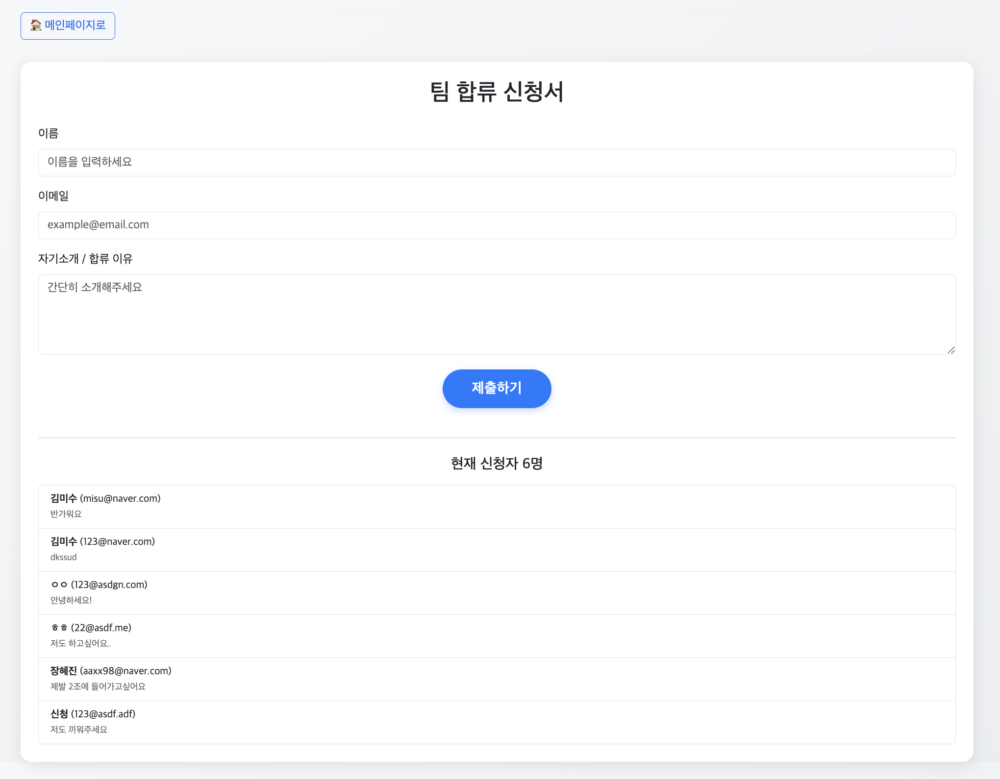
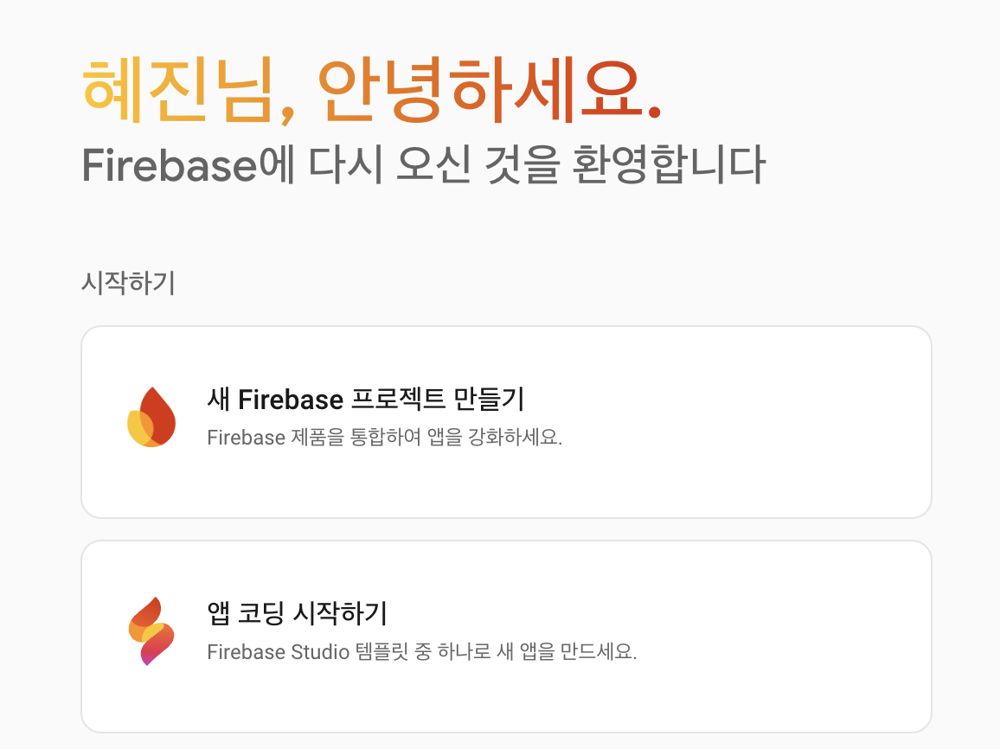
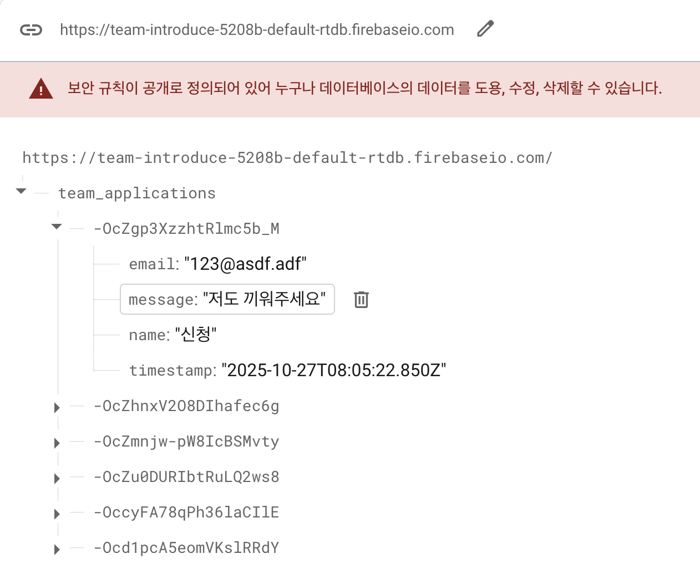

> 이번 주에는 웹 프론트엔드의 기본적인 내용에 대해 공부하고, 기본적인 html, css, javacript를 이용하여 팀 소개, 개인 소개 페이지를 만들어보았습니다.
>
> netlify로 배포, firebase로 데이터 받기, 보여주기도 추가로 진행했습니다.

# HTML, CSS, JavaScript 작동 방식 정리


## HTML (HyperText Markup Language)

- **역할** 웹 페이지의 구조와 콘텐츠를 정의
- **작동 방식**
  - 브라우저가 HTML을 파싱하여 DOM(Document Object Model) 트리 구조 생성
  - 각 태그는 노드가 되어 계층 구조를 형성
  - 시맨틱 태그(`<header>`, `<nav>`, `<main>` 등)로 의미있는 구조 표현

## CSS (Cascading Style Sheets)

- **역할**: HTML 요소의 시각적 표현(레이아웃, 색상, 폰트 등) 정의
- **작동 방식**
  - 브라우저가 CSS를 파싱하여 CSSOM(CSS Object Model) 생성
  - Specificity(명시도) 규칙에 따라 스타일 우선순위 결정
  - Cascade(종속) 원리로 여러 스타일 규칙을 병합
  - 선택자를 통해 DOM 요소와 매칭

## JavaScript

- **역할**: 웹 페이지에 동적 기능과 인터랙티브 제공
- **작동 방식**
  - 싱글 스레드 이벤트 루프 기반으로 실행
  - Call Stack에서 동기 코드 실행
  - Web API를 통해 비동기 작업 처리
  - Callback Queue와 Event Loop로 비동기 작업 완료 후 실행
  - DOM API로 HTML 요소를 동적으로 조작

- **이벤트 루프의 동작 과정**
  
  - Call Stack: 자바스크립트 함수 호출이 쌓이는 스택
  - Web APIs: 타이머, 네트워크 요청 등을 처리하는 브라우저의 API
  - Callback Queue: 비동기 작업이 완료되면 해당 콜백 함수가 이 큐에 추가됨
  - Event Loop: 호출 스택이 비어 있을 때 콜백 큐에서 콜백 함수를 꺼내 호출 스택에 추가하여 실행함

# 웹 애플리케이션의 렌더링 방식

## SPA (Single Page Application)

### SPA란?

- **단일 페이지로 구성된 웹 애플리케이션**
- 최초 한 번만 페이지를 로드하고, 이후에는 JavaScript로 동적으로 콘텐츠를 변경
- 페이지 전환 시 전체 페이지를 새로고침하지 않고 필요한 부분만 업데이트

### SPA 작동 방식

```
1. 초기 로드: HTML, CSS, JS 파일 한 번에 다운로드
2. 라우팅: URL 변경 시 JavaScript가 감지
3. 컴포넌트 전환: 필요한 컴포넌트만 렌더링
4. API 호출: 서버에서 데이터만 가져옴 (JSON)
5. DOM 업데이트: 가져온 데이터로 화면 갱신
```

### SPA의 장점

- **빠른 사용자 경험**: 페이지 새로고침 없이 즉각적인 반응
- **서버 부하 감소**: HTML 렌더링을 클라이언트에서 처리
- **모바일 앱과 유사한 경험**: 부드러운 전환 효과
- **개발 효율성**: 프론트엔드와 백엔드 분리

### SPA의 단점

- **초기 로딩 시간**: 첫 로드 시 많은 JS 파일 다운로드
- **SEO 문제**: 검색 엔진 크롤러가 콘텐츠를 제대로 읽지 못할 수 있음
- **JavaScript 의존성**: JS가 비활성화되면 작동 불가
- **메모리 관리**: 장시간 사용 시 메모리 누수 가능성

### 대표적인 SPA 프레임워크

- **React**: Meta(Facebook) 개발, 컴포넌트 기반
- **Vue**: 점진적 프레임워크, 학습 곡선 완만
- **Angular**: Google 개발, 완전한 프레임워크
- **Svelte**: 컴파일 타임에 최적화

## CSR (Client Side Rendering)


### CSR이란?

- **클라이언트(브라우저)에서 JavaScript로 렌더링**
- SPA의 기본 렌더링 방식

### CSR 작동 과정

1. 서버: 빈 HTML + JavaScript 번들 전송

```html
<div id="root"></div>
<script src="bundle.js"></script>
```

2. 브라우저: JavaScript 다운로드 및 실행
3. JavaScript: API 호출 → 데이터 가져오기
4. React/Vue 등
   데이터로 컴포넌트 렌더링
5. 브라우저: 최종 화면 표시

### CSR의 장점

- **풍부한 인터랙션**: 즉각적인 사용자 반응
- **서버 부담 적음**: HTML 생성 불필요
- **부분 업데이트**: 필요한 부분만 다시 그림

### CSR의 단점

- **초기 로딩 느림**: JS 다운로드 + 실행 + API 호출
- **SEO 불리**: 빈 HTML만 크롤링됨
- **JavaScript 필수**: JS 없으면 화면 안 보임

---

## SSR (Server Side Rendering)


### SSR이란?

- **서버에서 HTML을 완전히 렌더링하여 전송**
- 최초 로드 시 완성된 HTML 제공

### SSR 작동 과정

1. 브라우저: 페이지 요청

2. 서버:
   - 데이터 가져오기 (DB, API 등)
   - React/Vue 컴포넌트 실행
   - 완성된 HTML 생성

3. 브라우저:
   - HTML 즉시 표시 (First Paint)
   - JavaScript 다운로드
   - Hydration (이벤트 리스너 연결)

4. 이후: CSR처럼 동작

### SSR의 장점

- **빠른 초기 로딩**: 완성된 HTML 즉시 표시
- **SEO 최적화**: 크롤러가 완전한 콘텐츠 읽기 가능
- **저사양 기기**: JS 실행 전에도 콘텐츠 보임

### SSR의 단점

- **서버 부하**: 매 요청마다 렌더링 필요
- **복잡한 구현**: 서버/클라이언트 환경 모두 고려
- **TTFB 느림**: 서버 렌더링 시간 소요

### SSR 프레임워크

- **Next.js** (React 기반)
- **Nuxt.js** (Vue 기반)
- **SvelteKit** (Svelte 기반)

---

# firebase로 데이터 저장하기

다음과 같은 페이지를 만들었습니다.

이름/이메일/신청사유 등을 적으면 데이터가 저장되고, 신청란 하단에서 확인할 수 있는 페이지입니다.


## firebase console에서 프로젝트 생성



1. [firebase 콘솔](https://console.firebase.google.com/)에 들어갑니다.
2. 프로젝트 생성 후, **웹 애플리케이션(Web App)** 을 추가합니다.
   - 앱 이름을 입력하고 “Firebase SDK 추가” 단계까지 진행합니다.
   - 완료 후 표시되는 Firebase 설정 스크립트(firebaseConfig)를 복사해둡니다.

3. **Build → Realtime Database** 메뉴로 이동하여 실시간 데이터베이스를 생성합니다.
4. Database 규칙 설정
   - 프로젝트 초기에 테스트 중이라면 아래와 같이 임시로 전체 공개 권한을 설정할 수 있습니다.

   ```
    {
      "rules": {
        ".read": true,
        ".write": true
      }
    }
   ```

## 신청 페이지 작성

### HTML

```html
<!DOCTYPE html>
<html lang="ko">
  <head>
    <meta charset="UTF-8" />
    <meta name="viewport" content="width=device-width, initial-scale=1.0" />
    <title>팀 신청폼</title>
    <link
      href="https://cdn.jsdelivr.net/npm/bootstrap@5.3.3/dist/css/bootstrap.min.css"
      rel="stylesheet"
    />
    <link rel="stylesheet" href="form.css" />
  </head>
  <body>
    <div class="top-bar">
      <div class="container">
        <a href="../index.html" class="btn btn-outline-primary btn-md"> 🏠 메인페이지로 </a>
      </div>
    </div>

    <div class="container">
      <div class="card p-4">
        <h2 class="text-center mb-4">팀 합류 신청서</h2>
        <form id="joinForm">
          <div class="mb-3">
            <label for="name" class="form-label">이름</label>
            <input
              type="text"
              class="form-control"
              id="name"
              placeholder="이름을 입력하세요"
              required
            />
          </div>

          <div class="mb-3">
            <label for="email" class="form-label">이메일</label>
            <input
              type="email"
              class="form-control"
              id="email"
              placeholder="example@email.com"
              required
            />
          </div>

          <div class="mb-3">
            <label for="message" class="form-label">자기소개 / 합류 이유</label>
            <textarea
              class="form-control"
              id="message"
              rows="4"
              placeholder="간단히 소개해주세요"
              required
            ></textarea>
          </div>

          <button type="submit" class="submit-btn btn btn-primary">제출하기</button>
        </form>
        <div id="alertBox" class="mt-3"></div>

        <hr class="my-4" />

        <h5 class="mb-3 text-center">현재 신청자 <span id="applicantCount">0</span>명</h5>
        <ul id="applicantList" class="list-group small"></ul>
      </div>
    </div>
    <script type="module" src="firebase.js"></script>
  </body>
</html>
```

### CSS

```css
body {
  background: linear-gradient(135deg, #f8f9fa, #e9ecef);
  font-family: 'Noto Sans KR', sans-serif;
}
.container {
  margin-top: 30px;
}
.card {
  border: none;
  border-radius: 15px;
  box-shadow: 0 5px 20px rgba(0, 0, 0, 0.1);
}
.btn-primary {
  background: #007bff;
  border: none;
}
.btn-primary:hover {
  background: #0056b3;
}
.submit-btn {
  display: block;
  margin: 20px auto 0 auto;
  font-size: 1.2rem;
  font-weight: 600;
  letter-spacing: 0.5px;
  padding: 12px 40px;
  border-radius: 50px;
  box-shadow: 0 4px 10px rgba(0, 123, 255, 0.25);
  transition: all 0.2s ease;
  width: auto;
}
.submit-btn:hover {
  transform: translateY(-1px);
  box-shadow: 0 6px 15px rgba(0, 123, 255, 0.35);
}
```

### JS

- 프로젝트 생성시 받은 `firebaseConfig`를 작성합니다.
- firebase에 데이터를 입력하고, 데이터를 가져오는 로직이 작성되어있습니다.

```js
import { initializeApp } from 'https://www.gstatic.com/firebasejs/12.4.0/firebase-app.js';
import {
  getDatabase,
  ref,
  push,
  set,
  onValue,
} from 'https://www.gstatic.com/firebasejs/12.4.0/firebase-database.js';

const firebaseConfig = {
  // ... config 작성
};

// Firebase 초기화
const app = initializeApp(firebaseConfig);
const db = getDatabase(app);

// 폼 이벤트 리스너
const form = document.getElementById('joinForm');
const alertBox = document.getElementById('alertBox');

form.addEventListener('submit', async (e) => {
  e.preventDefault();

  const name = document.getElementById('name').value.trim();
  const email = document.getElementById('email').value.trim();
  const message = document.getElementById('message').value.trim();

  if (!name || !email || !message) {
    alertBox.innerHTML = '<div class="alert alert-danger">모든 항목을 입력해주세요.</div>';
    return;
  }

  try {
    const submissionsRef = ref(db, 'team_applications');
    const newSubmission = push(submissionsRef);

    await set(newSubmission, {
      name,
      email,
      message,
      timestamp: new Date().toISOString(),
    });

    form.reset();
    alertBox.innerHTML =
      '<div class="alert alert-success">🎉 신청이 성공적으로 제출되었습니다!</div>';
  } catch (error) {
    console.error(error);
    alertBox.innerHTML =
      '<div class="alert alert-danger">오류가 발생했습니다. 다시 시도해주세요.</div>';
  }
});

// 신청자 목록 갱신
const submissionsRef = ref(db, 'team_applications');

onValue(submissionsRef, (snapshot) => {
  const data = snapshot.val();
  applicantList.innerHTML = '';

  if (data) {
    const entries = Object.values(data);
    applicantCount.textContent = entries.length;

    entries
      .sort((a, b) => new Date(b.timestamp) - new Date(a.timestamp))
      .forEach((entry) => {
        const li = document.createElement('li');
        li.classList.add('list-group-item');
        li.innerHTML = `
          <strong>${entry.name}</strong> (${entry.email})<br />
          <small class="text-muted">${entry.message}</small>
        `;
        applicantList.appendChild(li);
      });
  } else {
    applicantCount.textContent = 0;
  }
});
```

- `ref()`
  - 데이터베이스에서 특정 위치(path)를 가리키는 참조(reference) 객체를 만드는 함수
  - 이 참조를 통해 데이터를 읽거나 쓸 수 있음
  - `snapshot`
    - `onValue()`, `get()` 등 데이터를 읽어올 때 콜백 함수에서 받는 읽기 결과 객체
    - 데이터베이스 경로(ref)가 가리키는 값 전체를 담고 있음
    - 데이터를 꺼낼 수 있는 인터페이스 제공
- `set()`
  - 특정 참조에 데이터를 덮어쓰는(write) 함수
  - 같은 경로가 이미 존재하면 기존 값이 모두 대체됨
- `push()`
  - 고유 키를 가진 새 항목을 만들고, 그 위치를 참조 객체로 반환하는 함수
  - uniqueKey를 생성하여 중복 방지

## 작동 확인

폼을 작성하고 제출하기를 누르면 firebase 콘솔의 Realtime Database에서 다음과 같이 데이터가 들어간 것을 확인할 수 있습니다.

