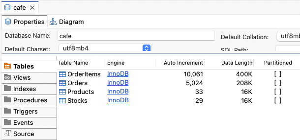
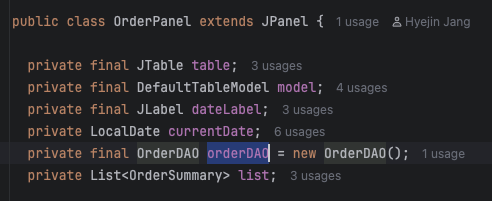
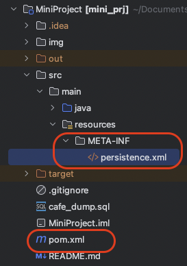
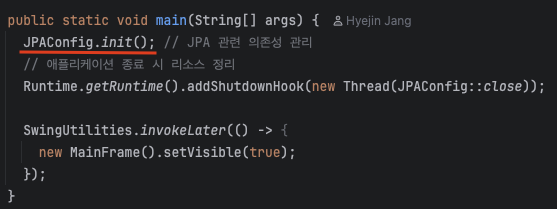
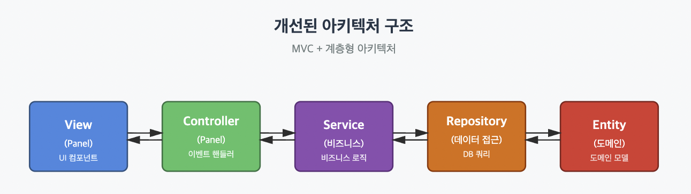
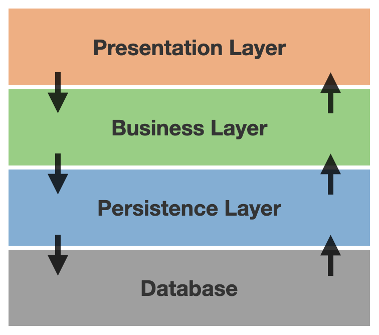

# 미니 프로젝트 개선

> Java Swing과 JDBC를 이용하여 **☕ 카페 재고 관리 프로그램**을 만들었습니다.
>
> JDBC는 데이터베이스 연결과 트랜잭션, 자원 해제를 매번 직접 관리해야 하며, 이로 인해 데이터 접근 코드와 비즈니스 로직이 밀접하게 결합되는 단점이 있습니다.
>
> JPA를 사용하면 Java 객체 중심으로 데이터베이스를 다룰 수 있고, SQL을 직접 작성하지 않아도 CRUD 작업과 연관관계 매핑을 쉽게 처리할 수 있습니다. 또한 1차 캐시와 변경 감지 기능 덕분에 성능 최적화가 가능하고, 코드 유지보수와 확장성이 훨씬 좋아집니다.
>
> 이번 til에서는 JDBC + DAO 구조으 프로젝트를 JPA를 사용하도록 변경하고, **객체지향 설계원칙 SOLID**에 맞추어 개선하는 과정을 공유하려고합니다.

## 1. 현재 미니 프로젝트 폴더 구조

미니 프로젝트는 간단한 재고 및 주문 관리 시스템으로, **JDBC를 직접 사용한 DAO 구조**로 작성되었습니다.

설명과 코드는 [github](https://github.com/aaxx98/java-study/tree/main/MiniProject)에서 확인할 수 있습니다.

### 구조

프로젝트는 다음과 같은 폴더 구조를 가집니다.

```
myProj/
 ┣ dao/
 ┃ ┣ StockDAO.java
 ┃ ┣ OrderDAO.java
 ┃ ┗ ProductDAO.java
 ┣ db/
 ┃ ┣ DBUtil.java
 ┃ ┗ DBConnection.java
 ┣ model/
 ┃ ┣ Product.java
 ┃ ┣ Stock.java
 ┃ ┣ OrderSummary.java
 ┃ ┗ OrderItemDetail.java
 ┣ panels/
 ┃ ┣ ProductPanel.java
 ┃ ┣ StockPanel.java
 ┃ ┣ OrderPanel.java
 ┃ ┗ dialogs/
 ┃   ┣ ProductAddDialog.java
 ┃   ┣ ProductEditDialog.java
 ┃   ┣ ProductDeleteDialog.java
 ┃   ┗ OrderDetailDialog.java
 ┣ frames/
 ┃ ┗ MainFrame.java
 ┗ Main.java
```

ERD는 다음과 같습니다.


프로젝트 폴더 루트의 `cafe_dump.sql`을 실행하면 cafe 데이터 베이스에 테이블과 데모 데이터들이 생성됩니다.



### DB 접근

이번 프로젝트의 목적은 데이터베이스와의 직접적인 연결과 SQL 제어 과정을 명확히 이해하는 것이었기 때문에, ORM을 사용하지 않고 JDBC 레벨에서 SQL을 직접 작성했습니다.

DB Connection 부분만 `db/DBConnection.java`에 작성하여 공유하고, 데이터 CRUD는 DAO 객체에 각각 SQL문으로 직접 작성되어있습니다.

### DAO

`OrderDAO`에서는 다음과 같이 `Connection`, `PreparedStatement`, `ResultSet`을 직접 다루며 SQL을 수행합니다.

모든 CRUD 작업마다 DB 연결, 쿼리 파라미터 처리에 필요한 `try-catch`문이 사용됩니다.

아래 코드는 OrderDAO의 insertOrder() 메서드로, 주문 생성부터 재고 차감까지 하나의 트랜잭션으로 처리합니다.

비즈니스 로직과 데이터 접근 로직이 강하게 결합되어있습니다. DB 접근 부분만 분리하는 것이 좋을 것 같습니다.

```java
  public void insertOrder(List<OrderItemDetail> items) {
    try (Connection conn = DBConnection.getConnection()) {
      conn.setAutoCommit(false);

      int orderId;

      // 주문 생성
      String orderSql = "INSERT INTO Orders(order_date) VALUES(CURDATE())";
      try (PreparedStatement ps = conn.prepareStatement(orderSql,
          Statement.RETURN_GENERATED_KEYS)) {
        ps.executeUpdate();
        try (ResultSet rs = ps.getGeneratedKeys()) {
          if (rs.next()) {
            orderId = rs.getInt(1);
          } else {
            throw new SQLException("주문 ID 생성 실패");
          }
        }
      }

      // 주문 항목 추가
      String itemSql = "INSERT INTO OrderItems(order_id, product_id, quantity, price) VALUES(?, ?, ?, ?)";
      try (PreparedStatement ps = conn.prepareStatement(itemSql)) {
        for (OrderItemDetail item : items) {
          ps.setInt(1, orderId);
          ps.setInt(2, item.productId);
          ps.setInt(3, item.quantity);
          ps.setInt(4, item.price);
          ps.addBatch();
        }
        ps.executeBatch();
      }

      // 재고 감소 처리
      String stockCheckSql = "SELECT stock_manage FROM Products WHERE id = ?";
      String stockUpdateSql = "UPDATE Stocks SET quantity = quantity - ? WHERE product_id = ?";
      try (PreparedStatement checkPs = conn.prepareStatement(stockCheckSql);
          PreparedStatement updatePs = conn.prepareStatement(stockUpdateSql)) {

        for (OrderItemDetail item : items) {
          checkPs.setInt(1, item.productId);
          try (ResultSet rs = checkPs.executeQuery()) {
            if (rs.next() && rs.getInt("stock_manage") == 1) {
              updatePs.setInt(1, item.quantity);
              updatePs.setInt(2, item.productId);
              updatePs.executeUpdate();
            }
          }
        }
      }
      conn.commit();
    } catch (SQLException e) {
      DBUtil.showSQLException(e, "주문 저장 중 오류");
      try {
        // 롤백 추가
        DBConnection.getConnection().rollback();
      } catch (SQLException rollbackEx) {
        System.err.println("롤백 실패: " + rollbackEx.getMessage());
      }
    }
  }
```

### Model

`model` 패키지의 클래스(`OrderItemDetail`, `OrderSummary` 등)는 DB 테이블 그대로가 아닌, **UI 페이지마다 필요한 정보를 담는 형태**로 구성했습니다.

각 화면에서 필요한 데이터만 받고, 보여주기 위해 엔티티를 단순화한 설계로, 빠른 프로토타이핑에 초점을 두었습니다.

```java
public class OrderItemDetail {

  public int productId;
  public String productName;
  public int quantity;
  public int price;

  public OrderItemDetail(int productId, String productName, int quantity, int price) {
    this.productId = productId;
    this.productName = productName;
    this.quantity = quantity;
    this.price = price;
  }
}
```

`model/OrderItemDetail.java`는 테이블로 명시되어 있지 않습니다. `OrderItem`과 `Stock` 두 엔티티를 혼재하여 사용하고 있습니다.

데이터 model이라기 보다는, dto에 가까운 형태입니다. model의 역할과 dto의 역할이 혼재되어 있으므로 분리가 필요합니다.

model 클래스 변수를 public으로 선언한 것은, dto의 객체가 처음 생성된 후에 읽기 외에 새로 변수를 변경하거나 하는 로직이 없기 때문에, getter를 반복하여 작성하는 것을 피하려는 의도였습니다.

하지만 추후에 캡슐화, 데이터 은닉을 중요하게 여기는 자바의 속성에 위배되는 코드라는 것을 깨달았고,

Java 16 이후 문법에서는 `record`로 선언하여 불변성을 보장할 수 있다는 것을 알게 되었습니다.

---

## 2. JDBC + DAO 구조의 문제점

JPA로 전환하기 전에, 현재 JDBC + DAO 구조에서 발견되는 주요 문제점을 정리해보겠습니다.

### 반복적인 Boilerplate 코드

모든 DAO 메서드마다 `Connection`, `PreparedStatement`, `ResultSet`을 생성하고 닫는 코드가 반복됩니다.

`SQLException`을 catch하고 처리하는 부분도 매번 반복됩니다. 예외 처리 로직이 바뀌면 모든 DAO를 일일이 수정해야 합니다.

DBMS 변경, SQL Dialect 변경 등 구조적 변화가 필요할 때 DAO 코드 전반을 수정해야 합니다.

```java
try (Connection conn = DBConnection.getConnection();
    PreparedStatement ps = conn.prepareStatement(sql)) {
  // 실제 비즈니스 로직
} catch (SQLException e) {
  DBUtil.showSQLException(e, "...");
}
```

### SQL 의존성과 데이터베이스 종속성

```java
String sql = """
    SELECT o.id, o.order_date, o.status, ...
    FROM Orders o
    JOIN OrderItems oi ON o.id = oi.order_id
    WHERE DATE(o.order_date) = ?
    ...
    """;
```

JDBC에서는 위와 같이 SQL이 DAO 내부에 직접 작성되어 있어, 테이블명이나 컬럼명이 변경되면 관련 DAO 코드를 모두 수정해야 합니다.

반면 JPA에서는 엔티티 클래스와 그 필드명을 기반으로 쿼리를 작성하므로, 데이터베이스가 아닌 객체 구조에 의존합니다.

즉, SQL의 종속성이 데이터베이스에서 도메인 모델로 옮겨가며, 데이터베이스 교체나 스키마 변경에도 유연하게 대응할 수 있습니다.

### DTO와 Entity의 혼재

`OrderItemDetail`처럼 UI 화면에 맞춘 DTO가 데이터 계층에서도 사용되고 있습니다. 이는 도메인 모델이 없고, 데이터 계층과 표현 계층이 강하게 결합되어 있음을 의미합니다.

`OrderItemDetail`은 UI를 위한 DTO인데, DAO의 `insertOrder`에서도 그대로 사용됩니다.

```java
public void insertOrder(List<OrderItemDetail> items) {
  // ...
}
```

실제로는 `Order`, `OrderItem`, `Product` 같은 도메인 엔티티가 존재해야 하고, 이들 간의 연관관계가 명확히 정의되어야 합니다.

### SOLID 원칙 위반

1. **Single Responsibility Principle (SRP) 위반**

- `OrderDAO.insertOrder()` 메서드를 보면, 하나의 메서드가 너무 많은 책임을 가지고 있습니다.
  - 주문 생성
  - 주문 항목 추가
  - 재고 확인 및 차감
  - 트랜잭션 관리
  - 예외 처리 및 롤백 처리

  ```java
    public void insertOrder(List<OrderItemDetail> items) {
    try (Connection conn = DBConnection.getConnection()) {
      conn.setAutoCommit(false);

      int orderId;

      // 주문 생성
      String orderSql = "INSERT INTO Orders(order_date) VALUES(CURDATE())";
      try (PreparedStatement ps = conn.prepareStatement(orderSql,
          Statement.RETURN_GENERATED_KEYS)) {
        ps.executeUpdate();
        try (ResultSet rs = ps.getGeneratedKeys()) {
          if (rs.next()) {
            orderId = rs.getInt(1);
          } else {
            throw new SQLException("주문 ID 생성 실패");
          }
        }
      }

      // 주문 항목 추가
      String itemSql = "INSERT INTO OrderItems(order_id, product_id, quantity, price) VALUES(?, ?, ?, ?)";
      try (PreparedStatement ps = conn.prepareStatement(itemSql)) {
        for (OrderItemDetail item : items) {
          ps.setInt(1, orderId);
          ps.setInt(2, item.productId);
          ps.setInt(3, item.quantity);
          ps.setInt(4, item.price);
          ps.addBatch();
        }
        ps.executeBatch();
      }

      // 재고 감소 처리
      String stockCheckSql = "SELECT stock_manage FROM Products WHERE id = ?";
      String stockUpdateSql = "UPDATE Stocks SET quantity = quantity - ? WHERE product_id = ?";
      try (PreparedStatement checkPs = conn.prepareStatement(stockCheckSql);
          PreparedStatement updatePs = conn.prepareStatement(stockUpdateSql)) {

        for (OrderItemDetail item : items) {
          checkPs.setInt(1, item.productId);
          try (ResultSet rs = checkPs.executeQuery()) {
            if (rs.next() && rs.getInt("stock_manage") == 1) {
              updatePs.setInt(1, item.quantity);
              updatePs.setInt(2, item.productId);
              updatePs.executeUpdate();
            }
          }
        }
      }
      conn.commit();
    } catch (SQLException e) {
      DBUtil.showSQLException(e, "주문 저장 중 오류");
      try {
        // 롤백 추가
        DBConnection.getConnection().rollback();
      } catch (SQLException rollbackEx) {
        System.err.println("롤백 실패: " + rollbackEx.getMessage());
      }
    }
  }
  ```

2. **Open/Closed Principle (OCP) 위반**

- 새로운 비즈니스 로직(예: 할인 적용, 포인트 적립)을 추가하려면 DAO 코드를 직접 수정해야 합니다. 확장에는 열려있지 않고, 수정에 닫혀있지도 않은 구조입니다.

3. **Dependency Inversion Principle (DIP) 위반**

- 상위 레벨 모듈(`OrderPanel`)이 하위 레벨 모듈(`OrderDAO`)에 직접 의존하고 있습니다. 추상화 계층이 없어 테스트가 어렵고, 구현체 교체가 불가능합니다.
  

---

## 3. JPA + SOLID 원칙 준수로 리팩토링

새로운 프로젝트 구조와 주요 변경사항은 다음과 같습니다.

1. **JPA Entity 작성**: `domain`에 JPA entity를 작성합니다. 기존 model은 DTO 역할에 가깝기 때문에 DTO로 변경합니다.
2. **Repository 패턴 도입**: DAO의 DB 접근 로직을 JPA `EntityManager` 사용하는 Repository로 교체하여 `repository`에 작성합니다.
3. **Service 계층 분리**: 비즈니스 로직을 DAO에서 분리하여 `service`에 작성합니다.
4. **의존성 주입(DI)**: service, repository는 인터페이스를 작성하고, 인터페이스를 상속받는 구현체를 작성합니다. `JPAConfig`에서 `service`와 `repository`를 생성하고 주입합니다.
5. **DTO 명시**: domain entity 클래스와 구별하기 위해 DTO 클래스명에 DTO를 붙여줍니다. DTO를 `record`로 선언하여 불변 객체로 만듭니다.

```
myProj/
 ┣ domain/
 ┃ ┣ Orders.java
 ┃ ┣ OrderItems.java
 ┃ ┣ Products.java
 ┃ ┗ Stocks.java
 ┣ repository/
 ┃ ┣ OrderRepository.java
 ┃ ┣ OrderRepositoryImpl.java
 ┃ ┣ ProductRepositoryImpl.java
 ┃ ┣ ProductRepository.java
 ┃ ┗ StockRepository.java
 ┃ ┗ StockRepositoryImpl.java
 ┣ service/
 ┃ ┣ OrderService.java
 ┃ ┣ OrderServiceImpl.java
 ┃ ┣ ProductService.java
 ┃ ┣ ProductServiceImpl.java
 ┃ ┗ StockService.java
 ┃ ┣ StockServiceImpl.java
 ┣ dto/
 ┃ ┣ OrderSummaryDTO.java
 ┃ ┗ OrderItemDetailDTO.java
 ┣ panels/
 ┃ ┣ ProductPanel.java
 ┃ ┣ StockPanel.java
 ┃ ┣ OrderPanel.java
 ┃ ┗ dialogs/
 ┃   ┣ ProductAddDialog.java
 ┃   ┣ ProductEditDialog.java
 ┃   ┣ ProductDeleteDialog.java
 ┃   ┗ OrderDetailDialog.java
 ┗ config/
   ┗ JPAConfig.java
```

---

프로젝트를 maven으로 전환하려면 `pom.xml`, `recourses`을 작성하고, 기존 프로젝트를 `src/main/java` 경로에 넣어주면 됩니다.



자세한 내용은 코드를 참고하길 바랍니다.

### 1) JPA Entity 작성

domain에 데이터 테이블을 기반으로 JAP Entity를 작성해줍니다.

기존 DTO는 UI 중심이었지만, domain은 데이터 구조 중심으로 로직을 작성하게 됩니다.

jpql을 작성하는 경우에도, 이 Entity 구조를 기반으로 작성하게 됩니다.

```java
@Entity
public class Orders {

  @Id
  @GeneratedValue(strategy = GenerationType.IDENTITY) // auto increase
  private int id;

  @Temporal(TemporalType.DATE)
  @Column(name = "order_date")
  private LocalDate orderDate;
  private boolean status;

  public Orders() {
  } // 기본생성자 - JPA에서 사용됨

  public Orders(LocalDate orderDate, boolean status) {
    this.orderDate = orderDate;
    this.status = status;
  }

  public int getId() {
    return id;
  }

  public void setId(int id) {
    this.id = id;
  }

  public LocalDate getOrderDate() {
    return orderDate;
  }

  public void setOrderDate(LocalDate orderDate) {
    this.orderDate = orderDate;
  }

  public boolean isStatus() {
    return status;
  }

  public void setStatus(boolean status) {
    this.status = status;
  }

  @Override
  public String toString() {
    return "Orders{" +
        "id=" + id +
        ", orderDate=" + orderDate +
        ", status=" + status +
        '}';
  }
}
```

### 2) Repository 계층 작성

JPA를 사용하면 기본 CRUD는 EntityManager가 제공하므로, Repository는 단순히 인터페이스로 선언하고 필요한 커스텀 쿼리만 추가합니다.

구현체는 EntityManager를 사용하여 CRUD를 수행하도록 작성합니다.

```java
public interface OrderRepository {

  void save(Orders order);

  Optional<Orders> findById(Integer id);

  List<Orders> findByOrderDate(LocalDate date);

  void updateStatus(Integer orderId, String status);
}
```

```java
package myProj.repository;

import jakarta.persistence.EntityManager;
import jakarta.persistence.TypedQuery;
import java.time.LocalDate;
import java.util.List;
import java.util.Optional;
import myProj.domain.Orders;

public class OrderRepositoryImpl implements OrderRepository {

  private final EntityManager em;

  public OrderRepositoryImpl(EntityManager em) {
    this.em = em;
  }

  @Override
  public void save(Orders order) {
    if (order.getId() == 0) {
      em.persist(order);
    } else {
      em.merge(order);
    }
  }

  @Override
  public Optional<Orders> findById(Integer id) {
    return Optional.ofNullable(em.find(Orders.class, id));
  }

  @Override
  public List<Orders> findByOrderDate(LocalDate date) {
    TypedQuery<Orders> query = em.createQuery(
        "SELECT o FROM Orders o WHERE o.orderDate = :date ORDER BY o.id DESC",
        Orders.class
    );
    query.setParameter("date", date);
    return query.getResultList();
  }

  @Override
  public void updateStatus(Integer orderId, String status) {
    Orders order = em.find(Orders.class, orderId);
    if (order != null) {
      order.setStatus(status);
    }
  }
}
```

### 3) Service 계층 작성

Service 계층은 비즈니스 로직을 담당하며, Repository를 의존성으로 주입받아 데이터를 처리합니다.

DAO에서 직접 데이터 접근과 비즈니스 로직을 함께 처리하던 구조에서 벗어나, 책임이 명확히 분리됩니다.

```java
public interface OrderService {

  List<OrderSummaryDTO> getOrdersByDate(LocalDate date);

  List<ProductDTO> getAllProducts();

  void createOrder(List<OrderItemDetailDTO> orderItems);

  List<OrderItemDetailDTO> getOrderItems(Integer orderId);

  void updateOrderStatus(Integer orderId, String status);
}
```

`OrderServiceImpl`은 주문 생성, 조회, 상태 변경 등 비즈니스 로직의 중심이 되는 클래스입니다.

`createOrder()`에서 여러 테이블에 접근해야하기 때문에 여러 Repository를 조합해서 하나의 트랜잭션을 처리하고 있습니다.

```java
public class OrderServiceImpl implements OrderService {

  private final OrderRepository orderRepository;
  private final ProductRepository productRepository;
  private final StockRepository stockRepository;
  private final EntityManager em;

  public OrderServiceImpl(
      OrderRepository orderRepository,
      ProductRepository productRepository,
      StockRepository stockRepository,
      EntityManager em) {
    this.orderRepository = orderRepository;
    this.productRepository = productRepository;
    this.stockRepository = stockRepository;
    this.em = em;
  }

  @Override
  public List<OrderSummaryDTO> getOrdersByDate(LocalDate date) {
    List<Orders> orders = orderRepository.findByOrderDate(date);

    return orders.stream()
        .map(order -> {
          int itemCount = order.getOrderItems().size();
          int totalPrice = order.getOrderItems().stream()
              .mapToInt(item -> item.getPrice() * item.getQuantity())
              .sum();

          return new OrderSummaryDTO(
              order.getId(),
              order.getOrderDate(),
              order.getStatus(),
              itemCount,
              totalPrice
          );
        })
        .collect(Collectors.toList());
  }

  @Override
  public List<ProductDTO> getAllProducts() {
    List<Products> products = productRepository.findAll();
    return products.stream()
        .map(product -> {
          return new ProductDTO(
              product.getId(),
              product.getName(),
              product.getCategory(),
              product.getPrice(),
              product.isStockManage()
          );
        })
        .collect(Collectors.toList());
  }

  @Override
  public void createOrder(List<OrderItemDetailDTO> items) {
    EntityTransaction tx = em.getTransaction();

    try {
      tx.begin();

      // 1. 주문 생성
      Orders order = new Orders();
      order.setOrderDate(LocalDate.now());
      order.setStatus("ORDER");

      // 2. 주문 항목 추가
      for (OrderItemDetailDTO dto : items) {
        Products product = productRepository.findById(dto.productId())
            .orElseThrow(() -> new IllegalArgumentException("상품을 찾을 수 없습니다."));

        OrderItems orderItem = new OrderItems();
        orderItem.setProduct(product);
        orderItem.setQuantity(dto.quantity());
        orderItem.setPrice(dto.price());

        order.addOrderItem(orderItem);

        // 3. 재고 차감 (재고 관리 대상인 경우만)
        if (product.isStockManage()) {
          Stocks stock = stockRepository.findByProductId(product.getId())
              .orElseThrow(() -> new IllegalStateException("재고 정보가 없습니다."));

          stock.decrease(dto.quantity());
        }
      }

      orderRepository.save(order);
      tx.commit();

    } catch (Exception e) {
      if (tx.isActive()) {
        tx.rollback();
      }
      throw new RuntimeException("주문 생성 중 오류 발생", e);
    }
  }
}
```

### 4) JPAConfig 설정

JPAConfig는 JPA 환경 초기화와 객체 간 의존성 관리를 담당하는 클래스입니다.

EntityManager와 각 Repository, Service의 의존성을 관리합니다.

```java
public class JPAConfig {

  private static EntityManagerFactory emf;
  private static EntityManager em;

  public static void init() {
    emf = Persistence.createEntityManagerFactory("cafeDB");
    em = emf.createEntityManager();
  }

  // Repository 생성
  public static OrderRepository orderRepository() {
    return new OrderRepositoryImpl(em);
  }

  public static ProductRepository productRepository() {
    return new ProductRepositoryImpl(em);
  }

  public static StockRepository stockRepository() {
    return new StockRepositoryImpl(em);
  }

  // Service 생성
  public static OrderService orderService() {
    return new OrderServiceImpl(
        orderRepository(),
        productRepository(),
        stockRepository(),
        em
    );
  }

...
  public static void close() {
    if (em != null && em.isOpen()) {
      em.close();
    }
    if (emf != null && emf.isOpen()) {
      emf.close();
    }
  }
}
```


Main에서 JPAConfig를 init하고,

패널(view) 생성 시 다음과 같이 사용합니다.

```java
    tabbedPane.addTab("상품관리", new ProductPanel(JPAConfig.productService()));
    tabbedPane.addTab("재고관리", new StockPanel(JPAConfig.stockService()));
    tabbedPane.addTab("주문관리", new OrderPanel(JPAConfig.orderService()));
```

### 5) DTO 작성

UI(view)단에서 데이터를 전달받거나 표시할 때는 Entity 대신 DTO를 사용합니다.

기존 model이 DTO처럼 사용되고 있었기 때문에, 위치와 클래스명을 DTO에 맞게 변경하였고,

DTO는 데이터 변환에 사용되어 한번 생성되면 내용이 바뀌어서는 안되므로, record로 선언하여 불변성을 유지하고, 계층 간 의존성을 최소화했습니다.

```java
public record OrderSummaryDTO(
    int id,
    LocalDate orderDate,
    String status,
    int itemCount,
    int totalPrice
) {

  public String getStatusString() {
    return switch (this.status) {
      case "ORDER" -> "주문";
      case "PREPARE" -> "준비중";
      case "COMPLETE" -> "완료";
      default -> "";
    };
  }
}
```

아래와 같이 Repository에서 조회 결과를 entity -> dto로 변환하거나,
Create, Update 작업 시 dto -> entity로 변환하여 사용합니다.

```java
  @Override
  public List<OrderSummaryDTO> getOrdersByDate(LocalDate date) {
    List<Orders> orders = orderRepository.findByOrderDate(date);

    return orders.stream()
        .map(order -> {
          int itemCount = order.getOrderItems().size();
          int totalPrice = order.getOrderItems().stream()
              .mapToInt(item -> item.getPrice() * item.getQuantity())
              .sum();

          return new OrderSummaryDTO(
              order.getId(),
              order.getOrderDate(),
              order.getStatus(),
              itemCount,
              totalPrice
          );
        })
        .collect(Collectors.toList());
  }

    @Override
  public void createOrder(List<OrderItemDetailDTO> items) {
    EntityTransaction tx = em.getTransaction();

    try {
      tx.begin();

      // 1. 주문 생성
      Orders order = new Orders();
      order.setOrderDate(LocalDate.now());
      order.setStatus("ORDER");

      // 2. 주문 항목 추가
      for (OrderItemDetailDTO dto : items) {
        Products product = productRepository.findById(dto.productId())
            .orElseThrow(() -> new IllegalArgumentException("상품을 찾을 수 없습니다."));

        OrderItems orderItem = new OrderItems();
        orderItem.setProduct(product);
        orderItem.setQuantity(dto.quantity());
        orderItem.setPrice(dto.price());

        order.addOrderItem(orderItem);

        // 3. 재고 차감 (재고 관리 대상인 경우만)
        if (product.isStockManage()) {
          Stocks stock = stockRepository.findByProductId(product.getId())
              .orElseThrow(() -> new IllegalStateException("재고 정보가 없습니다."));

          stock.decrease(dto.quantity());
        }
      }

      orderRepository.save(order);
      tx.commit();

    } catch (Exception e) {
      if (tx.isActive()) {
        tx.rollback();
      }
      throw new RuntimeException("주문 생성 중 오류 발생", e);
    }
  }
```

## 4. MVC와 계층형 아키텍처

이번에 리팩토링한 코드는 **MVC 패턴**을 기반으로 하되, **계층형 아키텍처(Layered Architecture)** 를 일부 적용한 구조입니다.

MVC는 화면, 로직, 데이터를 명확히 분리하는 구조이고, 계층형 아키텍처는 각 역할을 더 세분화해 의존성과 책임을 명확히 하는 방식입니다.

이번 구조에서는 MVC의 Controller와 Model 사이에 Service 계층을 중간에 두어 비즈니스 로직을 분리했습니다.
즉, UI는 화면과 입력만 담당하고, 데이터 처리나 트랜잭션은 모두 Service에서 담당합니다.



### MVC

MVC는 Model, View, Controller의 앞 글자를 딴 것으로 애플리케이션을 구성하는 요소를 역할에 따라 세 가지로 분리하는 설계 방식입니다.


리팩토링한 구조에서는 Panel이 Controller + View 역할을 동시에 수행하고 있습니다.

즉, 사용자의 버튼 클릭 → Service 호출 → 결과 반영 흐름이 MVC 구조로 동작하고 있습니다.

- **Model**: `Domain` 엔티티와 `Repository`가 데이터를 관리
- **View**: `Panel` (Swing UI 컴포넌트)이 화면을 표시
- **Controller**: `Panel`의 이벤트 핸들러가 사용자 입력을 처리하고 `Service`를 호출

### 계층형 아키텍쳐

계층형 아키텍처는 시스템을 여러 레이어로 나누어,
각 레이어가 명확한 역할과 책임을 가지도록 하는 설계 방식입니다.

각 계층은 바로 아래 계층에만 의존하며, 위로는 의존하지 않습니다.



현재 리팩토링한 구조에서는 Panel이 Service를 사용하고, Service는 Repository를, Repository는 Entity를 사용하고 있습니다.

- **Presentation Layer** (UI) - 사용자 입력 처리 및 화면 표시: `Panel`
- **Business Layer** (비즈니스 로직) - 비즈니스 로직 처리: `Service`
- **Persistence Layer** (데이터 접근) - 데이터베이스 접근: `Repository`
- **Domain Layer** (도메인 모델) - 핵심 데이터 구조 및 규칙 정의: `Entity`

## 정리

이번 리팩토링을 통해 다음을 실현했습니다.

- 유지보수성 향상: 계층별 책임이 명확해져 수정 범위를 최소화할 수 있었습니다.
- 확장성 확보: 새로운 기능 추가 시 기존 코드 변경을 최소화했습니다.
- 코드 품질 향상: SOLID 원칙 적용으로 객체지향적인 구조를 구현했습니다.
- 생산성 향상: JPA 덕분에 반복적인 JDBC 코드를 제거하고 개발 속도를 높일 수 있었습니다.

처음엔 다소 복잡해 보였지만, 계층을 분리하고 책임을 나누니 오히려 코드가 단순해지고 이해하기 쉬워졌습니다.
특히 도메인 엔티티가 스스로의 책임을 가지도록 설계하면서, 의도가 명확하고 직관적인 코드를 작성할 수 있게 되었습니다.
