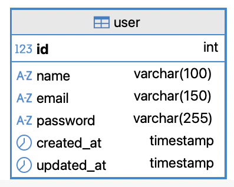
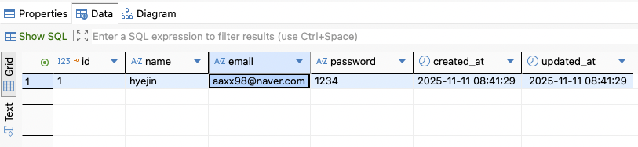
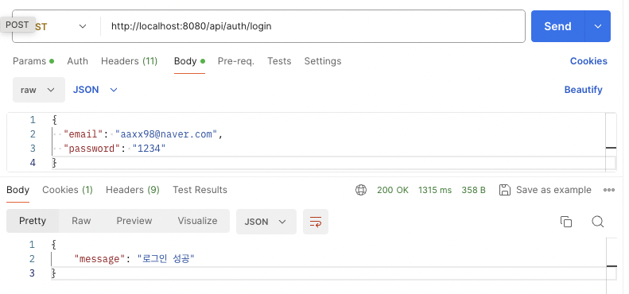
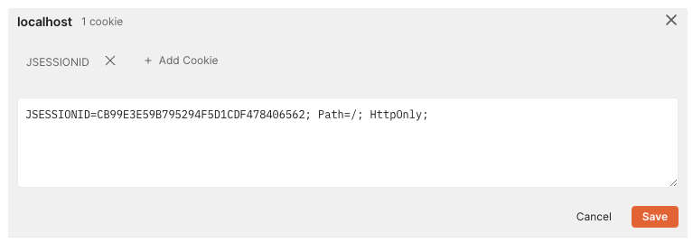
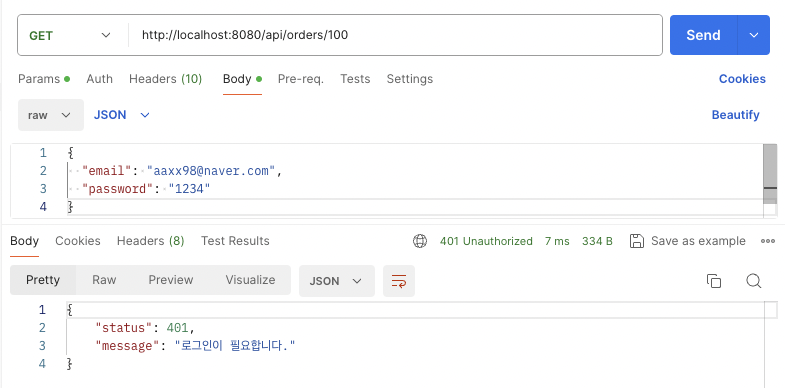
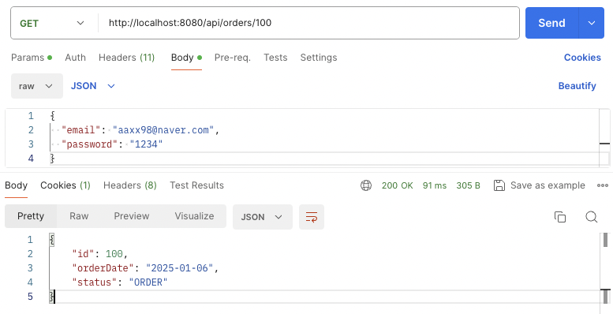

> 이번주는 Spring에서 로그인 처리와 간단한 CRUD를 처리할 수 있는 API를 작성해보았습니다.
>
> 저번에 Swing으로 작성했던 미니프로젝트를 Spring을 이용한 웹 서비스로 작성해보려고 합니다.
>
> 따로 회원 정보나 인증 부분이 없었기 때문에 추가적으로 user 테이블을 생성하여 작업했습니다.

전체 코드는 [Github repo](https://github.com/aaxx98/java-study/tree/main/Spring/CafeWeb)에서 확인할 수 있습니다.

# 1. 유저 정보 테이블 생성

cafe 데이터베이스에는 유저 정보를 저장하는 테이블이 따로 없기 때문에, 로그인 구현을 위해 추가해줍니다.

```sql
CREATE TABLE user (
    id INT AUTO_INCREMENT PRIMARY KEY,
    name VARCHAR(100) NOT NULL,
    email VARCHAR(150) NOT NULL UNIQUE,
    password VARCHAR(255) NOT NULL,
    created_at TIMESTAMP DEFAULT CURRENT_TIMESTAMP,
    updated_at TIMESTAMP DEFAULT CURRENT_TIMESTAMP ON UPDATE CURRENT_TIMESTAMP
);
```

erd에 다음과 같이 user 테이블이 추가됩니다.


기존 erd는 아래와 같습니다. user와 연관되는 부분은 없고 데이터 조회 api만 작성해두었습니다.


# 2. 세션을 이용하여 단순한 로그인 및 인증 확인 구현

## 로그인 API 작성

- **/api/auth/login (POST)**
  - 로그인 정보 `email`, `password`를 받습니다.
  - `email`로 사용자 목록에서 일치하는 데이터를 찾아 user에 저장합니다.
  - 검색된 user의 password와 입력받은 `password`를 비교하여 같으면 로그인 성공입니다.
  - user가 없거나, password 비교가 틀리면 로그인 실패입니다.

로그인에 성공하면 세션에 사용자 정보를 등록합니다.

```java
@Controller
@ResponseBody
@RequestMapping("/api/auth")
public class LoginController {

  private final LoginService loginService;

  public LoginController(LoginService loginService) {
    this.loginService = loginService;
  }

  @PostMapping("/login")
  public ResponseEntity<?> login(@RequestBody LoginRequest loginRequest,
      HttpServletRequest request) {
    Optional<UserDto> user = loginService.login(loginRequest);
    if (user.isPresent()) {
      HttpSession session = request.getSession(true); // 없으면 새로 생성
      session.setAttribute("userDto", user);
      return ResponseEntity.ok(Map.of("message", "로그인 성공"));
    }
    return ResponseEntity.status(HttpStatus.UNAUTHORIZED)
        .body(Map.of("message", "아이디 또는 비밀번호 오류"));
  }
}
```



로그인 정보를 가진 data를 미리 user 테이블에 등록해 두어야 로그인 할 수 있습니다.



postman으로 로그인 요청을 전송하면 위와 같이 로그인에 성공하는 것을 확인할 수 있습니다.



로그인 요청 후, postman의 Cookies를 확인하면 `session.setAttribute("userDto", user);`로 등록한 세션이 생성되어있는 것을 확인할 수 있습니다.

### 세션의 동작 원리

login 메소드에서, 아래 내용은 세션을 생성하고, userDto라는 이름으로 user 객체 정보를 세션에 할당하고 있습니다.

```java
HttpSession session = request.getSession(true);
session.setAttribute("userDto", user);
```

`HttpSession`은 서버(웹 애플리케이션) 내부에서 관리되는 사용자별 상태 저장 객체입니다.

클라이언트가 요청을 보내면, 이 요청 정보는 서블릿 컨테이너가 관리하는 `HttpServletRequest` 객체(`request`)를 통해 확인할 수 있습니다.

`request.getSession(true)`으로 현재 요청을 보낸 클라이언트에 대한 세션을 생성하고, 세션을 식별할 세션 ID (JSESSIONID)를 발급합니다.

서버는 응답 헤더에 아래와 같이 세션 ID를 담아서 클라이언트에게 쿠키를 내려보냅니다.

```
Set-Cookie: JSESSIONID=ABC123DEF456; Path=/; HttpOnly
```

쿠키를 전달 받은 클라이언트는 이 쿠키를 저장해두고,
다음에 같은 도메인으로 요청을 보낼 때 자동으로 쿠키를 붙여서 요청을 보냅니다.

```
Cookie: JSESSIONID=ABC123DEF456
```

로그인이 되어있는지 확인하려면, 클라이언트에서 보낸 요청으로부터 세션 ID를 받아서 서버 내부 세션 저장소의 세션 데이터가 존재하는지 확인해보면 됩니다.

> 기본적으로 서버 재시작 시 세션도 함께 사라집니다. RAM에 저장되는 정보이기 떄문에, 변수와 같이 관리됩니다.
>
> 서버가 잠깐 종료되었다가 재시작해도 세션 유지가 필요하면 Redis와 같은 외부 세션 스토리지를 써야 합니다.

## API 요청 시, 로직 실행 전 인증 여부 확인

로그인 API에서 세션에 user 정보를 등록했습니다. 이제 모든 API 마다 세션을 확인하는 로직을 추가해야 할까요?

공통 메소드로 정의해두고, API 로직 실행 전에 인증을 확인할 수 있지만,

컨트롤러가 실행되기 전, 공통 로직을 정의하는 방식으로 효율적으로 구현할 수 있습니다.

### Interceptor를 활용한 인증 처리

`HandlerInterceptor`를 활용하면 Spring MVC에서 컨트롤러가 실행되기 전후에 공통 로직을 삽입할 수 있습니다.

로그인 상태 확인, 권한 체크, 로깅 등 모든 API 요청에 공통적으로 적용할 수 있는 기능을 구현할 때 유용합니다.

```java
@Component
public class LoginInterceptor implements HandlerInterceptor {

  @Override
  public boolean preHandle(HttpServletRequest request, HttpServletResponse response, Object handler)
      throws Exception {
    HttpSession session = request.getSession(false); // 세션 가져오기, 없으면 null
    if (session != null && session.getAttribute("userDto") != null) {
      return true; // 로그인 되어 있음
    }
    // 로그인 안 되어 있으면 401 에러 반환
    response.setContentType("application/json"); // JSON 형식
    response.setCharacterEncoding("UTF-8");       // 한글 깨짐 방지
    response.setStatus(HttpServletResponse.SC_UNAUTHORIZED); // 401

    // JSON 문자열 작성
    String json = "{\"status\":401, \"message\":\"로그인이 필요합니다.\"}";
    response.getWriter().write(json);
    response.getWriter().flush();
    return false; // 컨트롤러 실행 중단
  }
}
```

**LoginInterceptor**

- 모든 API 요청에 대해 **사용자의 로그인 상태**를 확인합니다.
- 세션에 `userDto` 정보가 존재하면 요청을 정상적으로 컨트롤러로 전달합니다.
- 세션 정보가 없으면, **401 Unauthorized 응답**과 함께 로그인 필요 메시지를 반환하고 요청 처리를 중단합니다.
- 이를 통해 개별 컨트롤러마다 로그인 체크 로직을 반복 작성할 필요가 없습니다.

```java
@Configuration
public class WebConfig implements WebMvcConfigurer {

  @Autowired
  private LoginInterceptor loginInterceptor;

  @Override
  public void addInterceptors(InterceptorRegistry registry) {
    registry.addInterceptor(loginInterceptor)
        .addPathPatterns("/**")
        .excludePathPatterns(
            "/api/auth/login",
            "/api/user/register");
  }
}
```

**WebConfig 역할**

- `LoginInterceptor`를 **Spring MVC에 등록**하고, 적용 범위를 설정합니다.
- `/api/auth/login`, `/api/user/register` 등 로그인이나 회원가입과 같이 인증이 필요 없는 API 경로는 인터셉터 적용에서 **제외**합니다.
- 나머지 모든 API 요청은 인터셉터에서 로그인 여부를 확인하도록 구성됩니다.

---

인터셉터를 설정하고, 로그인 하지 않은 채로 다른 api를 호출하면 다음과 같이 401 코드와 메세지를 반환합니다.



로그인한 뒤, session이 등록되었을 때 api를 호출하면 Controller에 정의된 메소드가 호출되며 다음과 같이 response를 반환합니다.



# 3. 개선할 점

세션을 통해 간단히 로그인과 인증을 구현해보았습니다.

하지만 몇가지 아쉬운 점이 있습니다. 차차 개선해나가며 다음 TIL에서 이어서 작성하도록 하겠습니다.

1. **보안 취약점:** 비밀번호를 평문으로 저장하고 있어 보안에 취약합니다. 암호화가 필요합니다.
2. **세션 만료 시간, 동시 로그인 제한** 등의 고려가 부족합니다.
3. **JWT 전환:** 모바일 웹 개발이나 MSA 환경을 고려하여 JWT 기반 인증 방식으로 전환

# 마무리

세션 기반 로그인 내용을 정리해보았습니다. 이번 구현을 통해 다음을 배울 수 있었습니다.

1. **HTTP의 Stateless 특성:** HTTP는 기본적으로 상태를 유지하지 않지만, 쿠키와 세션을 통해 상태 관리가 가능합니다.
2. **HandlerInterceptor의 유용성:** 공통 로직을 중앙에서 관리하여 코드 중복을 제거할 수 있습니다.
3. **인증의 기본 원리:** 토큰 기반 인증으로 발전하기 전에 세션 기반 인증의 원리를 확실하게 이해했습니다.

다음 단계로는 비밀번호 암호화를 적용하고, 이후 JWT 기반 인증으로 발전시켜 나갈 예정입니다.
