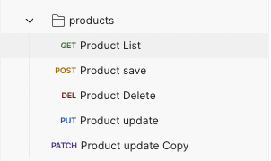
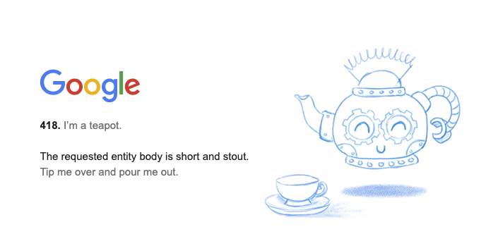
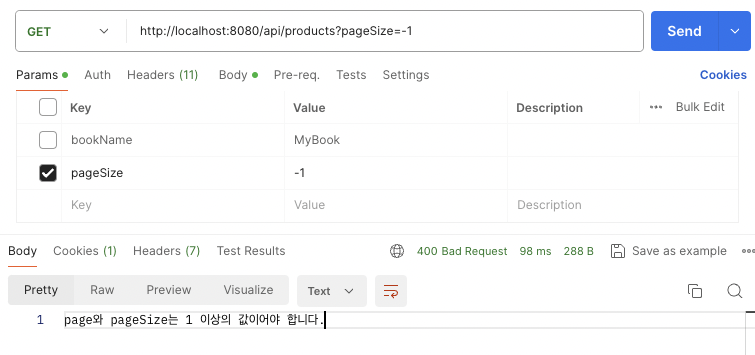
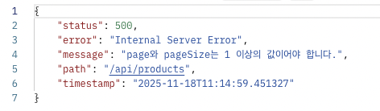
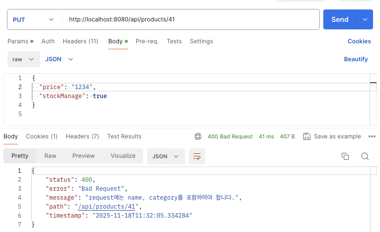
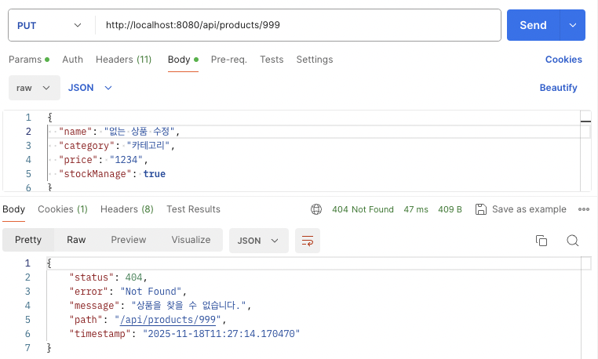
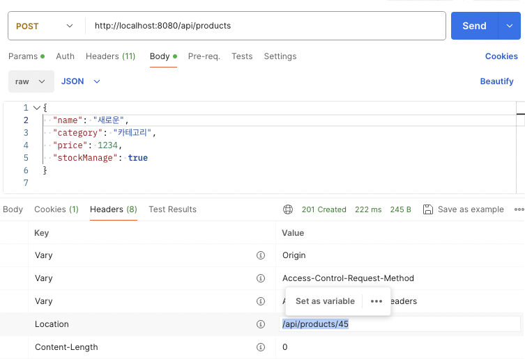

> 오늘은 Spring을 이용하여 RESTful API를 설계하고, 컨트롤러에서의 HTTP 메서드 처리 방식과  
> `ResponseEntity`로 상태 코드를 반환하는 방법, 그리고 글로벌 예외 처리 구조를 정리해보았습니다.

---

# 1. RESTful API

REST(Representational State Transfer)는 **리소스를 URI로 표현하고**,  
해당 리소스에 대한 행위는 **HTTP 메서드(GET, POST, PUT, PATCH, DELETE)** 로 구분하는 구조입니다.

예를 들어 `/api/products`라는 URI는 ‘상품’이라는 리소스를 나타내며,  
여기에 다양한 HTTP 메서드를 조합해 리소스를 조회, 생성, 수정, 삭제할 수 있습니다.

## 주요 HTTP 메서드

### **GET**

- 리소스 조회(Read)
- 서버의 상태를 변경하지 않는 안전한 메서드
- 예: 상품 목록 조회, 상품 상세 조회

### **POST**

- 리소스 생성(Create)
- 서버에 새로운 데이터를 추가
- 예: 상품 등록
- 일반적으로 **201 Created** 상태 코드와 Location 헤더 반환

### **PUT**

- 리소스 전체 수정(Update)
- 해당 리소스를 새로운 내용으로 완전히 교체하는 개념
- 예: 상품 전체 정보 수정
- 이미 존재하는 리소스가 아니면 404 반환하는 방식이 일반적

### **PATCH**

- 리소스 부분 수정(Partial Update)
- 전체가 아니라 **일부 필드만 수정**할 때 사용
- 예: 상품의 가격만 변경, 재고만 업데이트
- PUT보다 가볍고 변경 의도를 명확하게 표현할 수 있음

### **DELETE**

- 리소스 삭제(Delete)
- 요청이 성공해도 보통 응답 본문은 비우고 **204 No Content**로 반환하는 것이 REST 관례

RESTful API는 다음 원칙을 따릅니다.

- **명확한 자원 식별:** `/products/3`은 id가 3인 상품을 의미합니다.
- **HTTP 메서드에 따른 행위 분리:** GET(조회), POST(등록), PUT(수정), DELETE(삭제)
- **표준 상태 코드 사용:** 200, 201, 400, 404, 500 등
- **Stateless:** 서버는 클라이언트의 상태를 저장하지 않고 요청 기반으로 처리합니다.

---

# 2. Controller에서 REST API 작성

Spring에서는 `@RestController` 또는 `@Controller + @ResponseBody` 조합을 사용하여 JSON 기반 응답을 반환합니다.

상품 도메인을 기준으로 다음과 같은 컨트롤러를 구성했습니다.



```java
@Controller
@ResponseBody
@RequestMapping("/api/products")
public class ProductController {

  private final ProductService productService;

  public ProductController(ProductService productService) {
    this.productService = productService;
  }

  @GetMapping
  public ResponseEntity<?> getProductList(@ModelAttribute PageRequestDto requestDto) {
    if (requestDto.getPage() < 1 || requestDto.getPageSize() < 1) {
        return ResponseEntity
          .badRequest()
          .body("page와 pageSize는 1 이상의 값이어야 합니다.");
    }
    ProductListDto listDto = productService.getProductList(requestDto);

    return ResponseEntity.ok(listDto);
  }

  @DeleteMapping("/{id}")
  public ResponseEntity<Void> deleteProduct(@PathVariable int id) {
    boolean deleted = productService.deleteById(id);
    if (!deleted) {
      return ResponseEntity.notFound().build();
    }
    return ResponseEntity.noContent().build();
  }

  @PostMapping
  public ResponseEntity<Void> saveProduct(@RequestBody ProductDto product) {
    int createdId = productService.createProduct(product);
    URI location = URI.create("/api/products/" + createdId);
    return ResponseEntity.created(location).build();
  }

  @PutMapping("/{id}")
  public ResponseEntity<?> updateProduct(@PathVariable int id, @RequestBody ProductDto product) {
    boolean updated = productService.updateProduct(id, product);
    if (!updated) {
      return ResponseEntity.notFound().build();
    }
    return ResponseEntity.noContent().build();
  }

  @PatchMapping("/{id}/stock")
  public ResponseEntity<?> patchStockQuantity(
      @PathVariable int id, @RequestBody StockUpdateDto stock) {
    boolean updated = productService.updateStock(id, stock);
    if (!updated) {
      return ResponseEntity.notFound().build();
    }
    return ResponseEntity.noContent().build();
  }
}
```

## getProductList (GET: 상품 목록 조회)

- `@GetMapping`
  - HTTP GET 요청 처리
  - 주로 조회(Read) 작업에서 사용하며, 요청 본문 없이 URL 파라미터만으로 처리

- `@ModelAttribute`
  - 쿼리스트링(`?page=1&pageSize=10`) 형태의 요청 파라미터를 DTO로 자동 바인딩
  - GET 요청에서 페이징, 검색 조건 등을 DTO로 받을때 사용

## saveProduct (POST: 상품 등록)

- `@PostMapping`
  - HTTP POST 요청 처리
  - 새로운 리소스를 생성할 때 사용

- `@RequestBody`
  - HTTP 요청 Body(JSON)를 ProductDto로 변환하여 전달
  - JSON → DTO 자동 매핑에 사용

## updateProduct (PUT: 상품 수정)

- `@PutMapping("/{id}")`
  - HTTP PUT 요청 처리
  - 리소스를 수정하거나 교체할 때 사용
  - URL 경로의 `{id}`를 통해 수정 대상 리소스 지정

- `@PathVariable`
  - URI 경로 변수 `{id}`의 값을 메서드 파라미터로 매핑
  - `/api/products/3` → id = 3 과 같이 자동 매핑

- `@RequestBody`
  - 요청 Body(JSON)를 ProductDto로 변환하여 수정할 데이터 전달

## patchStockQuantity (PATCH: 상품 재고 일부 수정)

- `@PatchMapping("/{id}/stock")`
  - HTTP PATCH 요청 처리
  - **리소스의 일부 필드만 부분적으로 수정할 때 사용**
  - URL 경로의 `{id}`를 통해 재고를 수정할 상품 지정
- `@PathVariable`
  - URI 경로 변수 `{id}` 값을 메서드 파라미터로 매핑
  - `/api/products/3/stock` 요청 시 `id = 3` 으로 전달
- `@RequestBody`
  - 요청 Body(JSON)를 `StockUpdateDto`로 변환하여
    수정할 재고 필드(예: quantity 변경)를 전달
  - 전체 ProductDto를 보내는 것이 아닌,
    **변경이 필요한 필드만 포함된 DTO**를 사용한다는 점에서 PUT과 구분됨

## deleteProduct (DELETE: 상품 삭제)

- `@DeleteMapping("/{id}")`
  - HTTP DELETE 요청 처리
  - 특정 리소스를 삭제할 때 사용

- `@PathVariable`
  - URL 경로 `/api/products/{id}`에서 id 값을 추출하여 메서드 파라미터로 매핑
  - 삭제할 리소스의 식별자로 사용

---

# 3. ResponseEntity를 활용한 상태 코드 반환

- `ResponseEntity.ok(data)` → 200 OK
- `ResponseEntity.badRequest().body("잘못된 요청")` → 400 Bad Request
- `ResponseEntity.notFound().build()` → 404 Not Found
- `ResponseEntity.status(HttpStatus.CREATED).build()` → 201 Created

상태 코드를 명확히 지정함으로써 클라이언트가 응답을 정확히 해석할 수 있게 해줍니다.

## HTTP 상태코드

각 상태코드의 의미는 다음과 같습니다. 상황에 맞는 상태 코드를 사용하면 API의 의도를 더 명확하게 전달할 수 있습니다.

**200 OK**  
요청이 정상적으로 처리됨. GET, PUT, DELETE, POST 등 성공 시 공통적으로 사용.

**201 Created**  
리소스가 성공적으로 생성됨. 보통 POST 요청 성공 시 사용.

**204 No Content**  
요청은 성공했지만 반환할 데이터가 없음. DELETE 성공 시 자주 사용.

**400 Bad Request**  
클라이언트가 잘못된 요청을 보냄. 파라미터 누락, 타입 오류 등.

**401 Unauthorized**  
인증이 필요한데 인증되지 않은 경우. 세션/토큰 없음.

**403 Forbidden**  
인증은 되었으나 해당 리소스에 접근할 권한이 없음.

**404 Not Found**  
요청한 리소스를 찾을 수 없음.

**409 Conflict**  
요청이 서버의 현재 상태와 충돌함. 중복 데이터 등에서 발생 가능.

**422 Unprocessable Entity**  
요청은 문법적으로 맞지만 의미적으로 처리할 수 없음. (DTO 검증 실패 등)

**500 Internal Server Error**  
서버 내부에서 처리 중 예기치 못한 오류 발생.

**502 Bad Gateway**  
서버가 위임받은 백엔드 서버로부터 잘못된 응답을 받음.

**503 Service Unavailable**  
서버가 현재 요청을 처리할 준비가 되어 있지 않음. 과부하 또는 점검.

**504 Gateway Timeout**  
서버가 다른 서버로부터 응답을 제때 받지 못함.

**+** 418 I'm a teapot이라는 상태코드도 있습니다. 만우절 장난으로 만들어졌다고 합니다.

[google.com/teapot](https://www.google.com/teapot)에 접속하면 teapot 에러 페이지를 볼 수 있습니다.



## 현재 구조의 문제점

현재 구조에서는 Service에서 성공 여부를 boolean으로 반환하고, Controller에서 해당 값을 기반으로 HTTP 응답 코드를 분기하여 처리하고 있습니다.

Service의 내부 코드를 보면 아래와 같습니다. update가 성공 여부에 따라 boolean을 반환하고 있습니다.

```java
  @Transactional
  public boolean updateProduct(int id, ProductDto product) {
    product.setId(id);

    if (product.isStockManage()) {
      int productId = product.getId();
      StockDto existStock = stockDao.findByProductId(productId);
      if (existStock == null) {
        StockDto stock = new StockDto();
        stock.setProductId(productId);
        stockDao.initStock(stock);
      }
    }
    return productDao.updateProduct(product) > 0;
  }
```

이렇게 작성했을 때 발생하는 문제는 아래와 같습니다.

- **boolean 값 하나로는 실패한 이유를 구체적으로 표현할 수 없습니다.**
  다양한 오류 상황이 동일한 false에 묶여 Controller는 정확한 상태 코드를 판단할 수 없습니다.
- **Service에서 다른 형태의 값을 반환하더라도 Controller에서 분기 처리해야 하므로 유지보수가 복잡해집니다.**
  로직이 확장될수록 Controller가 불필요하게 비즈니스 조건까지 해석하게 됩니다.
- **Service 메소드가 정상적으로 값을 반환하면, 문제 상황이 발생해도 트랜잭션이 그대로 커밋됩니다.**
  예외가 발생하지 않는 구조에서는 트랜잭션 롤백이 일어나지 않아 데이터 정합성이 깨질 수 있습니다.

또한 Controller에서 다음과 같이 String으로만 에러 메세지를 보여주고있습니다.


Controller의 분기 처리를 줄이고, Service에서 예외를 발생시키는것으로 통일하고,

예외가 발생했을 때, 다음과 같은 형태로 에러 메세지를 반환할 수 있도록 개선해보도록 하겠습니다.



## 개선 방향

1. **실패 상황은 예외로 명확하게 표현합니다.**

   비즈니스 오류와 시스템 오류를 구분할 수 있도록 CustomException을 정의하고, Service에서는 실패 조건이 발생하면 boolean 대신 예외를 던지도록 변경합니다.

2. **Controller는 성공 응답만 처리하고, 실패 응답은 전부 GlobalExceptionHandler에서 intercept하여 처리합니다.**

   이렇게 하면 Controller는 로직 분기 없이 HTTP 상태 코드만 반환하는 단순한 구조가 되고, 실패 응답은 예외 타입별로 일관된 형식(JSON)으로 관리할 수 있습니다.

3. **트랜잭션은 예외가 발생할 때 자동으로 롤백되도록 유지합니다.**

   Service에서 예외를 던지면 Spring의 트랜잭션 관리에 따라 롤백되므로, “실패했는데 커밋되는 상황”을 방지할 수 있습니다.

# 4. `@RestControllerAdvice`를 이용한 예외처리 핸들러 작성

Spring에서는 `@RestControllerAdvice`를 사용해 애플리케이션 전역의 예외를 한 곳에서 처리할 수 있습니다.
이를 통해 각 Controller에서 중복되는 에러 처리 코드를 작성할 필요가 없고, 모든 API가 동일한 형태의 에러 응답을 제공하도록 표준화할 수 있습니다.

아래는 기본적인 전역 예외 처리기입니다.

- **`Exception.class`는 모든 예외의 부모 타입**이므로, 어떤 예외가 발생하든 이 메서드가 처리합니다.
- **전역 예외 처리의 최종 fallback**이며, 다른 핸들러에서 처리하지 못한 예외를 모두 잡습니다.
- **발생한 예외를 500 Internal Server Error 형태의 JSON 응답으로 변환**합니다.
- **요청 경로, 메시지를 ErrorResponse로 담아 일관된 오류 포맷을 유지합니다.**

```java
@RestControllerAdvice
public class GlobalExceptionHandler {

  @ExceptionHandler(Exception.class)
  public ResponseEntity<ErrorResponse> handleAllExceptions(
      Exception ex,
      HttpServletRequest request) {

    ex.printStackTrace();

    ErrorResponse response = new ErrorResponse(
        500,
        "Internal Server Error",
        ex.getMessage(),
        request.getRequestURI()
    );

    return ResponseEntity
        .status(HttpStatus.INTERNAL_SERVER_ERROR)
        .body(response);
  }
}
```

## Error Response 형식 정의

일관된 형식으로 에러 메세지를 반환하기 위해 `ErrorResponse` 형식을 정의해두고 사용하였습니다.

```java
@Getter
@Setter
public class ErrorResponse {

  private int status;
  private String error;
  private String message;
  private String timestamp;
  private String path;

  public ErrorResponse(int status, String error, String message, String path) {
    this.status = status;
    this.error = error;
    this.message = message;
    this.timestamp = java.time.LocalDateTime.now().toString();
    this.path = path;
  }
}
```

## Custom Exception 타입 정의

아래와 같이 자주 사용되는 Custom Exception을 정의하였습니다.

- 데이터 없음을 표시하는 404는 `NotFoundException`으로 처리
- 잘못된 Request 형식이 들어왔을 때 400은 `BadRequestException`으로 처리

```java
public class BadRequestException extends RuntimeException {

  public BadRequestException(String message) {
    super(message);
  }
}

public class NotFoundException extends RuntimeException {

  public NotFoundException(String message) {
    super(message);
  }
}
```

## Service에서 예외 throw

서비스에서는 문제가 발생하면 적절한 Exception 형식으로 에러를 throw하변 됩니다.

```java
  @Transactional
  public void updateProduct(int id, ProductDto product) {
    if (product.getName() == null || product.getCategory() == null) {
      throw new BadRequestException("request에는 name, category를 포함하여야 합니다.");
    }

    ProductDto exist = productDao.findById(id);
    if (exist == null) {
      throw new NotFoundException("상품을 찾을 수 없습니다.");
    }

    product.setId(id);

    if (product.isStockManage()) {
      StockDto stock = stockDao.findByProductId(id);
      if (stock == null) {
        stock = new StockDto();
        stock.setProductId(id);
        stockDao.initStock(stock);
      }
    }

    int updated = productDao.updateProduct(product);
    if (updated == 0) {
      throw new IllegalStateException("상품 수정에 실패했습니다.");
    }
  }
```

## GlobalExceptionHandler에서 예외 타입에 따라 분기 처리

throw된 에러 처리를 위해 GlobalExceptionHandler에서 예외 타입에 따라 서로 다른 HTTP 상태 코드를 반환하도록 분기할 수 있습니다.

```java
@RestControllerAdvice
public
class GlobalExceptionHandler {

  @ExceptionHandler(NotFoundException.class)
  public ResponseEntity<ErrorResponse> handleNotFound(NotFoundException ex,
      HttpServletRequest request) {

    ErrorResponse error = new ErrorResponse(
        404,
        "Not Found",
        ex.getMessage(),
        request.getRequestURI()
    );

    return ResponseEntity.status(404).body(error);
  }

  @ExceptionHandler(BadRequestException.class)
  public ResponseEntity<ErrorResponse> handleBadReq(BadRequestException ex,
      HttpServletRequest request) {

    ErrorResponse error = new ErrorResponse(
        400,
        "Bad Request",
        ex.getMessage(),
        request.getRequestURI()
    );

    return ResponseEntity.status(400).body(error);
  }

  @ExceptionHandler(Exception.class)
  public ResponseEntity<ErrorResponse> handleGeneral(Exception ex,
      HttpServletRequest request) {

    ErrorResponse error = new ErrorResponse(
        500,
        "Internal Server Error",
        ex.getMessage(),
        request.getRequestURI()
    );

    return ResponseEntity.status(500).body(error);
  }
}
```

위와 같은 전역 예외 처리기를 작성해두고 활용하면 다음과 같은 장점이 있습니다.

- Controller에서는 오직 정상 응답만 처리하고, 오류는 예외로 전달하여 단순한 구조를 유지할 수 있습니다.
- 에러 응답 형식을 일관적으로 유지할 수 있어 클라이언트에서도 통합된 방식으로 처리할 수 있습니다.
- 에러 로그를 한 곳에서 관리할 수 있으므로 유지보수가 용이합니다.
- 서버 내부 오류가 클라이언트에게 HTML이나 서버 에러 페이지로 노출되지 않도록 보호합니다.

## 개선 결과 확인

Service에서 예외를 판단하고 throw하고있으므로, Controller 로직은 아래와 같이 단순해졌습니다.

```java
  @PutMapping("/{id}")
  public ResponseEntity<?> updateProduct(@PathVariable int id, @RequestBody ProductDto product) {
    productService.updateProduct(id, product);
    return ResponseEntity.noContent().build();
  }
```

이제 request에서 값이 누락되거나, 없는 데이터를 수정하려고 하는 경우 상황에 맞는 적절한 상태코드를 반환하고, 피드백을 담은 메세지를 반환할 수 있습니다.




---

# 5. POST 메소드 Location 헤더 반환

POST 요청으로 리소스를 생성할 때, RESTful한 응답 패턴은 아래와 같습니다.

1. **상태코드 201 Created 사용**
2. **Location 헤더 제공**

   서버가 생성한 리소스의 고유 경로를 클라이언트에게 알려주는 역할

3. **바디는 비워도 무관함**

   생성 결과의 위치만 알려주면 클라이언트가 이후 필요한 데이터를 직접 조회할 수 있음

현재 코드는 헤더에 생성된 product에 접근 가능한 경로를 알려주고 있지 않으므로 추가로 개선해줍니다.

아래와 같이 생성된 상품 데이터의 ID를 받아서 `location`을 생성하여 반환할 수 있습니다.

```java
  @PostMapping
  public ResponseEntity<Void> saveProduct(@RequestBody ProductDto product) {
    int createdId = productService.createProduct(product);
    URI location = URI.create("/api/products/" + createdId);
    return ResponseEntity.created(location).build();
  }
```

이 내용을 적용하고 POST 메소드를 호출하면, 생성된 id가 담긴 Location을 헤더에서 확인할 수 있습니다.



---

# 마무리

RESTful API 구조와 컨트롤러 설계 방식을 정리하며 다음 내용을 정리할 수 있었습니다.

1. **RESTful API의 핵심 원칙:** URI로 자원을 표현하고 HTTP 메서드로 행위를 구분하는 구조를 다시 명확히 이해할 수 있었습니다.
2. **ResponseEntity 활용:** 상태 코드와 응답 데이터를 일관성 있게 구성함으로써 API 응답을 더욱 명확하게 표현할 수 있었습니다.
3. **전역 예외 처리의 중요성:** 공통 예외 처리 로직을 중앙에서 관리하여 에러 응답 형식을 통일할 수 있고, 유지보수성을 높일 수 있음을 확인했습니다.
