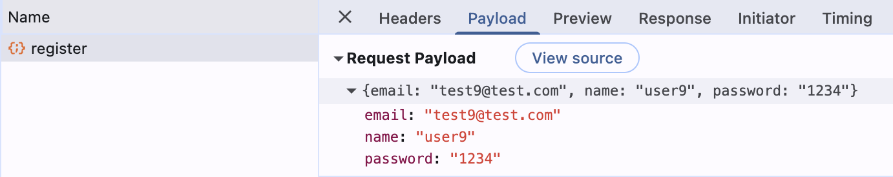
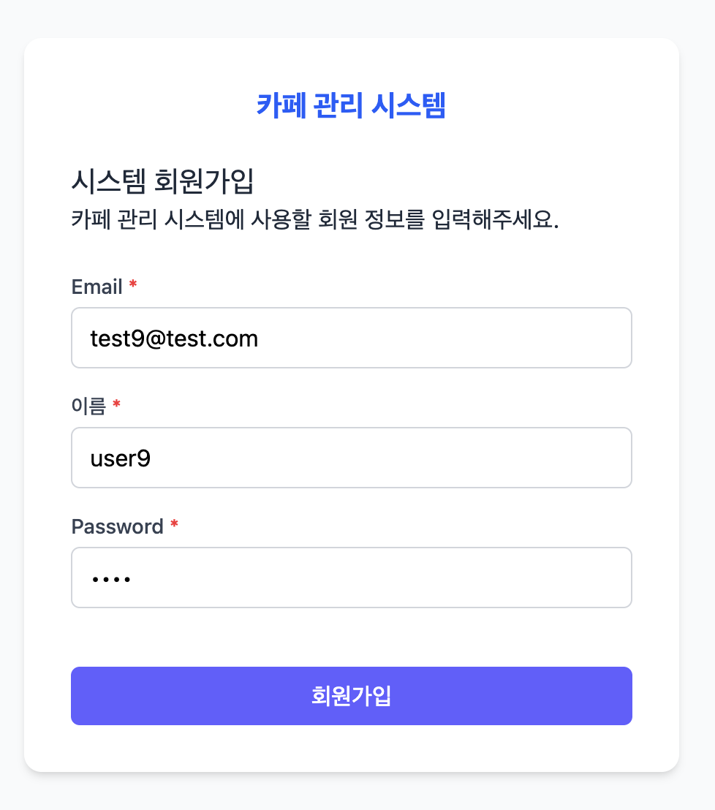
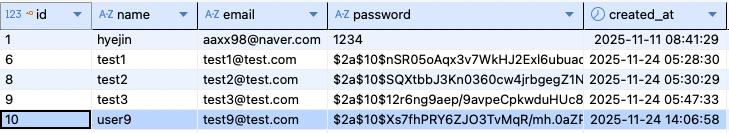
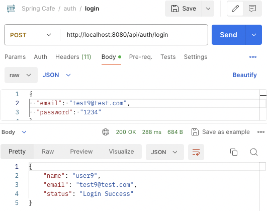
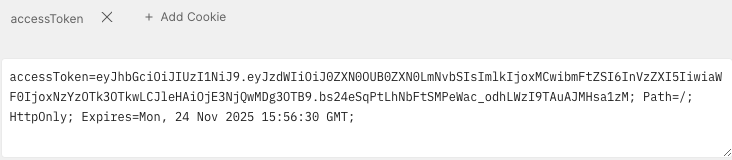
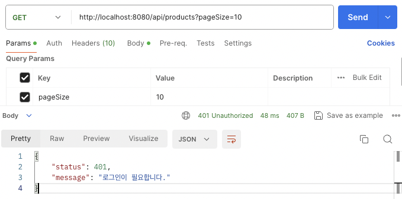

> 이번 주에는 저번에 작성했던 **세션 기반 로그인 방식**을 개선하여, **JWT 기반 인증 방식**으로 전환해보았습니다.
>
> 추가로 Spring Security를 이용하여 API 요청 단위로 사용자 인증 정보를 검증하도록 변경하였습니다.
>
> 또한 비밀번호를 암호화하여 안전하게 저장할 수 있도록 **Bcrypt 해싱**을 적용하고, 로그인 시 입력한 비밀번호를 복호화 없이 비교할 수 있도록 검증하는 로직도 추가했습니다.

전체 코드는 [Github repo](https://github.com/aaxx98/java-study/tree/main/Spring/CafeWeb)에서 확인할 수 있습니다.

# 1. 기존 세션 기반 로그인의 문제점

```java
  @PostMapping("/login")
  public ResponseEntity<?> login(@RequestBody LoginRequest loginRequest,
      HttpServletRequest request) {
      ...

      HttpSession session = request.getSession(true); // 없으면 새로 생성
      session.setAttribute("userDto", user); // 세션에 user 정보 저장
      return ResponseEntity.ok(Map.of("message", "로그인 성공"));

      ...
  }
```

세션 기반 인증은 `HttpSession`을 통해 세션에 사용자 정보를 저장하여 간단하게 구현할 수 있었지만 다음과 같은 문제점이 있습니다.

- **서버 메모리 의존성**
  - 세션 정보가 서버 메모리에 저장되기 때문에 서버 재시작 시 모든 세션이 초기화됩니다.
  - 세션 ID가 탈취될 경우 서버의 세션 저장소에 접근할 수 있어 사용자 정보 유출 가능성이 존재합니다.
    - 같은 세션 ID를 통해 다른 정보를 관리하는 경우 로그인 정보 뿐만 아니라 다른 데이터도 유출될 수 있습니다.
    - 예: 장바구니 정보를 세션에 저장하고 있을 때 - `session.setAttribute("cart", updatedCart);`
  - 로그인 사용자가 많아질수록 서버가 관리해야 하는 세션 수가 증가하여 메모리 사용량이 늘어나고 부하가 커집니다.

- ## **세션 기반은 Stateful하기 때문에 무상태 API 설계에 부적합**
  - 서버가 각 클라이언트의 상태(Session)를 보관해야 하므로 요청마다 동일 서버에 도달해야 합니다.
  - 서버 확장(스케일 아웃) 시 세션을 공유하기 위해 Redis 같은 외부 저장소 도입이 필요해 구조가 복잡해집니다.
  - MSA나 모바일/SPA 기반 환경에서 선호되는 Stateless API 방식과 잘 맞지 않습니다.

추가로, 현재 비밀번호를 그대로 저장하고 평문으로 비교하고 있기 때문에 회원가입 시 비밀번호를 암호화하여 저장해야합니다.

# 2. 개선 방향

## JWT 기반 인증 방식

- JWT(Json Web Token)는 사용자 인증 정보를 자체적으로 포함하는 토큰이며, 서버는 별도의 세션 상태를 저장하지 않는 Stateless 구조로 요청을 처리합니다.
- 토큰에는 사용자 식별자, 권한, 만료 시간 등의 정보가 포함되며, 서버는 서명(Signature)을 검증하여 위조 여부를 판단합니다.
- 로그인 후 발급된 JWT는 HttpOnly 쿠키에 저장되어 브라우저의 스크립트 접근을 차단하고, 이후 모든 요청마다 자동으로 쿠키를 통해 인증 검증이 수행됩니다.

**개선점**

- 서버가 세션 상태를 보관하지 않아 메모리 사용량이 감소합니다.
- 서버 확장 시 세션 공유를 고려하지 않아도 되어 구조가 단순해집니다.
- 토큰 만료 시간을 명시적으로 관리할 수 있어 인증 수명 제어가 용이합니다.
- 서버 내부의 세션 저장소가 없기 때문에 세션 하이재킹으로 인한 2차 피해가 없습니다.

---

## Spring Security 기반의 인증 처리

- `Security Filter Chain` 단계에서 JWT를 검증하여 컨트롤러에 진입하기 전에 요청을 차단할 수 있습니다.
- 커스텀 필터(JwtFilter)를 통해 쿠키에서 토큰을 추출하고 검증한 뒤, 정상적인 토큰일 경우 `SecurityContext`에 인증 정보를 등록합니다.
- API별 접근 제어를 설정 파일(`SecurityConfig`)에서 선언적으로 구성할 수 있어 인증 및 인가 관리가 체계적입니다.

**개선점**

- 인증 처리가 `Interceptor`보다 더 이른 단계에서 일관적으로 수행됩니다.
- 보안 관련 기능(CORS, CSRF, 권한, 인증 실패 처리 등)을 Spring Security 표준 방식으로 구성할 수 있습니다.
- 비즈니스 로직과 인증 로직이 분리되어 유지보수성이 향상됩니다.

---

## 비밀번호 암호화(Bcrypt)

- 사용자 비밀번호를 Spring Security의 `BCryptPasswordEncoder`로 해시하여 저장합니다.
- Bcrypt는 단방향 해시 방식이기 때문에 저장된 값은 복호화가 불가능하며, 비밀번호 비교는 `matches()` 메서드를 통해 안전하게 이루어집니다.
- 평문 저장 또는 단순 문자열 비교 방식에서 발생하는 보안 취약점을 제거할 수 있습니다.

**개선점**

- 비밀번호 유출 시 원본 비밀번호가 보호됩니다.
- 기본적인 회원 인증 보안 수준이 강화됩니다.

# 3. 개선 작업

## 의존성 추가

`pom.xml`에 Spring Security와 Java에서 JWT를 다룰수 있도록 하는 라이브러리인 JJWT 관련 의존성을 추가합니다.

```xml
    <dependency>
      <groupId>org.springframework.boot</groupId>
      <artifactId>spring-boot-starter-security</artifactId>
    </dependency>

    <!-- JJWT -->
    <dependency>
      <groupId>io.jsonwebtoken</groupId>
      <artifactId>jjwt-api</artifactId>
      <version>0.12.5</version>
    </dependency>
    <dependency>
      <groupId>io.jsonwebtoken</groupId>
      <artifactId>jjwt-impl</artifactId>
      <version>0.12.5</version>
      <scope>runtime</scope>
    </dependency>
    <dependency>
      <groupId>io.jsonwebtoken</groupId>
      <artifactId>jjwt-jackson</artifactId>
      <version>0.12.5</version>
      <scope>runtime</scope>
    </dependency>
```

## 회원가입 시 비밀번호 암호화(Bcrypt)

### PasswordEncoder Bean 등록

Spring Security와 관련된 설정은 `SecurityConfig`에서 관리합니다.

Spring Security에서 제공하는 `BCryptPasswordEncoder`를 Bean으로 등록합니다.

```java
@Configuration
public class SecurityConfig {

  @Bean
  public PasswordEncoder passwordEncoder() {
    return new BCryptPasswordEncoder();
  }
}
```

### 회원가입 시 암호화 된 비밀번호 저장

회원가입에 사용되는 UserService 코드의 일부입니다. request로 받은 비밀번호를 암호화하여 저장합니다.

```java
  public ResponseRegisterDto registerUser(UserDto user) {
    String encodedPassword = passwordEncoder.encode(user.getPassword()); // 비밀번호 암호화
    user.setPassword(encodedPassword);

    int inserted = userDao.registerUser(user);
    if (inserted <= 0) {
      throw new IllegalStateException("회원 등록에 실패했습니다.");
    }
    ResponseRegisterDto response = new ResponseRegisterDto();
    response.setName(user.getName());
    response.setEmail(user.getEmail());
    response.setStatus("Register Success");
    return response;
  }
```



> 회원가입 시 설정한 비밀번호는 평문으로 request body에 담겨 전송되지만,
>
> **HTTPS를 사용하면 전송 과정이 암호화**되기 때문에 중간에서 내용이 노출되지 않습니다.
>
> 따라서 서버는 안전하게 비밀번호를 수신한 뒤 Bcrypt로 해싱하여 저장할 수 있습니다.



회원가입 창에서 password를 1234로 설정하고, `api/user/register(POST)`를 호출하면, 아래와 같이 password가 암호화 되어 저장됩니다.



### 로그인 시 패스워드 비교

로그인 서비스에서 로그인 시 입력한 password와 DB에 저장된 암호화 된 password를 비교합니다.

스프링 시큐리티의 crypto `PasswordEncoder`의 `matches`를 이용하면, 평문과 암호가 같은지 비교해볼 수 있습니다.

`encoder.matches(loginInfo.getPassword(), userInfo.getPassword())`와 같이 사용합니다.

userInfo에는 암호화 된 비밀번호가, loginInfo는 request에 입력한 평문 비밀번호가 전달됩니다.

```java
  public LoginResponseDto login(LoginRequestDto loginInfo) {
    UserDto userInfo = loginDao.findUserByEmail(loginInfo.getEmail());
    if (userInfo == null) {
      throw new NotFoundException("가입되지 않은 사용자입니다.");
    }
    if (!encoder.matches(loginInfo.getPassword(), userInfo.getPassword())) {
      throw new UnauthorizedException("로그인 정보가 일치하지 않습니다.");
    }
    ...
  }
```

## JWT 토큰 발행 및 인증 확인

### `application.properties` 설정

JWT의 서명(Signature)에 사용될 비밀키를 `jwt.secret`에 설정합니다.

HMAC-SHA256 알고리즘을 사용할 경우 최소 256비트(32바이트) 이상의 키 길이가 필요합니다.

```
jwt.secret=[your-secret-key-here]
```

이 Key는 외부에 노출되면 보안에 문제가 생길 수 있으므로 별도로 관리해야합니다.

### JWT 유틸리티 클래스 생성

```java
@Component
public class JwtTokenProvider {

  private final Key key;

  public JwtTokenProvider(@Value("${jwt.secret}") String secret) {
    this.key = Keys.hmacShaKeyFor(secret.getBytes());
  }

  // 토큰 생성
  public String createToken(Long id, String email, String name) {
    Date now = new Date(); // 발급 시간
    Date exp = new Date(now.getTime() + 1000 * 60 * 60 * 3); // 만료시간: 3시간

    return Jwts.builder()
        .setSubject(String.valueOf(email)) // 토큰의 subject = 사용자 이메일
        .claim("id", id)
        .claim("name", name) // 커스텀 claim
        .setIssuedAt(now) // 발급 시간
        .setExpiration(exp) // 만료시간
        .signWith(key, SignatureAlgorithm.HS256) // 비밀키로 서명
        .compact(); // 문자열 형태의 JWT 생성
  }

  // 토큰 검증
  public void validate(String token) {
    try {
      Jwts.parser().setSigningKey(key).build().parseClaimsJws(token);
    } catch (ExpiredJwtException e) {
      throw new UnauthorizedException("토큰이 만료되었습니다.");
    } catch (JwtException e) {
      throw new UnauthorizedException("유효하지 않은 토큰입니다.");
    }
  }

  // 사용자 정보 반환
  public Claims getClaims(String token) {
    return Jwts.parser().setSigningKey(key).build()
        .parseClaimsJws(token)
        .getBody();
  }

  public String getUserEmail(String token) {
    return getClaims(token).getSubject();
  }

  public String getUserName(String token) {
    return getClaims(token).get("name", String.class);
  }
}
```

**JwtTokenProvider 생성자**

- `application.properties`에 저장된 `jwt.secret` 값을 주입받아 HMAC-SHA256용 Key 객체를 생성합니다.
- 이 Key는 토큰 생성 시 서명 과정에 사용되며, 토큰 검증 시 동일한 키를 사용하여 위변조 여부를 확인합니다.

**createToken** 토큰 생성

- JWT를 생성하여 문자열 형태로 반환합니다.
- 이메일을 `sub`(subject)로 설정하고, 사용자 id 및 이름과 같은 커스텀 Claim을 추가하여 이후 요청에서 사용자 식별이 가능하도록 구성합니다.
- 발급 시간(`iat`)과 만료 시간(`exp`)을 명시하여 토큰의 유효 기간을 제한합니다.
- 서버의 비밀키로 HS256 알고리즘을 사용해 서명하여 위조 방지가 가능한 토큰을 생성합니다.

**validate** 토큰 검증

- 클라이언트가 전송한 JWT가 올바르게 서명되었는지, 만료되지 않았는지 검증합니다.
- 서명이 올바르지 않거나, 토큰 구조가 손상되었거나, 만료된 경우 예외를 발생시킵니다.

## 로그인 시 브라우저 쿠키에 accessToken 저장

로그인 성공 후 서버는 생성된 JWT를 HttpOnly 쿠키에 담아 브라우저로 전달합니다.



아래는 쿠키에 accessToken을 담고있는 로그인 컨트롤러 코드입니다.

로그인 service의 login에서 jwt 토큰을 create하여 반환해주고 있습니다.

생성된 토큰을 브라우저 쿠키에 저장해두고, 다음 request 호출 시 자동으로 헤더에 토큰을 담아 전달해 줍니다.

```java
  @PostMapping("/login")
  public ResponseEntity<ResponseRegisterDto> login(@RequestBody LoginRequestDto loginRequest) {
    LoginResponseDto loginSuccess = loginService.login(loginRequest);

    ResponseCookie cookie = ResponseCookie.from("accessToken", loginSuccess.getAccessToken())
        .httpOnly(true)
        .secure(false) // http: false, https: true
        .path("/")
        .sameSite("Lax")
        .maxAge(30 * 60) // 30분
        .build();

    return ResponseEntity.ok()
        .header(HttpHeaders.SET_COOKIE, cookie.toString())
        .body(loginSuccess.getUser());
  }
```


지난번 세션ID를 쿠키에 저장했던 방식과 동일하게 동작합니다.

포스트맨에서 login api 호출 후 다음과 같이 쿠키가 설정된 것을 확인할 수 있습니다.



## 기존 Interceptor를 Spring Security 설정으로 변경

### 기존 Interceptor 제거

이제 Spring Security가 인증을 처리하므로 기존의 `LoginInterceptor`와 `WebConfig` 설정은 제거합니다.

일부 설정들은 Spring Security로 옮겨 사용하겠습니다.

### JWT 인증 필터 작성

요청에서 JWT 토큰을 추출하고 검증하는 필터를 작성합니다.

```java
public class JwtAuthenticationFilter extends OncePerRequestFilter {

  private final JwtTokenProvider provider;
  private final LoginDao loginDao;

  public JwtAuthenticationFilter(JwtTokenProvider provider, LoginDao loginDao) {
    this.provider = provider;
    this.loginDao = loginDao;
  }

  @Override
  protected void doFilterInternal(HttpServletRequest request,
      HttpServletResponse response,
      FilterChain chain)
      throws ServletException, IOException {

    String token = null;

    Cookie[] cookies = request.getCookies();
    if (cookies != null) {
      for (Cookie cookie : cookies) {
        if (cookie.getName().equals("accessToken")) {
          token = cookie.getValue();
        }
      }
    }

    if (token != null) {
      provider.validate(token);

      String email = provider.getUserEmail(token);
      UserDto user = loginDao.findUserByEmail(email);
      user.setPassword(null);

      UsernamePasswordAuthenticationToken auth =
          new UsernamePasswordAuthenticationToken(user, null, null);
      SecurityContextHolder.getContext().setAuthentication(auth);
    }

    chain.doFilter(request, response);
  }
}
```

**OncePerRequestFilter**

- Spring Security가 제공하는 필터 기반 추상 클래스
- 한 HTTP 요청에 대해 단 한번만 실행되는 보안 필터를 만들 때 사용
- `doFilterInternal()` 메서드에 보안 필터 로직 작성

**`doFilterInternal()` 내부 동작 설명**

1. 쿠키에서 JWT 토큰(accessToken) 추출

   ```java
    String token = null;

    Cookie[] cookies = request.getCookies();
    if (cookies != null) {
      for (Cookie cookie : cookies) {
        if (cookie.getName().equals("accessToken")) {
          token = cookie.getValue();
        }
      }
    }
   ```

2. JWT 유효성 검증
   - `provider.validate(token);`
3. JWT에서 사용자 email 추출
   - `String email = provider.getUserEmail(token);`

4. DB에서 사용자 조회 후 user 객체 생성
   - `UserDto user = loginDao.findUserByEmail(email);`
5. 스프링 시큐리티 인증 객체 `Authentication` 생성
   ```java
    UsernamePasswordAuthenticationToken auth =
    new UsernamePasswordAuthenticationToken(user, null, null);
   ```
6. `SecurityContextHolder`에 인증 정보 저장
   - `SecurityContextHolder.getContext().setAuthentication(auth);`

7. 다음 필터로 요청 전달
   - `chain.doFilter(request, response);`

### 인증 실패 시 처리 정의

기존 `LoginInterceptor`에서 세션이 비어있을 때에 대해 정의되어 있던 로직을 작성했습니다.

`AuthenticationEntryPoint`는 인증 실패 또는 인증 정보가 없는 경우에 스프링 시큐리티가 호출하는 핸들러입니다.

```java
@Component
public class CustomAuthenticationEntryPoint implements AuthenticationEntryPoint {

  @Override
  public void commence(HttpServletRequest request,
      HttpServletResponse response,
      AuthenticationException authException) throws IOException {

    response.setStatus(HttpServletResponse.SC_UNAUTHORIZED);
    response.setContentType("application/json; charset=UTF-8");

    response.getWriter().write(
        "{\"status\":401, \"message\":\"로그인이 필요합니다.\"}"
    );
  }
}
```

로그인하지 않고 다른 조회 api를 호출하면 다음과 같이 에러 코드와 메세지를 반환합니다.



### `SecurityConfig` 설정

`SecurityConfig`는
스프링 시큐리티의 설정을 정의하는 클래스입니다.

위에서 작성한 패스워드 암호화를 위한 PasswordEncoder / HTTP 각 요청에 대한 JWT 검증 필터 / 인증 실패 시 동작할 핸들러를 등록해줍니다.

아래와 같은 설정을 하고있습니다.

- PasswordEncoder Bean 등록
- SecurityFilterChain 설정
- CustomAuthenticationEntryPoint 설정
- 기존 WebConfig에서 인터셉터 예외 경로 설정을 하는 부분

```java
@Configuration
public class SecurityConfig {

  private final JwtTokenProvider tokenProvider;
  private final LoginDao loginDao;
  private final CustomAuthenticationEntryPoint entryPoint;

  public SecurityConfig(JwtTokenProvider tokenProvider, LoginDao loginDao,
      CustomAuthenticationEntryPoint entryPoint) {
    this.tokenProvider = tokenProvider;
    this.loginDao = loginDao;
    this.entryPoint = entryPoint;
  }

  @Bean
  public PasswordEncoder passwordEncoder() {
    return new BCryptPasswordEncoder();
  }

  @Bean
  public SecurityFilterChain filterChain(HttpSecurity http) throws Exception {

    JwtAuthenticationFilter jwtFilter = new JwtAuthenticationFilter(tokenProvider, loginDao);

    http
        .csrf(AbstractHttpConfigurer::disable)
        .exceptionHandling(e -> e.authenticationEntryPoint(entryPoint))
        .sessionManagement(s -> s.sessionCreationPolicy(SessionCreationPolicy.STATELESS))
        .authorizeHttpRequests(auth -> auth
            .requestMatchers("/api/auth/login", "/api/user/register").permitAll()
            .anyRequest().authenticated()
        )
        .addFilterBefore(jwtFilter, UsernamePasswordAuthenticationFilter.class);

    return http.build();
  }
}
```

# 마무리

## 인증 흐름 요약

이번에 구현한 JWT 기반 인증의 전체 흐름은 다음과 같습니다.

1. **로그인 요청:** 사용자가 `email`과 `password`를 서버로 전송합니다.
2. **비밀번호 검증:** 서버는 저장된 Bcrypt 해시값과 입력된 평문 비밀번호를 `BCryptPasswordEncoder.matches()`로 비교합니다.
3. **JWT 발급:** 검증이 완료되면 사용자 정보(email)를 담은 JWT 토큰을 생성합니다.
4. **쿠키 전달:** 발급된 JWT를 `HttpOnly` 속성이 적용된 쿠키에 담아 클라이언트로 전송합니다.
5. **자동 인증:** 클라이언트는 이후 모든 API 요청 시 이 쿠키를 자동으로 포함하여 전송합니다.
6. **토큰 검증 및 인증:** `JwtAuthenticationFilter`가 쿠키에서 토큰을 추출하고 유효성을 검증한 뒤, `SecurityContext`에 인증 정보를 등록하여 컨트롤러가 실행됩니다.

## 주요 개선 사항

세션 기반 인증에서 JWT와 Spring Security를 도입하면서 다음과 같은 개선이 이루어졌습니다.

### 1. **보안 강화**

- **비밀번호 암호화:** 평문 저장 방식에서 Bcrypt 해시 방식으로 전환하여 DB 유출 시에도 원본 비밀번호를 보호합니다.
- **HttpOnly 쿠키:** JWT를 HttpOnly 쿠키에 담아 JavaScript를 통한 토큰 탈취(XSS 공격)를 방지합니다.
- **HTTPS 전제:** 평문 비밀번호 전송은 HTTPS를 통한 전송 구간 암호화를 전제로 안전하게 동작합니다.

### 2. **확장성 및 유지보수성**

- **Stateless 인증:** 서버가 세션 상태를 저장하지 않아 수평 확장(Scale-out)이 용이하고, MSA 환경에 적합합니다.
- **체계적인 인증 관리:** Spring Security의 Filter Chain을 활용하여 인증 로직이 비즈니스 로직과 분리되었습니다.
- **선언적 보안 설정:** `SecurityConfig`에서 API별 접근 제어를 중앙에서 관리할 수 있습니다.

### 3. **개발 편의성**

- **인터셉터 제거:** 기존 `HandlerInterceptor` 방식보다 더 이른 단계에서 인증을 처리하며, Spring Security의 표준 기능을 활용합니다.
- **일관된 예외 처리:** `CustomAuthenticationEntryPoint`를 통해 인증 실패 시 일관된 JSON 응답을 제공합니다.

## 배운 점

이번 구현을 통해 다음을 깊이 이해할 수 있었습니다.

1. **인증 vs 인가:** 인증(Authentication)은 "누구인지" 확인하는 것이고, 인가(Authorization)는 "무엇을 할 수 있는지" 결정하는 것입니다.
2. **JWT의 장단점:** Stateless의 장점이 있지만, 토큰 만료 전 무효화가 어렵다는 한계도 함께 이해했습니다.
3. **Spring Security의 필터 체인:** 요청 처리 과정에서 Security Filter가 어떻게 동작하는지, 그리고 커스터마이징 방법을 배웠습니다.
4. **보안의 계층적 접근:** 암호화, HTTPS, HttpOnly 쿠키 등 여러 보안 기법을 조합하여 시스템을 보호하는 방법을 알게 되었습니다.
