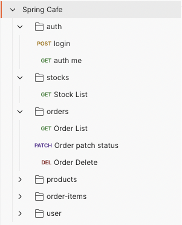
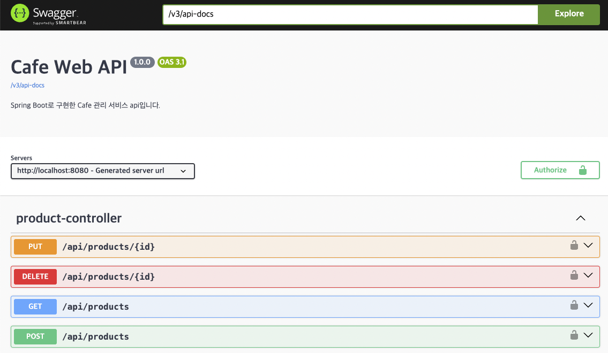
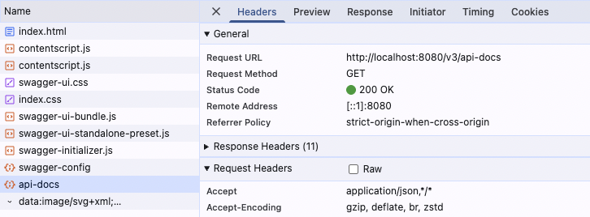
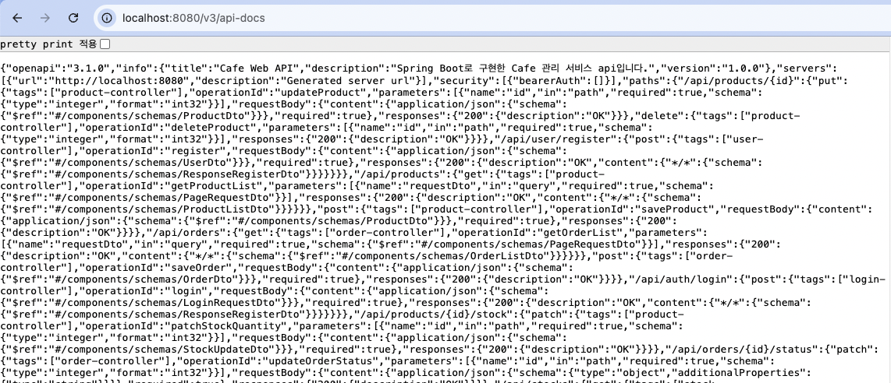
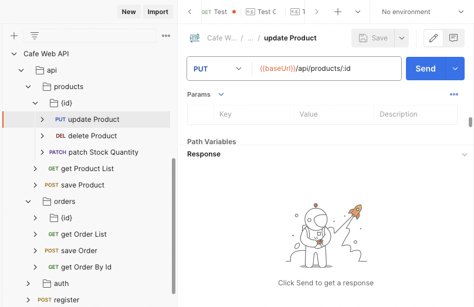
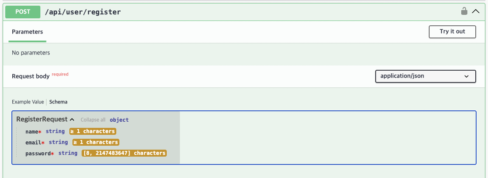
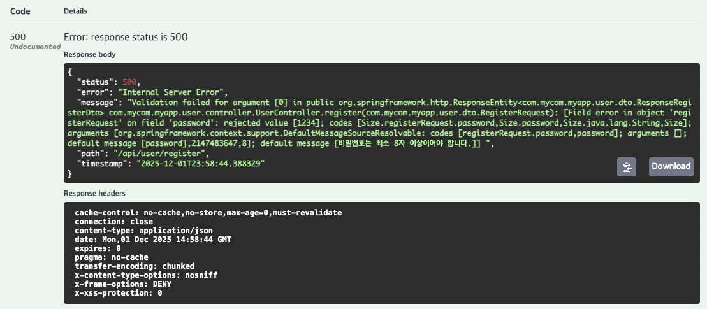
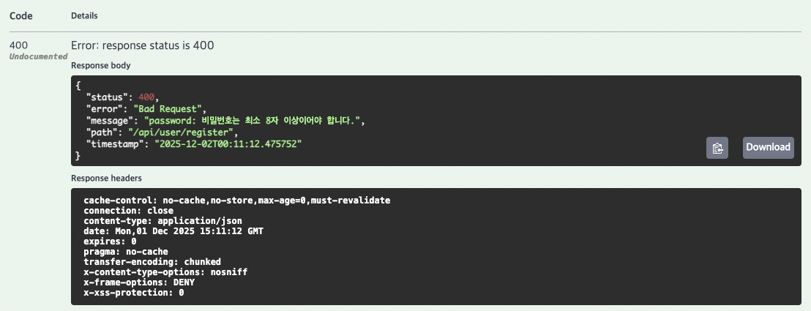

> 기존 API 문서는 Posman을 통해 생성하고 json으로 Export하여 저장하고있었습니다.
>
> API 문서화를 위해 **Swagger(springdoc-openapi)** 를 도입하고,
>
> 요청 값을 안정적으로 검증하기 위한 **Request Validation(Bean Validation)** 을 적용했습니다.
>
> 또한 기존에 Request, Response에서 혼재하여 사용하던 DTO를 각 용도에 맞게 분리하고,
>
> 유효성 검증을 통해 잘못된 요청을 사전에 차단하고,
>
> Swagger UI 에서 검증 규칙(minLength, required 등)을 자동으로 확인할 수 있도록 구성했습니다.

# 1. Swagger(OpenAPI) 설정

Spring Boot 3에서는 `springdoc-openapi`가 사실상 표준입니다.  
Swagger UI를 통해 API 요청 형식을 문서화하고 실시간 테스트가 가능하도록 구성했습니다.

[springdoc-openapi 공식 문서](springdoc-openapi)

## 1.1 의존성 추가

```xml
<!-- Swagger -->
<dependency>
  <groupId>org.springdoc</groupId>
  <artifactId>springdoc-openapi-starter-webmvc-ui</artifactId>
  <version>2.8.8</version>
</dependency>
```

추가 후 서버 실행 시 다음 주소에서 UI로 문서화된 API 목록을 확인 할 수 있습니다.

```bash
http://localhost:8080/swagger-ui.html
```

## 1.2 jwt인증 필터에서 swagger 경로 제외

Swagger UI 페이지가 `/swagger-ui.html`에서 보여지고,

OpenAPI 정보(JSON 형식)는 `/v3/api-docs`에서 보여지므로 두 url을 인증 필터에서 제외해야합니다.

`SecurityConfig`의 `SecurityFilterChain`에서 `permitAll`의 경로로 위 경로를 추가해줍니다.

```java
@Configuration
public class SecurityConfig {

  private final JwtTokenProvider tokenProvider;
  private final UserDao userDao;
  private final CustomAuthenticationEntryPoint entryPoint;

  public SecurityConfig(JwtTokenProvider tokenProvider, UserDao userDao,
      CustomAuthenticationEntryPoint entryPoint) {
    this.tokenProvider = tokenProvider;
    this.userDao = userDao;
    this.entryPoint = entryPoint;
  }

  @Bean
  public PasswordEncoder passwordEncoder() {
    return new BCryptPasswordEncoder();
  }

  @Bean
  public SecurityFilterChain filterChain(HttpSecurity http) throws Exception {

    JwtAuthenticationFilter jwtFilter = new JwtAuthenticationFilter(tokenProvider, userDao);

    http
        .csrf(AbstractHttpConfigurer::disable)
        .exceptionHandling(e -> e.authenticationEntryPoint(entryPoint))
        .sessionManagement(s -> s.sessionCreationPolicy(SessionCreationPolicy.STATELESS))
        .authorizeHttpRequests(auth -> auth
            .requestMatchers(
                "/api/auth/login",
                "/api/user/register",
                "/swagger-ui/**",
                "/v3/api-docs/**"
            )
            .permitAll()
            .anyRequest().authenticated()
        )
        .addFilterBefore(jwtFilter, UsernamePasswordAuthenticationFilter.class);

    return http.build();
  }
}
```

## 1.3 OpenAPI 기본 설정

JWT 기반 인증을 적용한 프로젝트이기 때문에 Swagger에서도 Authorization 헤더를 사용할 수 있도록 설정했습니다.

아래왁 같이 `SwaggerConfig`를 작성하면 Swagger UI에서 "Authorize" 버튼을 통해 Bearer Token을 입력할 수 있습니다.

`Info`로 title, description, api 버전 등을 설정하여 보여줄 수 있습니다.

```java
@Configuration
public class SwaggerConfig {

  @Bean
  public OpenAPI openAPI() {
    return new OpenAPI()
        .components(new Components()
            .addSecuritySchemes("bearerAuth",
                new SecurityScheme()
                    .type(SecurityScheme.Type.HTTP)
                    .scheme("bearer")
                    .bearerFormat("JWT")))
        .addSecurityItem(new SecurityRequirement().addList("bearerAuth"))
        .info(new Info()
            .title("Cafe Web API")
            .description("Spring Boot로 구현한 Cafe 관리 서비스 api입니다.")
            .version("1.0.0"));
  }
}
```

---

위 설정을 마치고 http://localhost:8080/swagger-ui/index.html로 접속하면 아래와 같이 Swagger UI가 보여집니다.





`swagger-ui/index.html`위치에서 http://localhost:8080/v3/api-docs(GET)을 이용하여 가져오고 있기 때문에

http://localhost:8080/v3/api-docs에서는 json 형식의 api 파일을 확인할 수 있습니다.



이 json형식 데이터는 Postman에서도 호환되는 형식이기 때문에 import하면 확인해 볼 수 있습니다.



# 2. Request 데이터 유효성 검증

사용자 입력값 검증은 서버 안정성과 보안에 매우 중요합니다.

Spring은 Jakarta Bean Validation(JSR 380)을 기반으로 DTO 단위에서 유효성을 검증할 수 있습니다.

다음과 같은 규칙을 적용했습니다:

- 필수 필드 검사(`@NotBlank`, `@NotNull`)
- 문자열 길이 검사(`@Size`)
- 이메일 형식(`@Email`)
- 최소값/최대값(`@Min`, `@Max`)
- 정규식 검사(`@Pattern`)

## 2.1 DTO에 Validation 적용

회원가입 요청 DTO를 `RegisterRequest` 객체로 별도 선언하고, Validation 조건을 달아줄 수 있습니다.

```java
public class RegisterRequest {

  @NotBlank(message = "이름은 필수 항목입니다.")
  private String name;

  @Email(message = "올바른 이메일 형식이어야 합니다.")
  @NotBlank(message = "이메일은 필수 항목입니다.")
  private String email;

  @NotBlank(message = "비밀번호는 필수 항목입니다.")
  @Size(min = 8, message = "비밀번호는 최소 8자 이상이어야 합니다.")
  private String password;
}
```

Swagger UI에서도 자동으로 다음과 같이 표시됩니다:

- required 여부
- minLength, maxLength
- format(email)
- 설명(description)

Swagger는 Validation 애노테이션을 스캔하여 자동 문서화를 지원합니다.



## 2.2 Controller에서 검증 활성화

Controller의 Request 파라미터에 `@Valid` 또는 `@Validated` 를 선언하면 Spring이 DTO를 검증합니다.

```java
@PostMapping("/register")
public ResponseEntity<?> register(@Valid @RequestBody RegisterRequest request) {
    ResponseRegisterDto result = userService.registerUser(user);
    return ResponseEntity.ok(result);
}

```

유효성 검증 실패 시 `MethodArgumentNotValidException`이 발생합니다.

현재 Exception 핸들러에서 별도로 처리하지 않는 것은 500 에러로 반환하고 있습니다.

password를 8글자 미만으로 설정하고 Request를 보내면 아래와 같이 반환됩니다.



## 2.3 `MethodArgumentNotValidException` 핸들러 추가

`MethodArgumentNotValidException` 형식의 예외를 처리하는 핸들러를 아래와 같이 추가합니다.

Request 형식이 잘못되었으므로 400에러를 반환합니다.

```java
  @ExceptionHandler(MethodArgumentNotValidException.class)
  public ResponseEntity<ErrorResponse> handleValidationException(
      MethodArgumentNotValidException ex,
      HttpServletRequest request) {

    // 검증 실패한 필드 메시지 추출
    String message = ex.getBindingResult()
        .getFieldErrors()
        .stream()
        .map(error -> error.getField() + ": " + error.getDefaultMessage())
        .collect(Collectors.joining(", "));

    ErrorResponse error = new ErrorResponse(
        HttpStatus.BAD_REQUEST.value(),
        HttpStatus.BAD_REQUEST.getReasonPhrase(),
        message,
        request.getRequestURI()
    );

    return ResponseEntity.status(HttpStatus.BAD_REQUEST).body(error);
  }
```

이제 다시 password를 8글자 미만으로 작성하고 요청을 보내면 아래와 같이 400 에러가 반환되고, validation에 설정한 메세지가 보여집니다.



# 3. 실제 설정과 검증 흐름

Swagger + Validation + Security까지 통합된 요청 처리 흐름은 다음과 같습니다.

1. Swagger UI에서 요청 생성
2. Controller 진입 전 `@Valid`에 의해 요청 DTO 검증
3. 유효하지 않을 경우 Request Body를 처리하기 전에 400 오류 반환
4. 유효하다면 JWT 필터가 인증 여부 확인
5. SecurityContext에 인증 정보 저장
6. Controller에서 비즈니스 로직 실행
7. Swagger UI에서 응답 확인 가능

따라서 개발자는 Swagger에서 바로 요청 규칙을 확인하며 테스트할 수 있고,

클라이언트는 어떤 데이터 형식을 보내야 하는지 명확하게 이해할 수 있습니다.

# 마무리

이번 작업을 통해 Swagger를 통한 문서화와 Request Validation 기반의 안정적인 입력 검증 환경을 구축했습니다.

## 배운 점

1. **Swagger는 Validation 정보를 자동 반영**하기 때문에 DTO 설계만 잘해도 문서 품질이 올라간다.
2. **전역 예외 처리기 활용**으로 검증 실패 응답 형식을 일관되게 유지할 수 있다.
3. JWT 기반 프로젝트에서는 Swagger Authorization 설정이 필수이다.
4. 클라이언트-서버 간 API 계약(API Contract)을 명확히 유지하는 데 Validation이 가장 중요하다.
