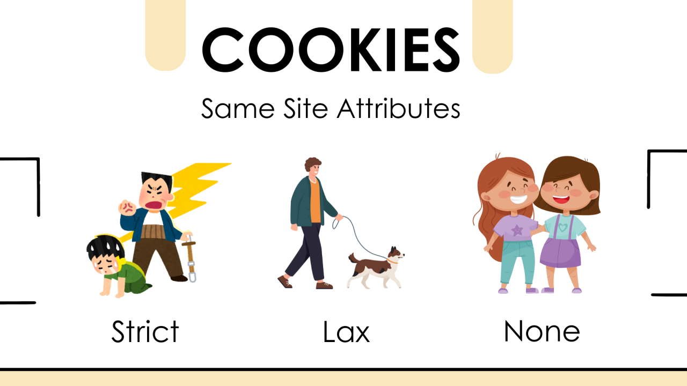
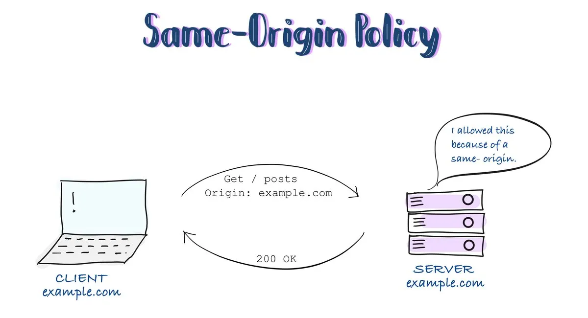
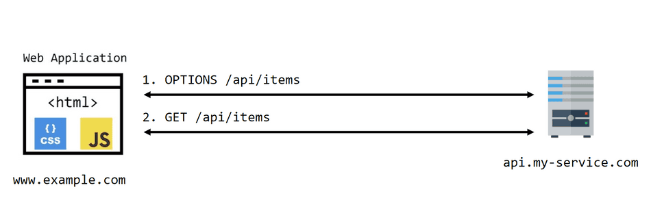
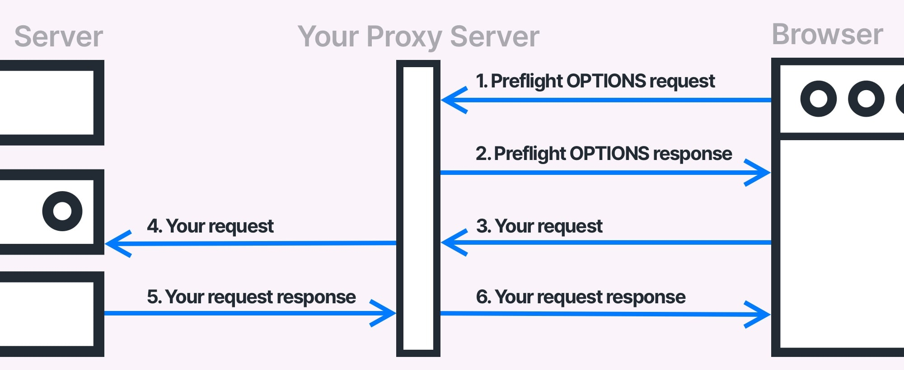
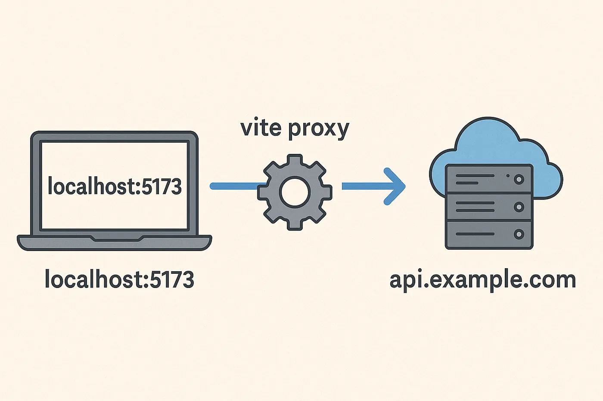
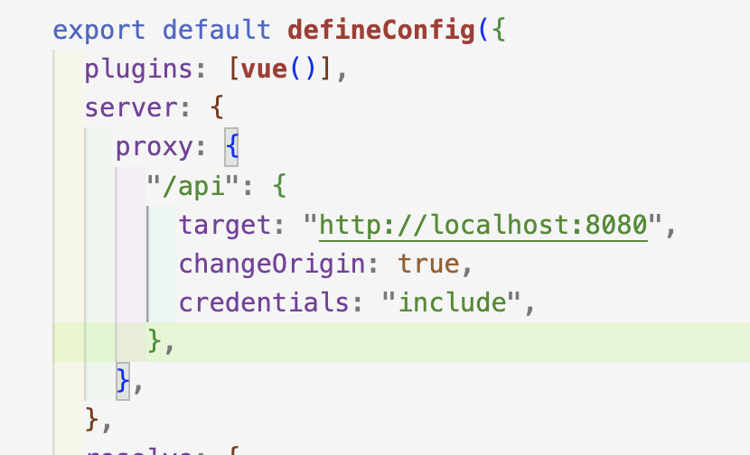

> 오늘은 CSRF와 CORS에 대해 브라우저 보안 모델의 관점에서 체계적으로 정리했습니다.
>
> 이전에는 단편적인 지식만 보유하고 있었으나, 두 개념이 서로 다른 목적을 갖고 있다는 점을 명확하게 이해했습니다.
>
> 또한 Spring Security 설정 코드를 직접 작성하며 SPA 환경에서 보안 설정이 어떤 방식으로 적용되는지 확인했습니다.

## CSRF(Cross-Site Request Forgery)

### CSRF 공격 흐름


CSRF는 사용자가 로그인한 상태에서 공격자가 의도하지 않은 요청을 대신 보낼 수 있게 만드는 공격 방식입니다. 브라우저가 쿠키를 자동으로 전송한다는 특성을 이용합니다. 사용자는 자신이 요청을 보냈다는 사실을 인지하지 못한 채 서버의 상태가 변경될 수 있습니다.

### SameSite Cookie 옵션



SameSite 옵션은 쿠키가 크로스 사이트 요청에 포함되는 조건을 제어합니다.

브라우저 보안 강화 측면에서 매우 중요한 옵션입니다.

- Strict: 외부 요청에 절대 포함되지 않습니다.
- Lax: GET 등 안전한 요청에 한해서만 제한적으로 허용됩니다.
- None: 모든 요청에서 전송할 수 있으나 HTTPS 환경이 필요합니다.

### Spring Security CSRF Token 설정 예시

CSRF Token은 서버가 임의의 난수 값을 발급하고, 클라이언트가 해당 값을 요청에 포함해 전송하는 인증 방식입니다. 쿠키와 독립된 값이므로 공격자가 예측할 수 없고, 요청이 실제 사용자로부터 발생했는지를 확인하는 데 사용됩니다.

Spring Security에서는 다음과 같이 설정할수 있습니다.

```java
@Configuration
@EnableWebSecurity
public class SecurityConfig {
    @Bean
    public SecurityFilterChain filterChain(HttpSecurity http) throws Exception {
        http
            .csrf(csrf -> csrf
                .csrfTokenRepository(CookieCsrfTokenRepository.withHttpOnlyFalse())
            )
            .authorizeHttpRequests(auth -> auth.anyRequest().authenticated());
        return http.build();
    }
}
```

SPA 환경에서 CSRF Token을 JavaScript에서 읽어야 하는 경우 `withHttpOnlyFalse()` 설정이 필요합니다.

## CORS(Cross-Origin Resource Sharing)


CORS는 브라우저가 Same-Origin Policy(SOP)를 적용했기 때문에 생겨난 제약을 완화하는 규칙이었습니다. 서버가 명시적으로 허용한 경우에만 브라우저는 응답을 스크립트에서 접근할 수 있었습니다.

### CORS 요청 및 Preflight 흐름



Preflight 요청은 브라우저가 서버에 “이 요청을 보내도 되는지” 사전에 확인하기 위해 OPTIONS 메서드로 보내는 검사 요청입니다.
서버는 `Access-Control-Allow-*` 형태의 헤더로 허용 범위를 명시합니다.

### Spring CORS 기본 설정 예시

```java
@Configuration
public class WebConfig implements WebMvcConfigurer {
    @Override
    public void addCorsMappings(CorsRegistry registry) {
        registry.addMapping("/api/**")
            .allowedOrigins("https://frontend.example.com")
            .allowedMethods("GET","POST","PUT","DELETE")
            .allowedHeaders("*")
            .allowCredentials(true)
            .maxAge(3600);
    }
}
```

### 프록시 서버

브라우저 환경에서 발생하는 CORS 문제를 구조적으로 제거하기 위해 가장 많이 사용하는 방식이 바로 프록시 서버입니다. 아래 그림은 그 흐름을 시각적으로 보여줍니다.



CORS는 “브라우저”가 외부 리소스를 막는 정책이기 때문에 서버 대 서버 요청은 아예 CORS 문제 자체가 발생하지 않습니다.

이 원리를 활용해 프록시 서버를 두면 CORS 문제를 구조적으로 해결할 수 있습니다.

**프록시 서버 동작 원리**

1. 브라우저는 프론트엔드 서버(동일 Origin)로 요청을 보냅니다.

2. 프론트엔드 서버(또는 API Gateway)가 백엔드 서버로 요청을 전달합니다.

3. 서버 → 서버 요청은 CORS가 적용되지 않습니다.

4. 프록시 서버가 결과를 브라우저에게 전달합니다.

**왜 프록시 서버는 CORS를 해결할까?**

CORS는 오직 브라우저의 스크립트 요청에만 적용됩니다.

서버 간 요청은 CORS 차단 대상이 아닙니다.

따라서 브라우저와 백엔드 사이의 “중간 서버”만 동일 Origin이면 문제 해결입니다.

**프록시 방식의 장점**

- 백엔드 서버에서 CORS 설정을 굳이 복잡하게 하지 않아도 된다.

- 배포 환경에서 API Gateway로 확장하기 좋다.

- 보안 설정을 서버 측에서 일관성 있게 관리할 수 있다.



vite를 이용하여 프론트엔드 코드를 작성했을 때 다음과 같이 프록시 서버 설정을 할 수 있었습니다.

`localhost:5713`과 `localhost:8080`간의 통신이 원활히 진행됩니다.



## 정리

개발을 하면서 CSRF와 CORS라는 용어는 자주 접했지만, 각각이 어떤 문제를 해결하기 위한 기술인지, 어떤 환경에서 발생하며 어떤 위험을 초래하는지에 대해서는 명확히 이해하지 못하고 있었습니다. 이번 TIL을 통해 두 개념을 구조적으로 비교하며 정리하면서 그 차이를 확실하게 이해할 수 있었습니다.

---

### **CSRF (Cross-Site Request Forgery)**

사용자가 _의도하지 않은 요청을 자동으로 보내게 만드는 공격 기법_

- **발생 배경**
  - 브라우저가 *쿠키를 자동으로 전송*하는 특성을 악용
  - 공격자가 별도의 인증 없이 사용자 권한으로 요청 실행 가능
- **문제점**
  - 로그인된 사용자의 권한으로 서버의 데이터가 수정될 수 있음
  - 사용자는 요청이 발생했다는 사실조차 모름
- **방어 방법**
  - 서버가 CSRF Token을 발급 → 요청마다 검증
  - SameSite Cookie 옵션(Lax/Strict) 적용
  - 중요한 상태 변경 요청은 Token 또는 Origin 검사 수행

### **CORS (Cross-Origin Resource Sharing)**

브라우저가 _다른 Origin의 응답 접근을 제한하는 정책을 완화하기 위한 메커니즘_

- **발생 배경**
  - 브라우저는 보안 때문에 Same-Origin Policy(SOP)를 기본 적용
  - 서로 다른 Origin 간에 API 요청은 되지만 **응답 접근은 차단**
- **문제점**
  - 프론트엔드와 백엔드가 서로 다른 도메인·포트에서 동작하면 브라우저가 응답 사용을 차단
  - 개발·배포 환경에서 흔히 발생하는 이슈
- **해결 방법**
  - 서버에서 `Access-Control-Allow-Origin`, `Allow-Methods`, `Allow-Headers` 등 설정
  - Preflight(OPTIONS) 요청을 허용하도록 구성
  - 또는 프록시 서버(개발 서버, API Gateway 등)를 사용해 동일 Origin으로 요청을 우회
