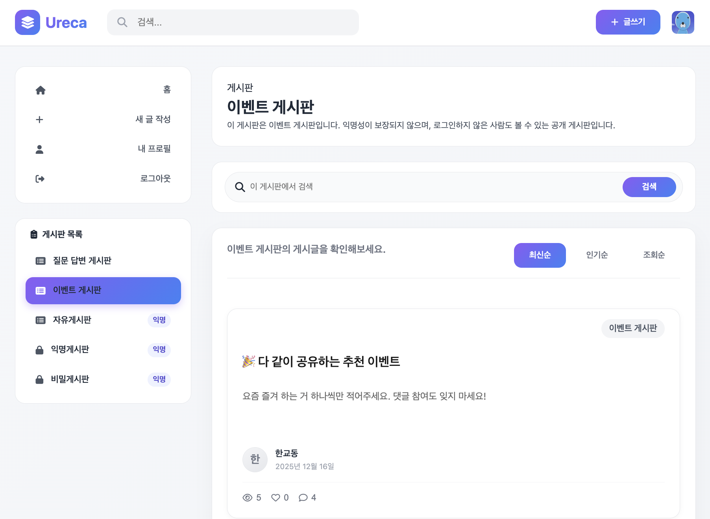
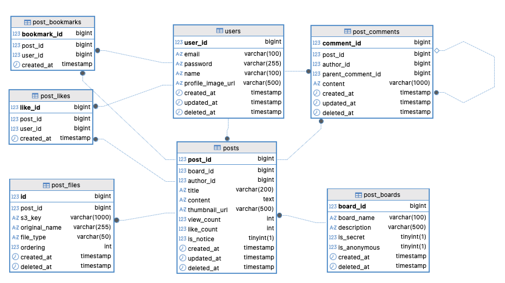
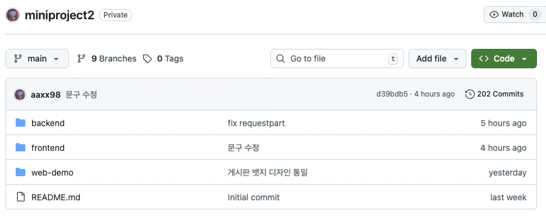
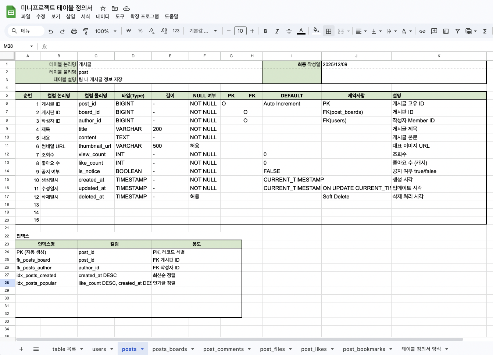
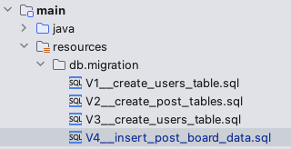
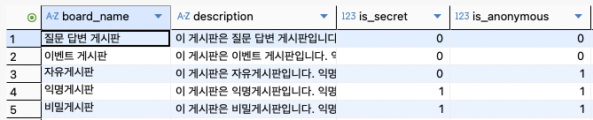
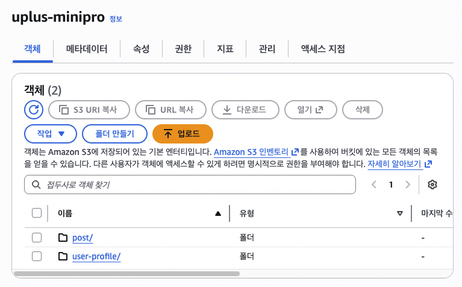
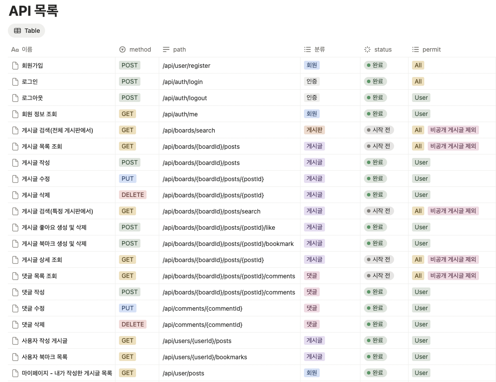

> 이번주에는 지금까지 배운 Spring 프레임워크에 전반에 대한 내용을 기반으로, 간단한 커뮤니티 게시판을 구현하는 미니프로젝트를 진행했습니다.
>
> 총 3명이 한 팀이 되어 하루 대부분의 시간을 함께하며 기능 구현부터 테스트,
> 오류 수정까지 전 과정을 협업으로 수행하였고,
> 짧은 기간이었지만 실제 프로젝트 흐름을 경험할 수 있었던 의미 있는 시간이었습니다.
>
> 협업을 위해 신경썼던 부분과, 로그인 하지 않았을 때도 접근 가능한 데이터가 일부 있어 고민했던 부분에 대해 공유하고자 합니다.

# 미니 프로젝트 소개



이번 프로젝트는 회원가입 및 로그인이 가능한 커뮤니티 게시판을 구현하는 것을 목표로 했습니다.
로그인하지 않은 사용자도 일부 공개 게시판의 게시글 목록과 상세 조회는 가능하도록 구성하였고,
글 작성 및 사용자 상호작용 기능(좋아요, 북마크, 댓글)은 로그인한 사용자만 사용할 수 있도록 제한했습니다.

또한 비밀 게시판의 경우에는 로그인 여부를 기준으로,
로그인한 사용자에게만 게시글이 노출되도록 접근 제어를 구현했습니다.

ERD는 다음과 같습니다.


## 코드 관리 - github



프론트엔드와 백엔드 프로젝트를 하나의 레포지토리에서 관리하되,
디렉토리를 분리하여 각각 독립적으로 개발할 수 있도록 구성했습니다.

다만 프로젝트 초반에 작업 단위와 브랜치 전략을 명확히 정하지 않은 상태에서 개발을 진행하면서,
각자의 작업량이 늘어날수록 충돌이 자주 발생하는 문제가 있었습니다.
이로 인해 머지 과정에서 예상보다 많은 시간이 소요되었고,
협업 프로젝트에서 초기 브랜치 전략 수립의 중요성을 체감하게 되었습니다.

프론트엔드 프레임워크로는 Next.js를 선택하였으나,
프레임워크에 대한 이해가 충분하지 않은 상태에서 개발을 진행하다 보니
스타일이 깨지거나 구조가 일관되지 않는 문제가 발생하기도 했습니다.

이 과정에서 Codex AI 도구의 도움을 받아 코드 이해와 수정에 많은 도움을 받을 수 있었습니다.

## 데이터 마이그레이션 - flyway



다음과 같이 테이블 정의서를 이용하여 데이터베이스 테이블 정의 이후,
DB 스키마 변경 이력을 버전 단위로 관리하기 위해 Flyway를 도입했습니다.



SQL 기반 마이그레이션 파일을 통해 변경 사항을 명확히 기록할 수 있었고,
특히 팀 단위 작업에서 DB 변경 이력을 코드로 남길 수 있다는 점이 큰 장점으로 느껴졌습니다.

테이블 변경사항이 많다면 환경 간 스키마 불일치 문제를 줄일 수 있었겠지만, 초기 데이터 테이블에서 수정점이 거의 없었습니다ㅎㅎ



공통으로 사용되는 게시판 초기 데이터에 대해서는
마이그레이션 파일을 통해 INSERT 구문을 정의하여,
환경별로 동일한 기준 데이터를 유지할 수 있도록 구성했습니다.

## 파일 저장 - aws s3

이번에 구현한 커뮤니티는 게시글에 이미지를 첨부할 수 있으며, 사용자 프로필 사진을 설정할 수 있습니다.

파일 업로드 및 관리를 위해 AWS S3 버킷을 사용했습니다.



서버 로컬 스토리지가 아닌 외부 스토리지를 활용함으로써,
서버 확장 시 파일 동기화 문제를 고려하지 않아도 되며,
파일 접근 URL을 통해 정적 리소스를 효율적으로 제공할 수 있었습니다.

또한 S3 접근 권한 설정을 위해 IAM 사용자를 생성하고 Access Key를 발급받아 사용하였으며,
버킷 정책을 직접 구성하는 과정을 통해
단순한 파일 업로드를 넘어 보안과 접근 제어의 중요성을 함께 학습할 수 있었습니다.

S3 요금 구조를 조사하는 과정에서,
파일 다운로드 요청 비용이 상대적으로 높다는 점을 알게 되었고
캐시 서버나 CloudFront와 같은 CDN을 활용하면
운영 비용을 절감할 수 있다는 점도 알게 되었습니다.

해당 부분은 구현에 포함하지는 않았지만 추후 적용해 보고 싶습니다.

## .env / .env.example를 이용한 키 관리

S3 접근키 등의 환경 변수 관리를 위해 `.env` 파일을 사용하고, `.gitignore`을 통해 github에 업로드되지 않도록 관리했습니다.

실제 키 값이 없는 `.env.example` 파일을 함께 관리하여 키 값 변경사항을 관리했습니다.

이를 통해 API Key, DB 정보와 같은 민감한 정보가
레포지토리에 직접 노출되는 것을 방지할 수 있었고,
환경별 설정 분리가 명확해졌습니다.

또한 협업 시 필요한 환경 변수 목록을 공유하기 쉬워졌다는 점에서도
효과적인 방식이라고 느꼈습니다.

## 로그인 분기 처리(Security Context 기반 접근 제어)

이번 프로젝트에서는 로그인 여부에 따라 접근 가능한 기능이 달라지는 요구사항이 있었습니다.

이에 따라 인증이 필요한 기능과 그렇지 않은 기능을 명확히 구분하여 설계했습니다.

다음은 이 미니프로젝트에서 작성한 API 목록 문서의 일부입니다.



permit 분류에서 `All`인 것은 접근제한을 하지 않고,
`비공개 게시글 제외`이면 비공개 게시판과 연관된 정보의 경우 로그인/비로그인을 체크하여 적절한 정보를 반환합니다.

### 1. Security 설정 관점 (permitAll, authenticated)

Spring Security 설정 단계에서
게시글 조회와 같이 공개되어야 하는 API는 permitAll()로 설정하여
인증 여부와 관계없이 접근할 수 있도록 구성했습니다.

반면, 글 작성·수정·삭제, 좋아요·댓글과 같은 상호작용 기능에 대해서는
authenticated() 설정을 적용하여
인증된 사용자만 요청을 보낼 수 있도록 기본적인 접근 제한을 적용했습니다.

이를 통해 URL 단위에서 1차적인 접근 제어를 수행하고,
인증이 필요 없는 요청만 컨트롤러까지 전달되도록 구성했습니다.

`SecurityFilterChain`을 설정할 때 다음과 같이 작성할 수 있습니다.

```java
    http
        .csrf(csrf -> csrf.disable())

        .authorizeHttpRequests(auth -> auth
            // 공개 API (비로그인 접근 허용)
            .requestMatchers(
                "/api/posts",
                "/api/posts/**",
                "/api/search/**"
            ).permitAll()

            // 로그인 사용자만 가능한 기능
            .requestMatchers(
                "/api/posts/create",
                "/api/posts/**/edit",
                "/api/posts/**/delete",
                "/api/posts/**/like",
                "/api/comments/**"
            ).authenticated()
            ...
```

### 2. 컨트롤러 vs 서비스 계층에서의 체크

컨트롤러 계층에서는 `@AuthenticationPrincipal`을 통해
Spring Security Context에 저장된 인증 정보를 주입받아
해당 정보를 서비스 계층으로 전달하는 역할만 수행하도록 구성했습니다.

서비스 계층에서는 전달받은 사용자 정보를 기준으로
현재 요청이 로그인 사용자에 의한 요청인지 여부를 판단하고,
인증 여부에 따라 비즈니스 로직의 처리 방식을 분기하도록 구현했습니다.

- 컨트롤러 / Security 설정
  - URL 단위 접근 가능 여부에 대한 1차 필터링
  - 인증 정보 전달 역할
- 서비스 계층
  - 인증 정보 존재 여부를 기준으로 로직 분기
  - 인증 상태에 따른 데이터 조회 범위 및 처리 방식 결정

위와 같이 역할 분리를 통해 접근 제어를 구현했하여
접근 제어 로직이 컨트롤러에 과도하게 집중되지 않도록 하면서도,
비즈니스 규칙과 밀접한 인증 판단은 서비스 계층에서 처리할 수 있었습니다.

## 느낀점

프로젝트 전반에서 가장 아쉬웠던 점은
작업 단위와 브랜치 전략을 명확히 정의하지 않은 상태에서 개발을 시작한 부분이었습니다.
이로 인해 코드 충돌이 잦았고, 협업 효율이 다소 떨어졌다고 느꼈습니다.

또한 게시글 조회수, 좋아요와 같이 빈번하게 조회·갱신되는 기능에 대해
캐시를 활용한 성능 최적화를 적용하고 싶었지만
시간적인 여유가 부족해 구현하지 못한 점이 아쉬움으로 남았습니다.

하지만 단순한 기능 구현을 넘어,
Spring 기반 애플리케이션에서 인증, 접근 제어, 데이터 조회 구조를
실제 요구사항에 맞게 설계해 보는 경험을 할 수 있었습니다.

짧은 기간이었지만 팀원들과 지속적으로 의견을 공유하며
문제 상황을 함께 해결해 나가는 과정에서,
개인 과제와는 다른 협업 프로젝트의 흐름을 경험할 수 있었습니다.

다음 프로젝트에서는 초기 설계 단계에서
협업 방식과 성능 요소까지 함께 고려하여 진행하고 싶습니다.
