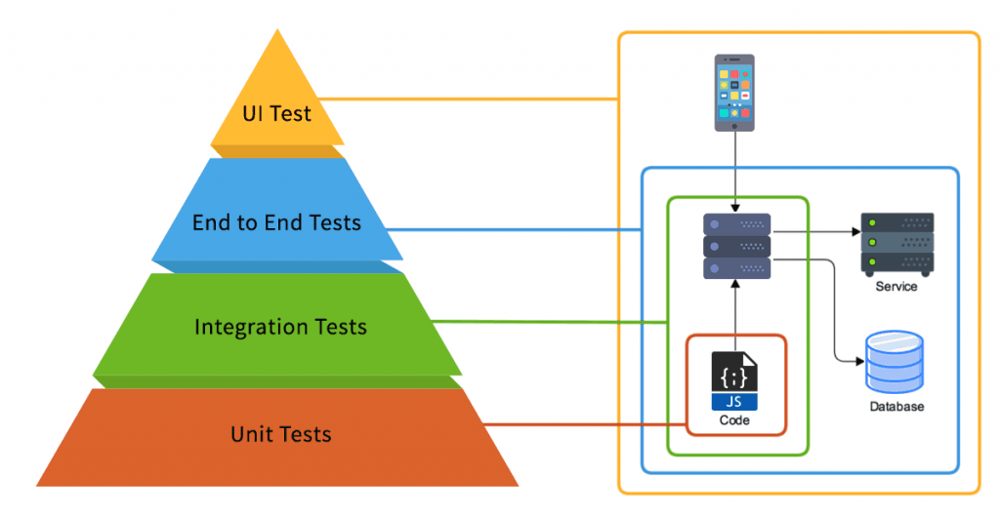
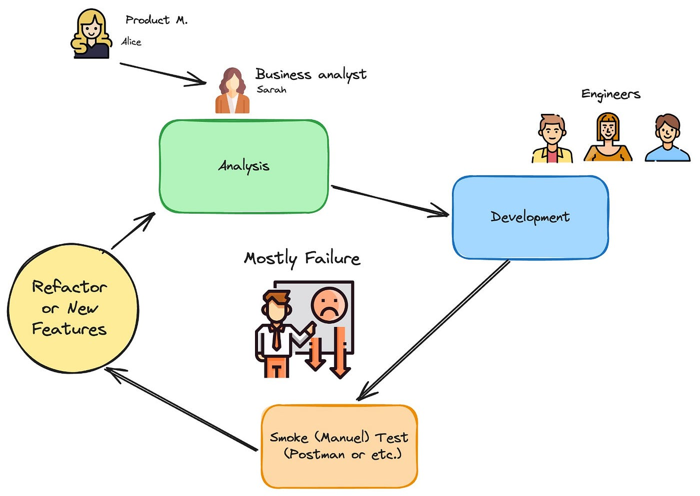
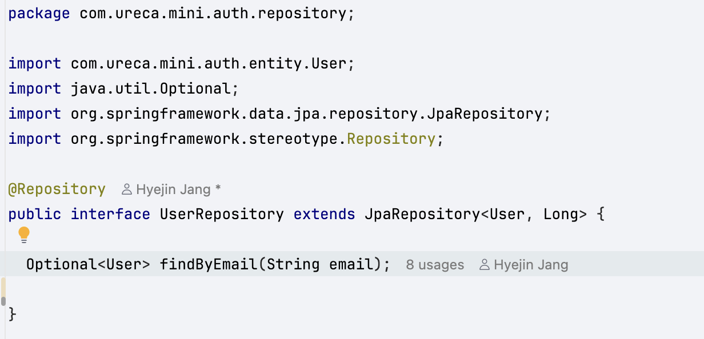
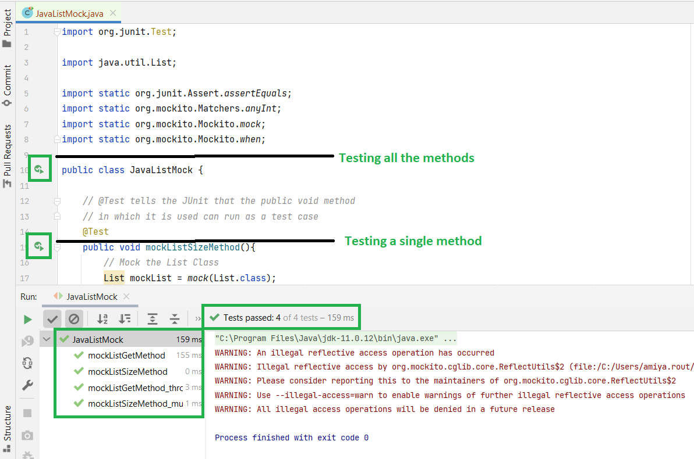
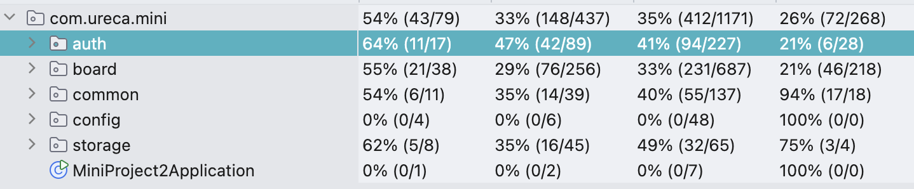
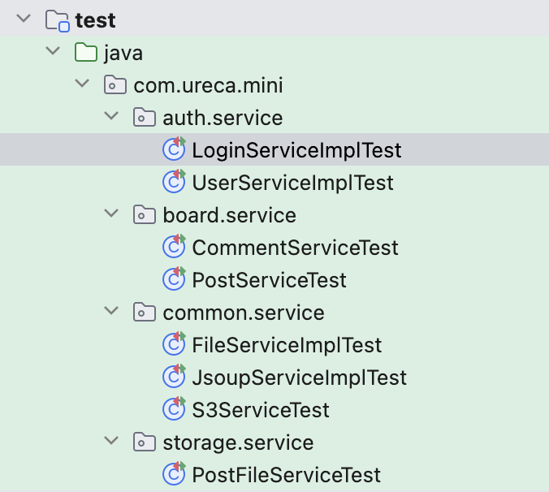

> 이번주에는 Spring 프로젝트에서 **서비스 계층 테스트를 어떻게 작성하는지**와 **@SpringBootTest 기반 통합 테스트와의 차이점**을  
> 실제로 작성한 테스트 코드를 기준으로 정리해보았습니다.
>
> 테스트를 단순한 동작 확인이 아닌,
> **로직 변경에 대비하기 위한 안전장치**라는 관점에서 접근했습니다.

# 1. 테스트를 작성하게 된 배경

기존에는 기능 구현 이후 애플리케이션을 직접 실행한 뒤,  
API를 호출하여 정상 동작 여부를 확인하는 방식으로 검증을 진행했습니다.

이 방식에는 다음과 같은 한계가 있었습니다.

- 테스트를 위해 매번 서버를 실행해야 한다
- 오류 발생 시 어느 계층의 로직에서 문제가 발생했는지 즉시 파악하기 어렵다
- 리팩터링 이후 기존 기능이 정상 동작하는지 빠르게 확인하기 어렵다

이러한 문제를 해결하기 위해  
**서비스 로직을 독립적으로 검증할 수 있는 단위 테스트(Unit Test)** 를 작성하게 되었습니다.

이번 테스트에서는 컨트롤러나 Repository를 포함한 전체 흐름이 아니라,  
**서비스 계층의 로직만을 테스트 대상으로 한정**했습니다.



위와 같이, 기존 검증 방식은 화면을 직접 실행하여 확인하는 UI Test와, Postman을 활용해 API 전체 흐름을 검증하는 End-to-End 테스트에 해당합니다.

이 방식은 코드가 의도대로 동작하는지 확인하기 위해 직접 실행시켜서 결과를 확인하는 방식이었습니다.

**Unit Test(단위 테스트)** 는 컨트롤러나 DB, 외부 환경과 분리된 상태에서 **코드 영역의 로직(주로 서비스 계층)** 이
주어진 조건에 따라 올바르게 동작하는지를 검증하는 테스트를 의미합니다.



위 그림은 단위테스트가 없으면
개발 → 수동 테스트 → 실패 → 수정 → 재실패의 악순환 루프에 빠지기 쉽다는 것을 보여주는 그림입니다.

단위 테스트를 통해
UI Test나 End-to-End Test를 수행하기 이전에
코드 영역의 로직이 의도대로 동작하는지를 먼저 검증할 수 있으며,
이로 인해 이후 테스트 단계에서 발생하는 오류의 원인을
보다 쉽게 추적할 수 있습니다.

서비스 계층은 요청 처리 과정에서 중복 검증, 예외 발생 여부 판단, 응답 객체 생성 등과 같이 비즈니스 규칙에 대한 핵심적인 판단 로직을 담당합니다.  
이러한 로직은 DB 연동이나 웹 요청 여부와 관계없이 독립적으로 검증할 수 있는 영역입니다.

따라서 이번 테스트에서는 외부 의존성은 Mockito로 Mock 처리하고, **서비스 로직의 판단과 분기 자체가 올바른지에 집중하기 위해** 서비스 계층 단위 테스트 방식을 선택했습니다.

이 방식은 로직 변경이나 리팩터링 이후에도 비즈니스 규칙이 의도대로 유지되고 있는지를 빠르게 확인할 수 있다는 장점이 있습니다.

# 2. 테스트 방식 개요


이번 테스트는 **JUnit 5와 Mockito를 사용한 서비스 계층 단위 테스트**입니다.

### 주요 특징

- Spring Context를 실행하지 않습니다
- Repository, Encoder 등 외부 의존성은 모두 Mock 처리합니다
- 서비스 로직만 단독으로 검증합니다

즉, **의존성은 가짜로 생성된 객체(Mock), 로직은 실제 코드**를 사용하는 구조입니다.

UserRepository의 경우, JpaRepository에 의해 구현체가 결정되므로 Mock 반환값을 내려주어 테스트할 수 있습니다.



IntelliJ에서는 다음과 같이 Test 코드에서 생성된 테스트 버튼을 이용하여 직접 테스트를 실행해보고, 결과를 확인 할 수 있습니다.



Test with Coverage 옵션으로 테스트를 실행하면,전체 코드 중 테스트가 실제로 실행된 코드의 비율을
Coverage 리포트를 통해 확인할 수 있습니다.



이번 테스트에서는 전체 Line Coverage 30% 이상을 목표로 설정했으며, 그 결과 다음과 같은 커버리지 결과를 확인할 수 있었습니다.

# 3. 테스트 대상 구성

테스트 대상은 `UserServiceImpl` 클래스입니다.

회원 가입, 회원정보 변경과 같은 처리를 하고있습니다.

다음과 같이 테스트 코드를 `test/` 경로에 작성했습니다.



```java
@ExtendWith(MockitoExtension.class)
class UserServiceImplTest {
    @InjectMocks
    private UserServiceImpl userService;

    @Mock
    private UserRepository userRepository;

    @Mock
    private UserActivityRepository userActivityRepository;

    @Mock
    private PasswordEncoder passwordEncoder;

    @Test
    void 회원가입_실패_중복이메일() { ... }

    @Test
    void 회원가입_성공() { ... }
...
}
```

- 테스트 대상 객체: `UserServiceImpl`
  - `@InjectMocks`
- Mock 처리된 의존성
  - `@Mock`
  - 실제 DB 접근이나 암호화 로직은 수행하지 않습니다
  - 테스트 범위를 서비스 로직으로 제한합니다

# 4. 테스트 코드 작성 방식 (Given–When–Then)

모든 테스트는 Given–When–Then 구조로 작성했습니다.

## 실패 케이스 테스트 예시 (중복 이메일)

```java
  @Test
  void 회원가입_실패_중복이메일() {
    // given
    RegisterRequest request = new RegisterRequest();
    ReflectionTestUtils.setField(request, "name", "홍길동");
    ReflectionTestUtils.setField(request, "email", "test@test.com");
    ReflectionTestUtils.setField(request, "password", "password");

    User user = User.builder()
        .id(1L)
        .name("홍길동")
        .email("test@test.com")
        .password("encoded-pass")
        .build();
    given(userRepository.findByEmail(request.getEmail()))
        .willReturn(Optional.of(user));

    // when & then
    assertThrows(BadRequestException.class,
        () -> userService.registerUser(request));
  }
```

### Given

- `ReflectionTestUtils`
  - `RegisterRequest`가 별도의 setter를 제공하지 않기 때문에, 테스트만을 위해서 코드를 변경하지 않고 Reflection을 이용해 테스트 환경에서만 필드 값을 설정했습니다

- `given`
  - 이미 동일한 이메일이 존재한다고 가정합니다.
  - 실제 DB 조회 없이 `userRepository.findByEmail()` 메소드는 Mockito가 정의한 값을 반환합니다.

### When & Then

- `assertThrows`
  - 서비스 메소드(`registerUser`)를 실행합니다
  - 중복 이메일일 경우 특정 예외(`BadRequestException.clas`)가 발생하는지 검증합니다

When & Then을 한번에 쓰지 않고, 아래와 같이 실행결과를 받아 비교하는 식으로 검증할 수도 있습니다.

```java
BadRequestException exception = assertThrows(
    BadRequestException.class,
    () -> userService.registerUser(request)
);

assertEquals("이미 존재하는 이메일입니다.", exception.getMessage());
```

## 성공 케이스 테스트 예시

```java
@Test
void 회원가입_성공() {
    // given
    RegisterRequest request = new RegisterRequest();
    ReflectionTestUtils.setField(request, "name", "홍길동");
    ReflectionTestUtils.setField(request, "email", "test@test.com");
    ReflectionTestUtils.setField(request, "password", "password");

    given(userRepository.findByEmail(request.getEmail()))
        .willReturn(Optional.empty());

    given(passwordEncoder.encode(request.getPassword()))
        .willReturn("encoded-password");

    User savedUser = User.builder()
        .id(1L)
        .name("홍길동")
        .email("test@test.com")
        .password("encoded-password")
        .build();

    given(userRepository.save(any(User.class)))
        .willReturn(savedUser);

    // when
    RegisterResponse response = userService.registerUser(request);

    // then
    assertEquals("홍길동", response.getName());
    assertEquals("test@test.com", response.getEmail());
}
```

### Given

- `given(userRepository.findByEmail(...))`
  - 해당 이메일을 가진 사용자가 존재하지 않는 상황을 가정합니다
  - 실제 DB 조회 없이 Mockito가 `Optional.empty()`를 반환하도록 설정합니다
- `given(passwordEncoder.encode(...))`
  - 비밀번호 암호화 결과를 고정합니다
  - 암호화 로직 자체가 아닌, 서비스 흐름 검증에 집중합니다
- `given(userRepository.save(...))`
  - 사용자 저장이 정상적으로 완료되었다고 가정합니다
  - 저장 후 반환되는 사용자 객체를 미리 정의합니다

### When

- `userService.registerUser(request)`
  - 회원가입 서비스 메소드를 실행합니다
  - 이메일 중복 확인, 비밀번호 암호화, 사용자 저장 로직이 순차적으로 수행됩니다

### Then

- `assertEquals("홍길동", response.getName())`
  - 응답 객체에 사용자 이름이 올바르게 담겼는지 검증합니다
- `assertEquals("test@test.com", response.getEmail())`
  - 응답 객체에 이메일이 정상적으로 매핑되었는지 검증합니다

# 5. 단위 테스트와 `@SpringBootTest`의 차이점

## @SpringBootTest란?

`@SpringBootTest`는  
Spring Boot 애플리케이션 전체를 실제로 실행하는 테스트 방식으로, 일반적으로 통합 테스트에 해당합니다.

- Spring Context를 로딩합니다
- 실제 Bean이 주입됩니다
- 설정에 따라 실제 DB 또는 테스트 DB와 연동됩니다
- 여러 컴포넌트가 함께 동작하므로 테스트 범위가 넓습니다

## 선택 기준

### 단위 테스트가 적합한 경우

- 서비스 로직을 단독으로 검증하고 싶은 경우
- 예외 처리 및 분기 로직을 확인하고 싶은 경우
- 빠른 피드백이 필요한 경우
- 리팩터링 시 안정성을 확보하고 싶은 경우

### @SpringBootTest가 적합한 경우

- JPA 매핑이 정상 동작하는지 확인할 때
- 실제 쿼리 동작을 검증해야 할 때
- Bean 설정 오류를 확인할 때
- 여러 컴포넌트 간 연동을 함께 검증해야 할 때

다음과 같이 JPQL로 작성한 Repository 메소드는 통합 테스트로 테스트할 필요가 있습니다.

엔티티 매핑, JOIN, 조건 필터링, DTO Projection 등
실행 시점에 오류가 발생할 수 있는 요소를 포함하고 있기 때문에,
Mock 기반 단위 테스트보다는 실제 JPA 환경에서 검증하는 통합 테스트가 적합합니다.

```java
public interface UserActivityRepository extends JpaRepository<Post, Long> {

  @Query("""
          SELECT
              c.id AS id,
              p.id AS postId,
              b.id AS boardId,
              b.boardName AS boardName,
              p.title AS postTitle,
              CASE WHEN LENGTH(c.content) > 200
                THEN CONCAT(SUBSTRING(c.content, 1, 200), '...')
                ELSE c.content
              END AS content,
              c.createdAt AS createdAt
          FROM PostComment c
          JOIN c.post p
          JOIN p.board b
          WHERE c.author.id = :userId
            AND c.deletedAt IS NULL
            AND p.deletedAt IS NULL
            AND b.deletedAt IS NULL
          ORDER BY c.createdAt DESC, c.id DESC
      """)
  Page<UserCommentResponse> findAllCommentsByUserId(
      @Param("userId") Long userId,
      Pageable pageable
  );
}
```

하지만 이번 프로젝트에서 테스트 범위는 Service 로직으로 한정했기 때문에, `@Query`로 작성한 코드에 대해 통합 테스트를 작성하지 못한 점이 아쉬웠습니다.

# 마무리

이번 테스트 작성을 통해 다음과 같은 점을 정리할 수 있었습니다.

- 테스트는 단순한 기능 검증을 넘어, 로직 변경이나 리팩터링 이후에도 기능의 안정성을 보장하는 역할을 합니다.
- 모든 테스트를 @SpringBootTest로 작성할 필요는 없으며, 테스트 대상과 목적에 따라 적절한 테스트 방식을 선택해야 합니다.
- 테스트의 목적에 맞게 단위 테스트와 통합 테스트의 범위를 구분하는 것이 중요합니다.
