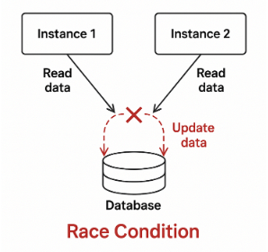
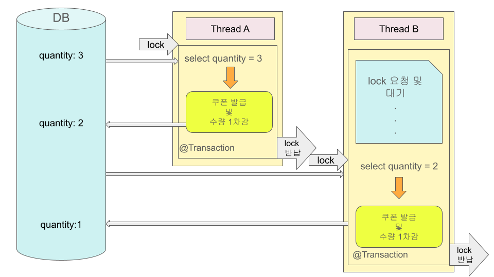
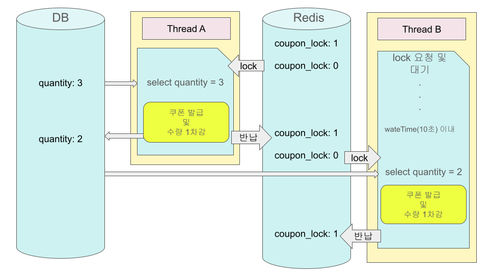
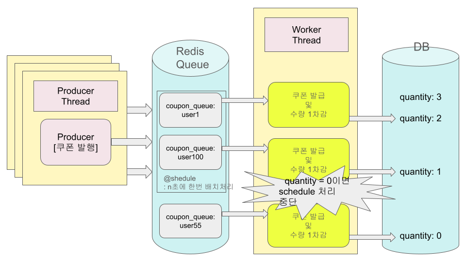

> 선착순 쿠폰 발급 기능을 구현하면서 동시성 문제를 직접 마주하게 되었습니다.
>
> 처음에는 단순한 조회-수정-저장 로직으로 충분할 줄 알았는데, 동시 요청 환경에서 예상치 못한 문제들이 발생했고,
>
> 이를 해결하기 위해 여러 방법을 시도하며 각각의 장단점을 정리해보았습니다.

# 문제 발견

선착순 쿠폰 이벤트 기능을 개발하고 있었습니다. 기본 로직은 다음과 같았습니다.

1. 쿠폰 정보 조회
2. 남은 수량 확인
3. 수량 감소 후 저장
4. 사용자에게 발급

개발 환경에서 단건 테스트를 할 때는 문제가 없었습니다. 그런데 JMeter로 1000개의 동시 요청을 보내자 이상한 현상이 발생했습니다.

100개만 발급되어야 하는 쿠폰이 실제로는 130여 개가 발급되었고, DB를 확인해보니 남은 수량이 음수로 표시되어 있었습니다.

## 원인 파악

로그를 추적해보니 여러 스레드가 동시에 같은 쿠폰 정보를 조회하고 있었습니다.

전형적인 **Race Condition** 상황이었습니다. 여러 스레드가 동시에 같은 데이터를 읽고 수정하면서 데이터 정합성이 깨지는 것입니다.


### 문제 상황

- 스레드 1: 남은 수량 3 조회 → 쿠폰 발급 및 수량 1 감소
- 스레드 2: 남은 수량 3 조회 (1의 저장 이전) → 쿠폰 발급 및 수량 1 감소
- ...
- 스레드 N: 남은 수량 3 조회 (1...N-1의 저장 이전) → 쿠폰 발급 및 수량 1 감소
- 결과: 유효 수량이 3인 상태에서 3보다 큰 N번의 발급이 일어났으며, 남은 수량이 음수가 됨


# 해결 과정

## 비관적 락 (Pessimistic Lock)



- 트랜잭션의 충돌이 발생한다고 가정하고, 데이터 접근 시점에 우선 락을 선점하여 다른 트랜잭션의 접근을 차단
- 데이터베이스가 제공하는 락 기능을 사용
- 주로 SQL 쿼리에 `SELECT ... FOR UPDATE` 구문을 사용하면서 시작하며, 버전 정보는 사용하지 않음
- 데이터를 수정하는 즉시 트랜잭션 충돌을 감지할 수 있다.

비관적 락은 DB 레벨에서 락을 거는 방식입니다. JPA에서는 `@Lock` 어노테이션을 사용하여 구현할 수 있습니다.

```java
@Lock(LockModeType.PESSIMISTIC_WRITE)
@Query("select c from Coupon c where c.id = :id")
Optional<Coupon> findByIdWithLock(Long id);
```

Select가 일어날 때 다음과 같이 동작합니다.

```sql
SELECT * FROM coupon WHERE id = 1 FOR UPDATE;
```

이제 쿠폰 수량 조회시, 해당 메서드를 사용하면 Update에 대한 트랜잭션에서 자동으로 락이 걸리게 됩니다.

### 장점

- 데이터 정합성이 매우 높음
- 동시 수정으로 인한 충돌을 원천 차단
- 구현 및 이해가 비교적 단순

### 단점

- 락 대기로 인한 **성능 저하**
- 데드락 발생 가능
- 트래픽이 많을수록 확장성에 불리

### 적합한 상황

- 충돌 가능성이 높은 경우
- 데이터 정합성이 최우선인 경우
- 트랜잭션 수가 많지 않은 시스템

**느낀 점**

데이터 정합성은 완벽하게 보장되었지만, 부하 테스트를 해보니 처리 속도가 많이 느려졌습니다. 대기하는 요청들이 쌓이면서 타임아웃이 발생하는 경우도 있었습니다. 트래픽이 많은 상황에서는 부담스러운 방식이라는 생각이 들었습니다.

## 낙관적 락 (Optimistic Lock)


- 트랜잭션 대부분은 충돌이 발생하지 않는다고 낙관적으로 가정
- 락을 걸지 않고 처리한 뒤, 커밋 시점에 충돌 여부를 확인
- 트랜잭션을 커밋하기 전까지는 트랜잭션의 충돌을 알 수 없음
- 데이터베이스가 제공하는 락 기능이 아닌 JPA가 제공하는 버전 관리 기능을 사용

낙관적 락은 버전 컬럼을 추가하고 수정 시점에 버전을 체크하여 충돌을 방지하는 방법입니다.

JPA의 버전 관리 기능에 의해 작동합니다. `@Version` 어노테이션을 엔티티에 추가하면 버전 컬럼을 추가할 수 있습니다.

```java
@Version
private Long version;
```

```java
public void issueOptimistic(Long couponId) throws InterruptedException {
    int retryCount = 0;
    int maxRetry = 10;

    while (retryCount < maxRetry) {
        try {
            couponService.issueOptimistic(couponId);
            return;
        } catch (ObjectOptimisticLockingFailureException e) {
            retryCount++;
            Thread.sleep(50);
        }
    }

    throw new IllegalStateException("쿠폰 발급 재시도 한도 초과");
}
```

이제 `Coupon` 엔티티에 버전 컬럼이 추가되고, JPA는 업데이트 시점에 업데이트 전에 읽었던 버전과 현재 버전을 체크합니다.

두 버전이 달라 충돌이 발생하면 `ObjectOptimisticLockingFailureException`이 발생하고, Facade 계층에서 재시도 로직을 구현했습니다.

### 장점

- 락을 사용하지 않아 **성능과 확장성 우수**
- 데드락 발생 없음
- 읽기 위주의 시스템에 적합

### 단점

- 충돌 발생 시 재시도 로직 필요
- 충돌이 잦으면 오히려 성능 저하
- 구현 복잡도가 상대적으로 높음

### 적합한 상황

- 읽기 비중이 높은 경우
- 동시 수정 가능성이 낮은 경우
- 대규모 트래픽 환경

**느낀 점**

비관적 락보다는 성능이 좋았지만, 동시 요청이 많을 때 재시도가 빈번하게 발생하면서 오히려 비효율적이었습니다. 충돌이 적은 환경에서는 좋은 선택일 것 같다는 생각이 들었습니다.

## Redis 분산 락 (Distributed Lock)



- 여러 서버 인스턴스에서 동시에 접근하더라도 하나의 요청만 임계 구역에 진입하도록 제어
- 데이터베이스 락이 아닌 외부 저장소(Redis) 를 이용해 락 상태를 관리
- 서버 간 메모리를 공유하지 않는 환경에서도 동일한 락을 사용할 수 있음
- 락 획득 여부를 명시적으로 제어할 수 있음

Redis 분산 락은 DB 락의 성능 문제와 단일 서버 환경의 한계를 보완하기 위해 사용했습니다.


이번 구현에서는 Redisson 라이브러리를 사용하여 분산 락을 적용했습니다.

```java
public void issueCouponWithDistributedLock(Long couponId) {
    RLock lock = redissonClient.getLock("coupon_lock:" + couponId);
    boolean isLocked = false;

    try {
        // waitTime: 락 획득을 최대 5초까지 대기
        // leaseTime: 10초 후 자동으로 락 해제
        isLocked = lock.tryLock(5, 10, TimeUnit.SECONDS);

        if (!isLocked) {
            throw new IllegalStateException("락 획득 실패");
        }

        // === 임계 구역 ===
        Coupon coupon = couponRepository.findById(couponId)
            .orElseThrow();

        if (coupon.getQuantity() <= 0) {
            throw new SoldoutException();
        }

        coupon.decrease();
        couponRepository.save(coupon);

    } catch (InterruptedException e) {
        Thread.currentThread().interrupt();
        throw new RuntimeException(e);
    } finally {
        if (isLocked && lock.isHeldByCurrentThread()) {
            lock.unlock();
        }
    }
}
```

### 장점

- 분산 환경에서 데이터 정합성 확보 가능
- 애플리케이션 레벨에서 제어 가능

### 단점

- 구현 및 운영 난이도 높음
- 네트워크 및 외부 시스템 장애에 민감
- 잘못 설계 시 심각한 장애 유발 가능

### 적합한 상황

- 다중 서버에서 동일 자원을 제어해야 하는 경우
- 배치 작업, 쿠폰 발급, 재고 차감, 스케줄러 중복 실행 방지 등

**느낀 점**

DB 락보다 가볍고, 멀티 서버 환경에서도 동작해서 적절한 균형점을 찾은 느낌이었습니다. 다만 Redis가 장애나면 전체 시스템에 영향을 줄 수 있다는 점은 고려해야 했습니다.

## Redis Queue 방식



- 동시 요청을 즉시 처리하지 않고 **큐에 적재한 뒤 순차적으로 처리**
- 락을 사용하지 않고, 요청 흐름 자체를 직렬화(serialization)하여 동시성 문제를 제거
- 요청 시점과 실제 처리 시점을 분리함으로써 DB 동시 접근을 최소화

Redis Queue 방식은 락을 통한 동시성 제어 대신,

**요청을 큐에 쌓고 하나씩 처리하는 구조**로 문제를 해결하는 접근입니다.

### Producer: 요청 적재

```java
pushToQueue(Long userId) {
    redisTemplate.opsForList().rightPush("coupon_queue", String.valueOf(userId));
}
```

### Consumer: 순차 처리

```java
@Scheduled(fixedDelay = 100)
public void couponEventScheduler() {
    while (true) {
        Long userId = couponRedisRepository.popFromQueue();
        if (userId == null) {
            break;
        }

        if (isSoldOut) {
            continue;
        }

        try {
            couponService.publish(userId);
        } catch (SoldoutException e) {
            isSoldOut = true;
            System.out.println("선착순 쿠폰이 마감되었습니다.");
        }
    }
}
```

Scheduler가 주기적으로 큐에서 데이터를 하나씩 꺼내어
쿠폰 발급 로직을 순차적으로 수행합니다.

### 장점

- 락 경쟁이 없어 **Race Condition 자체가 발생하지 않음**
- DB에 동시에 접근하는 요청 수를 크게 줄일 수 있음
- 선착순 처리 요구사항을 자연스럽게 만족
- 구조가 비교적 단순하고 직관적임

### 단점

- 즉시 처리(동기 응답)가 어려움
- 비동기 처리에 대한 사용자 경험(대기, 알림 등) 고려 필요
- Scheduler가 단일 Consumer로 동작한다는 전제 필요
- 대량 트래픽 시 큐 적체 관리 필요

### 적합한 상황

- 선착순, 예약, 응모와 같이 **순서가 중요한 기능**
- 즉시 응답이 필수가 아닌 경우
- 대량의 동시 요청을 안정적으로 제어해야 하는 경우
- 처리량보다 **정합성과 안정성**이 중요한 시스템

**느낀 점**

락을 사용하지 않고도 동시성 문제를 구조적으로 해결할 수 있다는 점이 인상적이었습니다.

요청을 순차적으로 처리하기 때문에 안정성이 높았고,
DB에 동시에 접근하는 상황을 거의 만들지 않는다는 점에서 가장 깔끔한 해결 방식이라는 느낌을 받았습니다.

다만 즉시 응답을 주기 어렵기 때문에, 비동기 처리 결과를 사용자에게 어떻게 안내할지에 대한 고민은 필요하다고 느꼈습니다.

## 확장 가능성 및 추가로 고민해볼 내용

이번에는 Redis Queue를 활용해 동시성 문제를 구조적으로 해결했지만,

이 방식 역시 **모든 상황에서 완벽한 해답은 아니라는 점**도 함께 느낄 수 있었습니다.

Redis Queue 방식은 안정적이고 구현이 단순하다는 장점이 있지만,
트래픽이 더 커지거나 처리량을 더 끌어올려야 하는 상황에서는

다음과 같은 한계가 존재합니다.

- 단일 Consumer(Scheduler) 기반 처리
- 처리 속도가 큐 소비 속도에 의존
- 장애 발생 시 메시지 유실 가능성

이러한 한계를 보완하기 위한 다음 단계로는

**이벤트 기반 아키텍처**를 고려해볼 수 있을 것 같습니다.

### 고려해볼 수 있는 확장 방향

- **Kafka 기반 이벤트 처리**
  - 대량 트래픽을 안정적으로 처리
  - 메시지 영속성 보장
  - 장애 발생 시에도 데이터 유실 최소화
- **Consumer Group을 통한 수평 확장**
  - 여러 Consumer가 동시에 메시지를 분산 처리
  - 처리량 증가에 유연하게 대응 가능
- **메시지 재처리(Replay) 전략**
  - 장애나 오류 발생 시 특정 시점부터 재처리 가능
  - 운영 안정성 확보에 유리

이번 구현에서는 Redis Queue로 충분했지만,
트래픽 규모가 커질수록 **“단순한 큐”에서 “스트리밍 플랫폼”으로의 전환**이
자연스러운 수순이라는 점을 느꼈습니다.

## 마무리

이번 실습을 통해,
동시성 문제에는 **하나의 정답이 존재하지 않는다**는 점을 다시 한 번 느꼈습니다.

- **Pessimistic Lock**: 정합성은 확실하지만 성능 부담 큼
- **Optimistic Lock**: 충돌이 적을 때 효과적
- **Redis 분산 락**: 멀티 서버 환경에서 현실적인 선택지
- **Redis Queue**: 구조적으로 안전하지만 비동기 처리 고려 필요

결국 중요한 것은

“어떤 락을 쓰느냐”가 아니라,

**시스템의 특성, 트래픽 패턴, 사용자 경험을 종합적으로 고려해
가장 적절한 방식을 선택하는 것**이라는 점이었습니다.

특히 동시성 문제는

단순히 락을 걸어 해결할 수 있는 문제가 아니라,

**아키텍처와 흐름 설계의 문제**라는 점이 인상 깊게 남았습니다.
