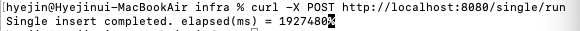
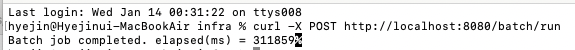
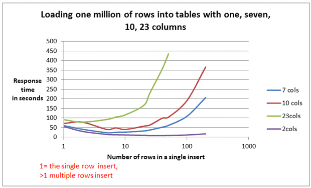
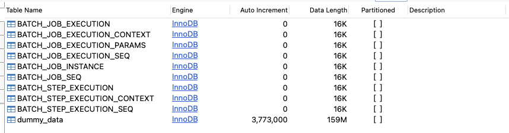
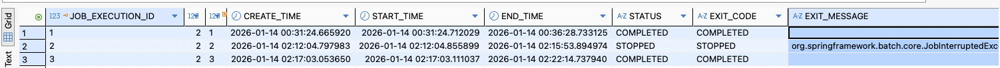
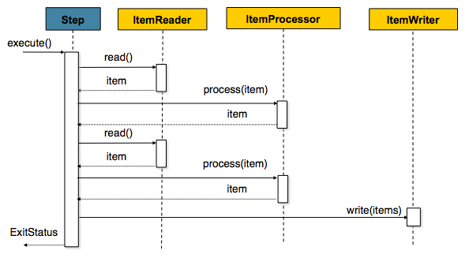

> 과거에 JPA를 사용해 여러 건의 데이터를 insert할 때, bulk insert를 적용하려면 설정이 복잡하다는 이유로 결국 하나씩 insert하는 방식을 사용했던 기억이 있습니다.
>
> 하지만 이번 종합 프로젝트에서 100만~500만 건 규모의 데이터를 다뤄야 하는 상황이 생겼고, 기존 방식으로는 성능과 안정성 모두 한계가 명확하다고 느꼈습니다.
>
> 이 문제를 해결하기 위해 insert 쿼리 수를 줄이는 Batch Insert 방식과, 대량 데이터를 구조적으로 처리할 수 있는 Spring Batch에 대해 본격적으로 알아보게 되었습니다.

## 1. 단건 Insert 방식의 구조적 한계

가장 단순한 데이터 저장 방식은 반복문을 통해 데이터를 하나씩 insert하는 방식입니다.

```java
for (inti=0; i <1_000_000; i++) {
DummyDatadata=newDummyData("dummy-" + i, i);
    repository.save(data);
}

```

이 방식은 구현은 직관적이지만, 데이터 양이 많아질수록 구조적인 한계를 드러냅니다. 100만 건의 데이터를 저장하는 경우, insert 쿼리는 그대로 100만 번 실행되고, 그만큼 DB와의 통신과 트랜잭션 처리도 반복됩니다.

이로 인해 다음과 같은 문제가 발생합니다.

- **insert 쿼리 수만큼 DB와의 네트워크 왕복이 발생**해 성능이 급격히 저하됩니다.
- **트랜잭션 단위 설정이 애매**해집니다. 크게 잡으면 실패 시 롤백 비용이 크고, 작게 잡으면 커밋이 과도하게 발생합니다.
- **처리 흐름 관리가 어렵습니다.** 중간 실패 시 어디까지 처리됐는지 추적하거나 재시작 로직을 직접 구현해야 합니다.

즉, 이 방식의 문제는 **쿼리 실행과 DB 통신이 과도하게 많이 발생하는 구조 자체에 있습니다.**

### JPA 환경에서 Bulk Insert가 어려웠던 이유

그렇다면 JPA에서 Bulk Insert를 사용하면 되지 않을까 생각할 수 있습니다. 하지만 실제로 JPA에서는 Bulk Insert를 자연스럽게 적용하기가 쉽지 않습니다.

JPA는 엔티티 단위의 영속성 관리에 초점이 맞춰져 있어, 기본 동작만으로는 insert 시 개별 SQL이 생성됩니다. 특히 IDENTITY 전략을 사용하는 경우, DB에서 생성된 PK 값을 즉시 받아와야 하기 때문에 batch insert 자체가 사실상 불가능해집니다.

batch insert를 적용하려면 추가 설정, 전략 변경, flush/clear 타이밍 제어 등이 필요하고, 이 과정에서 설정 복잡도가 급격히 올라갑니다. 과거에는 이러한 이유로 bulk insert 적용을 포기하고 단건 insert 방식을 선택했던 경험이 있었습니다. 하지만 이번처럼 수백만 건 단위의 데이터를 다뤄야 하는 상황에서는 이 방식이 더 이상 현실적인 선택지가 아니라고 판단하게 되었습니다.

---

## 2. Batch Insert(Bulk Insert) 적용과 성능 비교 포인트

이러한 한계를 해결하기 위해 선택한 방식이 **Batch Insert**입니다. Batch Insert는 여러 건의 데이터를 묶어 한 번에 DB로 전달함으로써, 애플리케이션과 DB 사이의 통신 횟수를 크게 줄이는 방식입니다.

예를 들어 단건 insert 방식과 batch insert 방식은 다음과 같은 차이가 있습니다.

```sql
-- 단건 Insert
INSERT INTO dummy_data (name, seq)VALUES ('dummy-1',1);
INSERT INTO dummy_data (name, seq)VALUES ('dummy-2',2);
INSERT INTO dummy_data (name, seq)VALUES ('dummy-3',3);

-- Batch Insert
INSERT INTO dummy_data (name, seq)VALUES
('dummy-1',1),
('dummy-2',2),
('dummy-3',3);

```

이를 100만 건 기준으로 보면 차이는 더 명확해집니다.

- **단건 insert**: 100만 번 execute → 100만 번 DB 통신
- **batch insert (1000건 단위)**: 1000번 execute → 1000번 DB 통신

데이터 양은 동일하지만, **DB와 통신하는 횟수에서 수백 배 차이**가 발생합니다.

이번 실습에서는 다음 포인트를 중심으로 성능을 비교했습니다.

- 전체 실행 시간
- SQL execute 호출 횟수
- 트랜잭션 커밋 횟수
- 실패 시 재시작 가능 여부

> 단건 insert 방식은 실행 시간이 지나치게 길어졌고, 데이터 양이 늘어날수록 성능 저하가 누적되었습니다. 반면 batch insert를 적용한 이후에는 실행 시간이 체감될 정도로 줄어들었고, 대량 데이터 처리에 훨씬 적합하다는 것을 확인할 수 있었습니다.

- 단건으로 100만건을 insert했을 때는 1,927,480ms가 소요되었습니다.
  
- 배치로 100만건을 insert했을 때는 311,859ms가 소요되었습니다.
  

현재 테스트용 데모에서는 컬럼 수가 3개인 단순한 테이블을 기준으로 측정했지만, 컬럼 수가 증가할수록 insert에 필요한 데이터 크기와 SQL 처리 비용이 함께 증가하게 됩니다.
즉, 동일한 row 수를 처리하더라도 컬럼 수가 많아질수록 전체 실행 시간은 더 늘어날 수밖에 없습니다.

아래 그래프는 단일 insert 및 batch insert 모두에서 컬럼 수 증가가 실행 시간에 직접적인 영향을 미친다는 점을 보여줍니다.


# 3. Spring Batch를 적용한 이유

Batch Insert 적용을 통해 insert 성능은 개선되었으나, 100만 건 이상 규모의 데이터 처리 환경에서는 다음과 같은 요구사항이 발생합니다.

- 대량 데이터 처리 시 메모리 사용량을 통제하기 위한 Chunk 단위 처리
- 처리 중 장애 발생 시 진행 지점 추적 및 재시작 가능성
- 트랜잭션 범위를 제한하여 실패 영향 최소화

Spring Batch는 이러한 요구사항을 충족하기 위한 대량 처리 전용 프레임워크로,
Job / Step 기반 실행 구조를 통해 처리 이력을 데이터베이스에 기록하며,
Chunk 단위 트랜잭션 관리 방식을 통해 대량 데이터 처리 시 안정성을 제공합니다.

이를 통해 대량 데이터 처리 과정에서 발생할 수 있는 오류에 대해
부분 롤백 및 재시작이 가능한 구조를 구성할 수 있습니다.

### Spring Batch 메타데이터 테이블 구조



Spring Batch는 Job 및 Step 실행 이력을 관리하기 위해

**전용 메타데이터 테이블을 데이터베이스에 생성하여 사용합니다.**

아래는 본 실습 환경에서 생성된 Spring Batch 기본 메타데이터 테이블 목록입니다.

각 테이블의 역할은 다음과 같습니다.

- `BATCH_JOB_INSTANCE`
  → 동일한 Job 이름과 파라미터 조합을 기준으로 Job 인스턴스를 식별
- `BATCH_JOB_EXECUTION`
  → Job 실행 단위의 시작/종료 시간, 상태(SUCCESS, FAILED 등) 관리
- `BATCH_STEP_EXECUTION`
  → 각 Step의 실행 정보 및 처리 건수(Read / Write / Skip) 기록
- `_CONTEXT`
  → Job 또는 Step 실행 중 유지해야 할 상태 정보 저장
- `_SEQ`
  → 메타데이터 테이블에서 사용할 시퀀스 값 관리

이러한 메타데이터 구조를 통해 Spring Batch는

**실행 이력 추적, 실패 지점 식별, 재시작 처리**를 프레임워크 차원에서 지원합니다.

즉, 대량 데이터 처리 시 발생할 수 있는 장애 상황에서도

**처리 흐름을 직접 구현하지 않고 안정적인 재시작이 가능한 구조**를 제공합니다.

### Job 실행 이력 및 재시작 관리 방식

Spring Batch는 Job 실행 단위를 `BATCH_JOB_EXECUTION` 테이블에 기록하여

각 실행의 상태와 실행 시간을 관리합니다.

아래는 본 실습에서 실제로 생성된 Job 실행 이력입니다.



각 실행은 다음 정보를 기준으로 관리됩니다.

- `START_TIME` / `END_TIME`
  → Job 실행 시작 및 종료 시점
- `STATUS`
  → 실행 결과 상태 (COMPLETED, FAILED, STOPPED 등)
- `EXIT_CODE` / `EXIT_MESSAGE`
  → 실행 종료 사유 및 상세 메시지

위 예시에서 확인할 수 있듯이, 2번 배치는 애플리케이션 종료로 인해 종료되었습니다.

중간에 **STOPPED 상태로 종료된 실행 이력 또한 DB에 그대로 저장**되며,

이후 Job을 다시 실행하면 **기존 실행을 덮어쓰지 않고 새로운 Execution으로 관리**됩니다.

이러한 구조를 통해 Spring Batch는

대량 데이터 처리 도중 장애가 발생하더라도

**처리 이력을 기반으로 안전한 재시작을 지원**합니다.

# 4. JPA vs JDBC 중 Batch 데이터 처리에 JDBC를 선택한 이유

본 실습의 목적은 복잡한 도메인 로직 처리가 아닌,
단일 테이블을 대상으로 한 100만 건 규모의 더미 데이터 생성이었습니다.

아래와 같은 이유로 JPA보다는 JDBC가 적합하다고 판단했습니다.

- JPA는 엔티티 관리, 영속성 컨텍스트 유지, flush/clear 처리 등으로 인해 대량 insert 환경에서 불필요한 오버헤드가 발생

- 객체 매핑 및 상태 관리 비용이 증가함에 따라 순수 insert 성능 측면에서 비효율 발생 가능

반면 JDBC는 SQL을 직접 실행하는 방식으로,
엔티티 관리 및 매핑 과정이 없어 Batch Insert 성능에 집중하기에 적합합니다.

이에 따라 본 실습에서는 Spring Batch의 처리 구조를 유지하면서,
Writer 영역에 JdbcBatchItemWriter를 적용하여
대량 데이터 insert 성능을 우선적으로 확보하는 방식으로 구성하였습니다.

# 5. 실습 코드 소개 (Spring Batch + JdbcBatchItemWriter)

## 처리 흐름

- **Reader**: 더미 데이터를 카운터 기반으로 생성
- **Writer**: `JdbcBatchItemWriter`로 batch insert

아래는 본 실습에서 사용한 Spring Batch 처리 흐름을 간단히 나타낸 구조도입니다.


본 프로젝트는 테스트용 데모를 목적으로 하여,
현재는 별도의 연산이나 추가 액션이 필요하지 않아 Processor를 사용하지 않았습니다.
다만 비즈니스 로직이 포함되는 경우, 데이터 가공을 위한 Processor 단계가 추가될 수 있습니다.

- **Processor**: 필요 시 데이터 변환, 필터링, 검증 등의 비즈니스 로직을 수행
  

## MySQL Bulk Insert 활성화 (필수 설정)

MySQL에서 Bulk Insert를 제대로 사용하려면 **DB URL에 `rewriteBatchedStatements=true` 파라미터를 필수로 추가**해야 합니다.

```yaml
spring:
  datasource:
    url: jdbc:mysql://localhost:3306/batch_test?rewriteBatchedStatements=true
    username: root
    password: 1234
    driver-class-name: com.mysql.cj.jdbc.Driver
```

**이 옵션이 없으면** 여러 INSERT 쿼리를 하나로 합쳐주지 않아 **성능 향상 효과가 없습니다.**

### Batch Insert 동작 확인용 로깅 설정 (선택사항)

```yaml
spring:
  datasource:
    url: jdbc:mysql://localhost:3306/batch_test?rewriteBatchedStatements=true&profileSQL=true&logger=Slf4JLogger&maxQuerySizeToLog=999999
```

- `profileSQL=true`: Driver에 전송하는 쿼리를 출력
- `logger=Slf4JLogger`: MySQL 드라이버는 기본값이 System.err이므로 필수
- `maxQuerySizeToLog=999999`: 출력할 쿼리 길이 제한 (기본값 0이라 설정 필수)

## DummyData

```java
public record DummyData(String name, int seq) {}
```

## ItemReader (100만 건 생성)

```java
@Bean
public ItemReader<DummyData> dummyItemReader() {
    return new ItemReader<>() {
        private int count = 0;
        private static final int MAX = 1_000_000;

        @Override
        public DummyData read() {
            if (count >= MAX) return null;
            count++;
            return new DummyData("dummy-" + count, count);
        }
    };
}
```

`read()`가 null을 반환하면 Step이 종료되므로, 100만 건 생성 후 자연스럽게 종료됩니다.

## JdbcBatchItemWriter (Batch Insert)

```java
@Bean
public JdbcBatchItemWriter<DummyData> dummyWriter(DataSource dataSource) {
    return new JdbcBatchItemWriterBuilder<DummyData>()
        .dataSource(dataSource)
        .sql("INSERT INTO dummy_data (name, seq) VALUES (:name, :seq)")
        .beanMapped()
        .build();
}
```

`:name`, `:seq`는 DummyData 필드명과 자동으로 매칭됩니다.

## Step (Chunk = 1000)

```java
@Bean
public Step dummyStep(
    JobRepository jobRepository,
    PlatformTransactionManager transactionManager,
    JdbcBatchItemWriter<DummyData> dummyWriter
) {
    return new StepBuilder("dummyStep", jobRepository)
        .<DummyData, DummyData>chunk(1000, transactionManager)
        .reader(dummyItemReader())
        .processor(item -> item)
        .writer(dummyWriter)
        .build();
}
```

**Chunk Size 1000**이면 "1000건 생성 → 1000건 insert → commit"이 반복됩니다.

Chunk Size를 바꾸면 커밋 횟수/배치 크기가 달라져 성능이 달라질 수 있습니다.

## Job 구성

```java
@Bean
public Job dummyDataJob(JobRepository jobRepository, Step dummyStep) {
    return new JobBuilder("dummyDataJob", jobRepository)
        .start(dummyStep)
        .build();
}
```

# 6. Identity 전략과 Batch Insert의 제약사항

JPA에서 `@GeneratedValue(strategy = GenerationType.IDENTITY)`를 사용하면 **Hibernate는 JDBC 수준에서 Batch Insert를 비활성화**합니다.

**이유:**

- IDENTITY 전략은 DB가 자동으로 ID를 생성하므로, INSERT 전에는 ID 값을 알 수 없습니다
- Hibernate가 채택한 'Transactional Write Behind' 방식과 충돌이 발생합니다
- OneToMany 관계에서 부모 Entity를 대량 등록할 때, 어느 자식이 어느 부모에 매핑되는지 알 수 없는 문제가 생깁니다

**해결책:**

1. Auto Increment가 아닌 다른 전략(SEQUENCE, TABLE 등) 사용
2. **JdbcTemplate의 batchUpdate를 직접 사용** (이번 실습에서 선택)

### JdbcTemplate 직접 사용 예제

```java
@Repository
@RequiredArgsConstructor
public class DummyDataBulkRepository {

    private final JdbcTemplate jdbcTemplate;

    @Transactional
    public void saveAll(List<DummyData> dataList) {
        String sql = "INSERT INTO dummy_data (name, seq) VALUES (?, ?)";

        jdbcTemplate.batchUpdate(sql,
            dataList,
            dataList.size(),
            (PreparedStatement ps, DummyData data) -> {
                ps.setString(1, data.name());
                ps.setInt(2, data.seq());
            });
    }
}
```

## 마무리

### 핵심 정리

본 실습을 통해 대량 데이터 처리에서 가장 중요한 요소는

**코드 구조보다 DB로 전송되는 쿼리의 횟수와 방식**이라는 점을 확인할 수 있었습니다.

- 단건 insert 방식은 구조적으로 성능 한계가 명확하며,
  Batch Insert 적용만으로도 실행 시간이 크게 개선되었습니다.
- JPA의 IDENTITY 전략은 대량 insert 환경에서 제약이 존재하므로,
  JDBC 기반 접근 방식이 더 적합한 경우가 있습니다.
- Spring Batch를 통해 Chunk 단위 처리와 재시작 기능을 확보하면서도,
  Batch Insert를 적용해 성능과 안정성을 동시에 확보할 수 있었습니다.
- `rewriteBatchedStatements=true`와 같은 JDBC 설정은
  대량 insert 성능에 직접적인 영향을 미칩니다.

### Chunk 사용 시 고려할 사항

- Chunk Size는 환경에 따라 성능 차이가 크므로 사전 테스트가 필요합니다.
- Chunk 크기 증가에 따른 메모리 사용량을 지속적으로 모니터링해야 합니다.
- Chunk 단위 트랜잭션 특성상, 실패 시 해당 범위만 롤백됩니다.
- 멀티스레드 Step 적용을 통해 추가적인 성능 개선이 가능합니다.

### 향후 개선 방향

- Chunk Size별 성능 비교
- 멀티스레드 Step 적용 및 성능 측정
- MySQL 파라미터 튜닝
- 파티셔닝 기반 병렬 처리 검토
