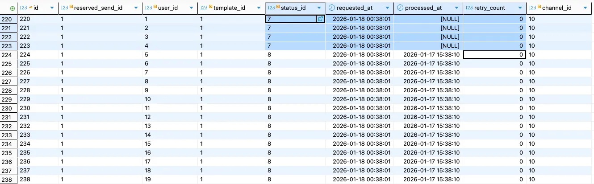
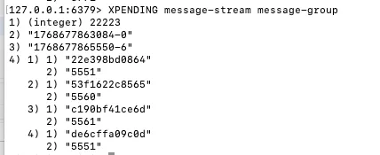
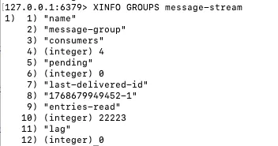
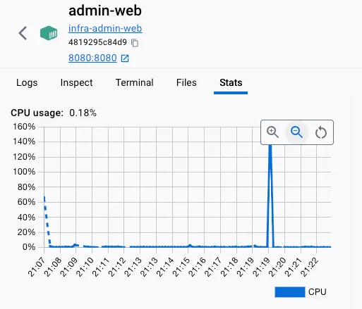

## 배경

메시지 발송 시스템에서 대량의 메시지를 효율적으로 처리하기 위해 Redis Stream을 메시지큐로 활용하고, Docker 컨테이너를 통해 4개의 Consumer를 병렬로 운영하는 구조를 구축했다. 이 과정에서 발생한 여러 문제들과 해결 과정을 정리한다.

## 아키텍처 개요

- **Producer**: Spring 애플리케이션에서 메시지 발송 요청을 Redis Stream에 발행(admin-web)
- **Consumer**: 4개의 Docker 컨테이너에서 각각 실행되며 메시지를 병렬 처리(message-sender)
- **메시지큐**: Redis Stream (Consumer Group 방식)

### Docker을 이용하여 환경 구성

다음과 같이 실행하면 Consumer를 여러 개 실행시킬 수 있다.

```
docker compose up -d --build --scale message-sender=4
```


## 발생한 문제와 해결 과정

### 1. 트랜잭션 타이밍 이슈: Race Condition

#### 문제 흐름

1. Producer가 DB에 메시지 상태 저장 (커밋 이전)
2. Redis Stream에 메시지 발행
3. Consumer가 메시지를 읽고 DB 조회 시도
4. **커밋 전이라 데이터가 없어서 예외 발생** → 컨테이너 종료 및 재시작
5. 4개 컨테이너가 각각 한 번씩 재시작되며 초기 4건의 미처리 발생

- 메시지 처리 중, userId 별 메시지 상태 데이터를 Insert하며 `streamProducer.publish` 발행
  - requestMessage가 종료되면 트랜잭션이 종료되어 메세지 상태 결과가 DB에 반영됨

  ```java
    @Transactional
  public void requestMessage(Long messageReservationId) {
    markProcessing(messageReservationId);
    MessageReservation reservation =
        messageReservationRepository.findByIdWithRelations(messageReservationId)
            .orElseThrow();

    ...

    for (Long userId : userIds) {
      MessageSendResult result = messageSendResultRepository.save(
          MessageSendResult.createFrom(reservation, userId, waitingStatus)
      );
      streamProducer.publish(result.getId(), channelTypeCode, purposeTypeCode);
    }

    markSent(reservation.getId());
  }
  ```

- Consumer에서는 위 트랜잭션이 끝나기 전, Stream에 전송된 메세지들을 읽으려고 시도하지만, Commit 되지 않았기 때문에 메세지 상태 정보를 찾을 수 없음 → 예외 발생 및 컨테이너가 종료되고 재실행됨
  - 예외 발생시 애플리케이션 종료되는 이유: Redis Listener에서 예외를 처리하여 종료되고있음

  ```java
  public void process(MessageRequestDto dto) {

  	MessageSendResult result =
          messageSendResultRepository.findById(dto.getMessageSendResultId())
              .orElseThrow(() -> new IllegalArgumentException("메시지 없음"));
    ...
  }
  ```

- 그 결과, 각 message-sender 컨테이너가 한번씩 재실행되며 초기 4건의 미처리가 발생하는것으로 추측됨
  - code_id = 7: WAITING(발송 대기)
  - code_id = 8: SUCCESS(발송 성공)
    

#### 해결방법: `TransactionSynchronizationManager`를 활용해 트랜잭션 커밋 후에 메시지 발행

- afterCommit 콜백에서 publish 처리
  - afterCommit: 커밋 정상처리 후 실행되는 메소드

```java
@Transactional
public void requestMessage(Long messageReservationId) {
  markProcessing(messageReservationId);

  MessageReservation reservation =
      messageReservationRepository.findByIdWithRelations(messageReservationId)
          .orElseThrow();
  ...

  List<Long> resultIds = new ArrayList<>(); // 이후 메시지 발송을 위해 발송상태ID 저장

  for (Long userId : userIds) {
    MessageSendResult result = messageSendResultRepository.save(
        MessageSendResult.createFrom(reservation, userId, waitingStatus)
    );
    resultIds.add(result.getId());
  }

  TransactionSynchronizationManager.registerSynchronization(
      new TransactionSynchronization() {
        @Override
        public void afterCommit() {
          for (Long resultId : resultIds) {
            streamProducer.publish(resultId, channelTypeCode, purposeTypeCode);
          }
        }
      }
  );

  markSent(reservation.getId());
}
```

### 2. ACK 처리 실패: Serializer 불일치

#### 문제 원인

모든 메시지가 Pending 상태에서 ACK 처리가 되지 않았다. Redis Stream에서 ACK가 성공하려면 stream key, group, messageId가 정확히 일치해야 하는데, `RedisTemplate<String, Object>` 사용 시 serializer가 명시적으로 설정되지 않아 바이트 레벨에서 불일치가 발생했다.



#### 해결 방법: `StringRedisTemplate`로 변경하여 올바른 serializer가 기본 설정되도록 함

- 변경 전: `RedisTemplate<String, Object>`
- 변경 후: `StringRedisTemplate` 사용

```java
redisTemplate.opsForStream().acknowledge(
    message.getStream(),
    group,
    message.getId()
);
```



## 최적화 과정

### 각 Consumer 별 메시지 분배를 균등하게 개선

#### 초기 문제

각 메시지 처리에 소요되는 시간은 1초인데, pollTimeout을 5초로 설정했더니 메시지가 균등하게 분배되지 않았다.

- message-sender-1: 1건
- message-sender-2: 1건
- message-sender-3: N-3건
- message-sender-4: 1건

한 번 대기 상태에 빠진 Consumer는 계속 대기하는 경향이 있었다.

### 개선

- 1. **pollTimeout 조정**: 5초 → 500ms로 단축
  - 여전히 각 consumer 별 pending 메시지는 균일하게 분배되지 않음
  - onMessage에서 각 메세지 발송을 처리하기 전 우선 처리할 메시지를 consumer가 선점하고있음
    

- 2. **batchSize 설정**: 10으로 설정하여 10건씩 균일하게 할당
  - batch로 묶여있으면 1건 처리 실패 시 batch 단위가 재처리 대상이 되므로 실패율을 고려해 10건으로 설정
  - 각 consumer가 10건씩 할당받고, 순차적으로 처리 후 균일하게 할당됨
    

## 추가 고려사항 및 향후 개선 방향

### 메시지 상태 초기 저장 시 CPU 사용량 이슈



메시지 발송 요청 시, 대략 2만건 이상의 대량의 메시지 상태를 한 번에 저장하는 과정에서 CPU 사용량이 급격히 증가하는 문제가 확인되었다.

이에 따라 메시지 상태 초기 저장 및 Stream 발행 책임을 어느 컴포넌트에서 처리할지에 대한 구조적 검토가 필요하다.

- **admin-web에서 즉시 처리**
  - API 응답 지연 및 CPU 부하 집중 가능성
- **별도 batch 성격의 컴포넌트(billing-batch)에서 처리**
  - 예약 발송, 재시도 처리와 함께 순차적(batch) 처리 가능
  - 시스템 부하 분산 측면에서 유리

### 처리 속도 및 처리량 한계

메시지 전송 지연을 1초로 가정할 경우, 단일 Consumer는 약 10초에 9건 수준의 처리량을 보였으며, 100만 건 처리 시 약 12.9일이 소요되는 것으로 계산되었다.

Consumer를 4개로 확장하더라도 약 3.23일이 소요되어, 대량 처리 환경에서는 추가적인 처리량 개선이 필요하다.

이를 위해 다음과 같은 개선 방향을 검토 중이다.

- Batch Insert 및 Redis Pipeline 적용을 통한 RTT 감소
- Consumer 내부 스레드 병렬 처리
- Consumer 컨테이너 수 조절
- pollTimeout, batchSize 등 Stream 설정값 튜닝

### message-sender 컨테이너 실행 시점 관리 필요성

현재 구조에서는 message-sender 컨테이너가 항상 Redis Stream을 polling하는 형태로 동작한다.

그러나 실제 메시지 발송이 발생하는 시간대가 제한적인 경우, 불필요한 polling으로 인한 리소스 낭비가 발생할 수 있다.

- 메시지 발송이 없는 시간대에도 지속적인 poll 수행
- CPU 및 Redis 부하 증가 가능성

이에 따라 다음과 같은 방식의 개선을 고려하고 있다.

- **예약 발송 또는 재전송 요청이 발생하는 시점에만 Consumer 활성화**
- Spring의 `StreamMessageListenerContainer`를 활용하여
  Listener의 생명주기를 명시적으로 관리

```java
container.start();
container.stop();

```

메시지 발송이 필요한 구간에서만 Consumer를 활성화하고, 불필요한 리소스 사용을 줄이는 방향으로 개선할 계획이다.

## 배운 점

1. **트랜잭션 경계를 명확히 해야 한다**: 특히 메시징 시스템과 DB를 함께 사용할 때 트랜잭션 커밋 시점이 중요하다.
2. **Redis 직렬화는 명시적으로**: Template 타입에 따라 serializer가 달라질 수 있으므로 주의해야 한다.
3. **분산 시스템의 예외 처리**: 예외로 인한 서비스 중단보다는 재처리 가능한 구조가 더 안정적이다.
4. **메시지큐 설정의 중요성**: pollTimeout, batchSize 같은 설정값이 처리량과 분배에 큰 영향을 미친다.
