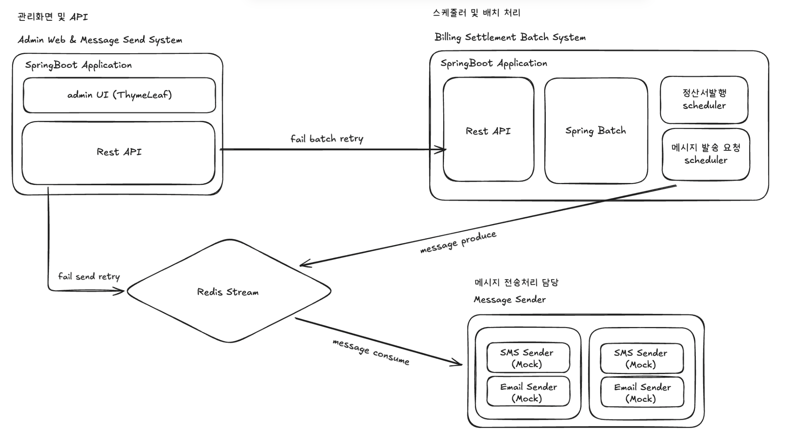
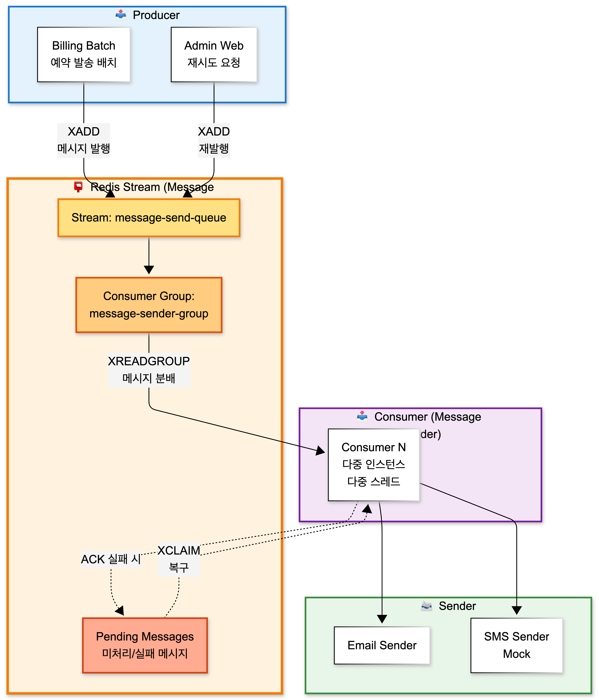
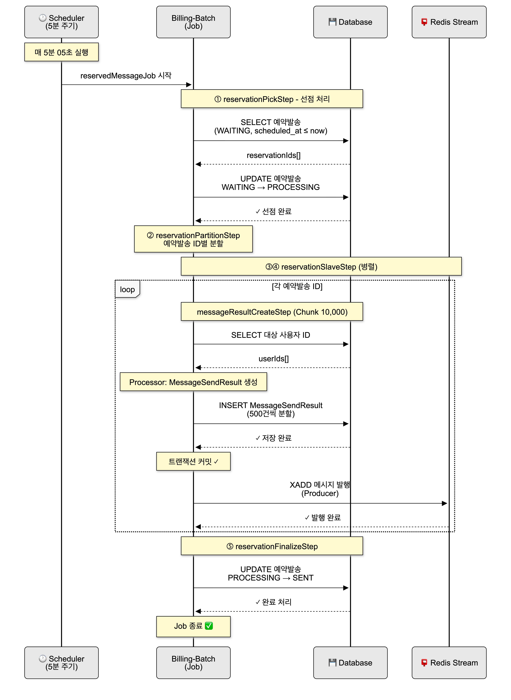
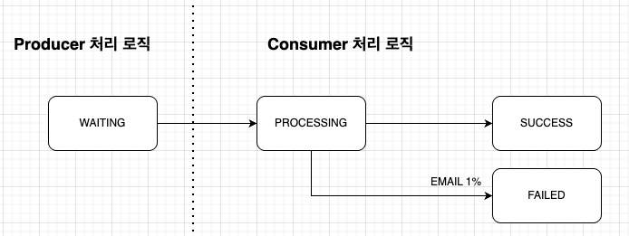
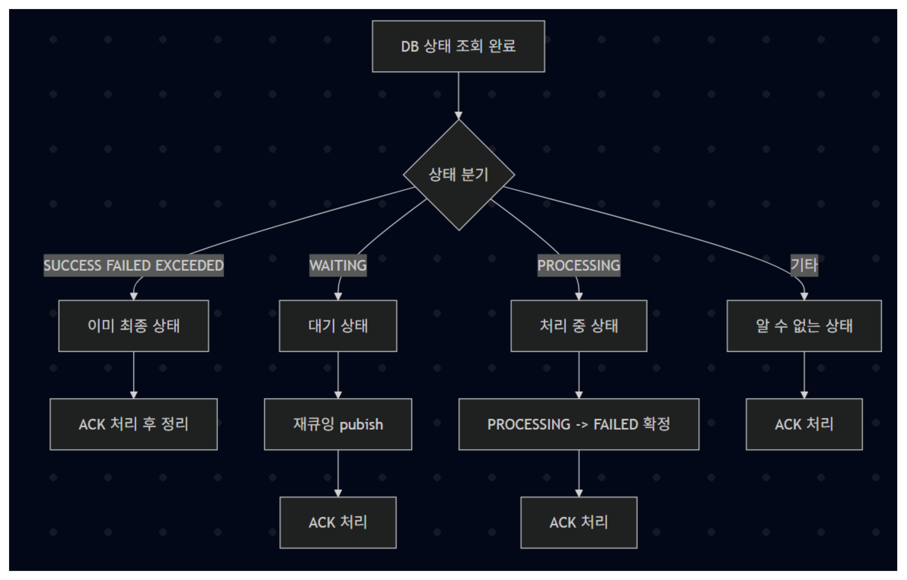
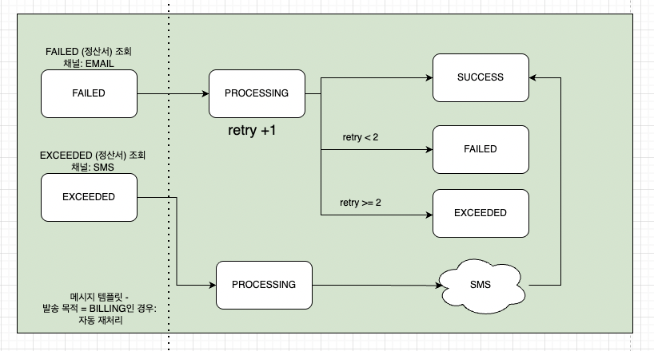
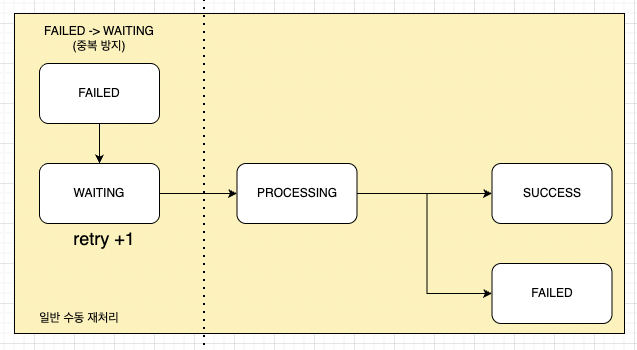

> 이번 프로젝트에서는 전체 시스템 설계와 예약 발송 메시지 처리 구조 설계와 구현을 중심으로 맡아 작업했다.
>
> 관리자 화면에서 예약 발송이 등록된 이후 실제 메시지 상태 생성, 큐 발행, 발송 완료 처리까지 이어지는 전체 흐름을 배치 기반으로 설계했고, 대량 메시지 처리 과정에서 발생할 수 있는 예외와 복구 시나리오를 함께 고려했다.

# 1. 시스템 아키텍쳐

- 시스템은 역할에 따라 세 개의 Spring 애플리케이션과 하나의 메시지 브로커로 분리되어 있다.
  - **Admin Web**
    - 관리자 화면을 담당한다.
    - 전송 실패 또는 배치 실패 발생 시 웹 UI를 통해 수동 재처리가 가능하다.
    - 메시지 전송 상태와 배치 실행 상태를 조회할 수 있다.
  - **Billing Batch**
    - 스케줄러 및 대량 처리 전담 시스템이다.
    - Scheduler
      - 정산서 데이터 생성: 월 1회
      - 예약 발송 실행: 5분 주기
      - 메시지 자동 재전송 및 복구 처리: 1~5분 주기
    - Spring Batch
      - 정산 배치와 예약 발송 배치를 Chunk / Partition 기반으로 수행한다.
    - Producer 역할
      - 예약 발송 실행 시 Redis Stream에 메시지를 발행하는 Producer 역할을 수행한다.
  - **Message Sender**
    - 실제 메시지 전송을 담당하는 Consumer 애플리케이션이다.
    - 다중 인스턴스 및 다중 스레드 환경에서 메시지를 병렬로 처리한다.
    - 메시지 채널에 따라 Email Sender, SMS Sender(Mock)로 분기 처리한다.

## Redis Stream 메시지 브로커

Redis Stream은 시스템 간 비동기 연결과 메시지 상태 복구를 담당한다.

- Billing Batch에서 메시지 발송 요청을 produce
- Message Sender에서 Consumer Group 기반으로 메시지를 consume
- Admin Web에서 실패 메시지 재시도 요청 시 재발행

Redis Stream을 사용함으로써 다음을 보장한다.

- 메시지 유실 방지
- 다중 Consumer에 의한 병렬 처리
- Pending 메시지 기반 장애 복구 가능

# 2. 예약 발송 처리 흐름

_예약 발송 선점부터 메시지 발행, 소비까지의 전체 흐름_

예약 발송은 5분 주기로 실행되는 스케줄러에 의해 처리된다. 스케줄러가 기동되면 현재 시각을 기준으로 발송 대상 예약을 조회하며, 동일한 Job이 이미 실행 중인 경우 중복 실행을 방지하도록 설계했다. 각 실행은 실행 시각을 JobParameter로 전달받아 독립적인 실행 단위로 구분된다.

처리의 시작 단계에서는 `scheduled_at <= now` 조건을 만족하고 `WAITING` 상태인 예약 발송만을 대상으로 선점 처리를 수행한다. 이 과정에서 예약 발송의 상태를 `WAITING`에서 `PROCESSING`으로 변경함으로써 동일한 예약 발송이 동시에 처리되는 상황을 구조적으로 차단했다.

선점이 완료된 예약 발송 ID 목록은 JobExecutionContext에 저장된다. 이후 파티셔닝 및 하위 Step에서는 해당 Context를 공통으로 참조하여, 동일한 예약 발송 집합을 기준으로 메시지 생성과 발송 요청 처리를 수행한다. 이를 통해 예약 발송 단위의 처리 흐름을 명확히 분리하고, Job 내부에서 일관된 데이터 범위를 유지할 수 있도록 했다.

## 예약 발송 배치 구조와 Producer 책임

예약 발송은 billing-batch의 ReservedMessageScheduler가 5분 주기로 실행하며, 예약 발송 처리 전반을 Spring Batch Job으로 수행한다. Job은 예약 발송을 선점하고(`WAITING` → `PROCESSING`), 예약 발송 ID 단위로 파티셔닝한 뒤 사용자별 메시지 상태를 생성하고 Redis Stream에 발송 요청을 발행한다. 이때 billing-batch는 메시지 발송 요청을 Redis Stream에 적재하는 Producer 역할을 맡으며, 메시지 발행은 DB 트랜잭션 커밋 이후에만 수행되도록 구성해 Consumer가 항상 커밋된 데이터만 조회하도록 보장했다.

## 병렬 처리 전략

예약 발송은 예약 발송 ID 단위로 파티셔닝을 적용했다. 하나의 Job 안에서 여러 예약 발송을 병렬로 처리할 수 있도록 구성했고, 각 파티션에는 reservationId, channelCode, purposeCode를 ExecutionContext로 전달해 예약 발송 단위의 처리 흐름이 서로 간섭되지 않도록 했다. 이 구조로 예약 발송 단위의 격리를 보장하면서도 처리량을 확보할 수 있었다.

## 메시지 상태 생성과 Stream 발행

메시지 상태 생성은 Chunk 기반 Step으로 구성했다. Reader에서 예약 발송 대상 사용자 ID 목록을 조회하고, Processor에서 각 사용자에 대해 MessageSendResult를 생성한 뒤, Writer에서 대량 Insert 부하를 줄이기 위해 Chunk 10,000건을 500건 단위로 분할 Insert하도록 했다. 메시지 발행은 트랜잭션 커밋 이후에 수행되도록 구성했으며, 이 규칙이 깨지면 Consumer가 DB 조회에 실패하거나 누락이 발생할 수 있기 때문에 “커밋 이후 발행”을 일관된 원칙으로 고정했다.

또한 예약 발송 완료 처리는 별도 Tasklet에서 수행해 메시지 상태 생성/발행 단계와 분리했고, 예약 발송 상태는 최종적으로 SENT로 변경되도록 했다. 대량 메시지 상태를 한 번에 생성하는 과정에서 CPU 사용량이 급증하는 문제가 있어 admin-web에서 즉시 생성하는 방식은 배제했고, 대량 작업을 billing-batch에서 순차적(batch)으로 수행하도록 역할을 분리했다.

# 3. 예외 상황 및 복구 설계

_메시지 상태 기본 분기_

비동기 메시지 처리에서 가장 문제가 되는 상황은 Consumer 장애 또는 예외로 인해 Redis Stream에 Pending 메시지가 누적되는 경우다. 이 상태에서 ACK가 되지 않으면 메시지는 재처리되지 않고 `PROCESSING`으로만 남기 때문에, Pending을 주기적으로 점검하고 회수하는 복구 루틴이 필요했다.

## timeout 메시지 처리

_Redis Stream timeout 메시지 상태별 처리_

복구 흐름은 다음 원칙으로 설계했다. 먼저 XPENDING으로 Consumer Group 기준 Pending 메시지를 조회하고, 마지막 전달 이후 idle 시간이 특정 timeout을 초과한 메시지에 한해서만 복구 대상으로 선정했다. 이후 XCLAIM으로 Recovery 전용 Consumer가 메시지를 회수해 “이 메시지는 내가 다시 처리하겠다”는 소유권을 가져오고, 회수한 메시지는 무조건 DB 상태를 기준으로 재처리 여부를 판단하도록 했다. Redis만 보고 재처리하면 중복 처리 위험이 있기 때문에, 최종 판단 기준은 항상 DB의 message_send_results 상태 코드로 고정했다.

상태별 처리 정책은 다음과 같이 정리했다. 첫째, `SUCCESS`/`FAILED`/`EXCEEDED`처럼 이미 최종 상태인 경우에는 재처리를 하지 않고 ACK만 수행해 Pending을 정리한다. 둘째, `WAITING` 상태라면 실제 전송이 아직 시작되지 않은 상태이므로 동일 payload로 Redis Stream에 다시 발행(XADD)하여 재큐잉하고, 기존 Pending 엔트리는 ACK로 정리한다. 셋째, `PROCESSING` 상태로 오래 남아있는 경우는 전송 도중 Consumer가 죽었거나 예외로 종료된 케이스로 간주하고, DB 상태를 `PROCESSING`에서 FAILED로 확정 업데이트한 뒤 ACK 처리해 “재시도 스캔 대상”으로 넘긴다. 넷째, DB에 레코드가 없거나 payload가 불완전한 경우는 유령 메시지로 보고 ACK 후 정리한다.

이 구조를 통해 Consumer가 중단되더라도 메시지가 유실되지 않고, 재처리 여부가 DB 상태에 의해 결정되므로 중복 발송 가능성을 낮출 수 있었다. 또한 예외 발생 시 즉시 ACK하지 않고 Pending에 남기도록 해서, 일시적인 장애는 복구 스케줄러가 회수해 처리할 수 있게 했다.

## 정산서 전송 실패 시 메시지 자동처리

정산서 전송일 경우 메시지는 EMAIL 채널로 전송되며 1% 확률로 실패한다. 100만 건을 처리하는데 총 3회의 전송이면 실패율이 1건이 되므로 최대 재전송 시도는 2회로 설정하였다.

최대 재전송 횟수만큼 재전송을 실행하고, 실패하면 SMS 채널로 전환하여 전송한다. 실패 여부는 message_send_result 데이터에 상태코드로 저장되며, 스케줄러에 의해 1분 마다 자동 재전송이 시도된다.

_정산서 자동 재전송 상태 분기_

이메일 전송이 실패하면 상태는 `FAILED`로 변경되고 retry_count가 증가하며, retry_count가 최대 재시도 횟수(2회) 미만인 경우 다시 `PROCESSING` 상태로 진입해 재전송을 시도한다. 재시도 횟수가 2회를 초과하면 더 이상 이메일 재시도를 수행하지 않고 `EXCEEDED` 상태로 전환한다.

정산서 메시지가 `EXCEEDED` 상태가 되면 이메일 대신 SMS 채널로 fallback 발송을 수행한다. SMS 발송은 실패하지 않는다는 가정 하에 처리되며, SMS 전송이 완료되면 최종적으로 `SUCCESS` 상태로 확정된다. 이 흐름을 통해 정산서 메시지는 외부 시스템 장애나 일시적인 오류가 발생하더라도 시스템이 개입 없이 자동으로 복구를 시도하고, 최종적으로 사용자에게 전달되도록 설계했다.

## 정산서 이외의 전송 실패 메시지는 수동 재처리

_정산서 이외 메시지 수동 재전송 상태 분기_

정산서 목적이 아닌 일반 메시지는 자동 재시도 대상에서 제외했다. 일반 메시지는 템플릿 오류, 발송 대상 설정 오류 등 관리자의 판단이 필요한 실패 원인이 많다고 판단했기 때문이다. 이러한 메시지가 실패하면 `FAILED` 상태로 종료되며, 관리자 화면에서 수동 재시도 요청이 들어온 경우에만 재처리 흐름으로 다시 진입한다.

수동 재시도가 요청되면 메시지 상태는 `FAILED`에서 `WAITING으로` 변경되고 retry_count가 증가한다. 이후 해당 메시지는 새로운 발송 요청과 동일하게 Redis Stream에 다시 발행되며, Consumer에서 `PROCESSING` 상태로 선점된 뒤 재전송을 시도한다. 이 과정에서도 자동 재시도와 동일하게 DB 상태를 기준으로 처리 여부를 판단해 중복 발송을 방지한다.

이처럼 자동 재시도와 수동 재시도를 목적과 책임 주체에 따라 분리함으로써, 시스템이 처리해야 할 실패와 사람이 판단해야 할 실패를 명확히 구분할 수 있었다. 또한 모든 재처리 흐름은 DB 상태를 기준으로 수렴되도록 설계해, Consumer 장애나 중복 발행 상황에서도 메시지 처리 기준이 흔들리지 않도록 했다.

결과적으로 메시지 처리 흐름은 정상 처리, 자동 복구, 수동 개입, 또는 종료(`EXCEEDED`) 중 하나로 귀결되며, 중간 상태로 방치되는 메시지는 남지 않도록 설계했다.

# 회고

## 잘한 점

- 예약 발송 메시지 발송 구조를 설계하면서 성공 흐름보다 예외와 중단 상황을 먼저 고려했다. 예약 발송 선점 처리, 트랜잭션 커밋 이후 메시지 발행, Redis Stream Pending 복구 흐름을 통해 장애가 발생하더라도 메시지가 유실되지 않고 자동으로 복구될 수 있는 구조를 구현했다. 특히 Consumer 장애 상황을 가정하고 DB 상태를 기준으로 재처리 여부를 판단하도록 한 설계는 실제 운영 환경을 고려한 선택이었다고 생각한다.

- Producer와 Consumer의 역할을 명확히 분리하고 Redis Stream과 Consumer Group을 활용해 메시지 발송을 병렬 처리하는 구조를 직접 설계하고 구현했다. 단순히 큐를 사용하는 수준이 아니라, 메시지 상태 정합성과 처리 순서를 함께 고려한 구조를 경험할 수 있었고 비동기 메시지 처리 흐름에 대한 이해도가 크게 높아졌다.

- 조장으로서 팀 프로젝트를 이끌며 예약 발송 및 메시지 발송 구조처럼 복잡한 흐름을 맡아 정리하고 방향을 제시했다. 팀원들이 각자 맡은 역할을 안정적으로 수행할 수 있도록 작업 범위를 나누고, 문제 발생 시 원인과 해결 방향을 공유하는 데 집중했다. 그 결과 팀 프로젝트 전반이 큰 혼선 없이 진행되었고, 팀 리딩에 대해 긍정적인 평가를 받을 수 있었다.

## 아쉬운 점

- 메시지 발송과 정산 배치의 핵심 로직에 대해 테스트 코드를 충분히 작성하지 못했다. 대량 처리 특성상 수동 테스트와 로그 분석에 의존한 부분이 많았고, 예약 발송 Step이나 메시지 상태 전이 로직을 자동으로 검증할 수 있는 테스트 환경을 구축하지 못한 점이 아쉬움으로 남는다.

- 메시지 상태 저장과 발송 과정에서 발생한 CPU 병목을 구조적으로 완화하는 방향까지는 도달했지만, DB 분리나 샤딩과 같은 근본적인 확장 구조까지는 적용하지 못했다. 병목을 인지하고 개선 방향을 도출했으나, 프로젝트 범위와 시간 제약으로 완전한 해결까지 이어지지 못한 한계가 있었다.

- 기획 단계에서 예약 발송 정책과 메시지 처리 조건에 대한 고민이 충분하지 못했다. 실제 구현 과정에서 대량 메시지 생성 시 부하 문제나 상태 관리 책임에 대한 재설계가 필요했고, 초기 기획 단계에서 이러한 부분을 더 깊이 고려했으면 구조 변경 비용을 줄일 수 있었을 것이라고 느꼈다.

- 정산 및 메시지 발송 로직에서 실제 서비스 수준의 복잡한 계산 조건이나 예외 케이스를 모두 반영하지는 못했다. 이번 프로젝트에서는 대용량 처리 구조와 안정성에 초점을 맞췄기 때문에 계산 로직 자체는 단순화된 정책 위주로 구현되었고, 이 부분은 한계로 남았다.
