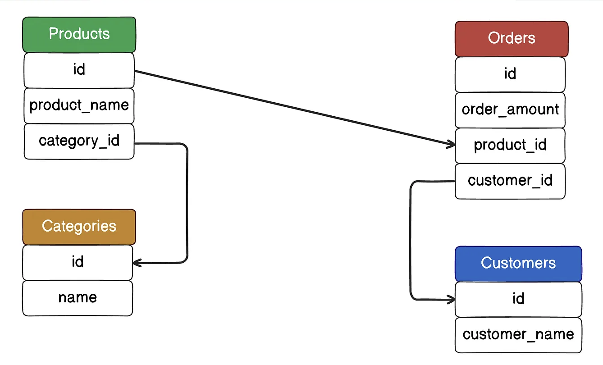
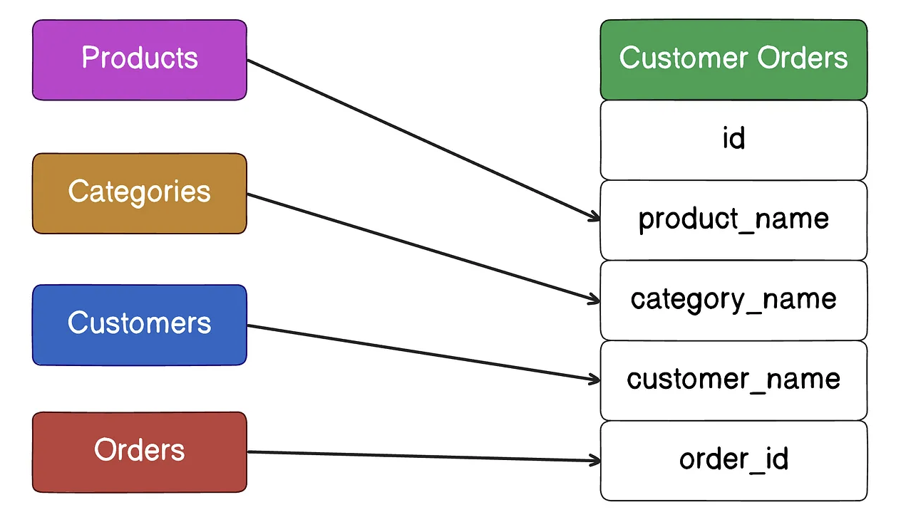
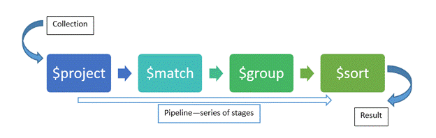
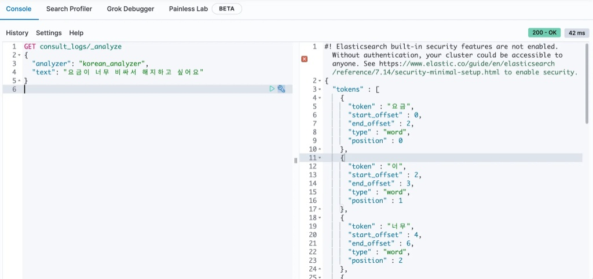
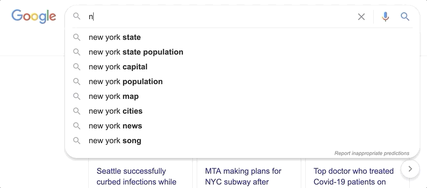

## 1. 성취 (Achievement)

- 검색/조회 중심 서비스 설계를 위한 Polyglot Persistence 구조 설계
- RDBMS(MySQL), MongoDB, Elasticsearch 역할 분리로 성능과 정합성 확보
- 사용자 사전, 동의어 사전을 기반으로 검색 인덱스 설계 전략 수립
- MySQL 기반 검색 최적화(B-Tree, Composite Index, Covering Index, Full-Text)와 NoSQL/검색 엔진 최적화 전략 학습

---

## 2. 학습 (Learning)

### 2.1 MySQL 검색 최적화 요소 및 고민

1. **B-Tree Index**

   B-Tree는 MySQL에서 가장 기본적인 인덱스 구조로, 특정 값(`=`) 조회나 범위 조회(`>`, `<`)에서 뛰어난 성능을 보여준다.

   부분 일치 검색(`LIKE '%키워드%'`)은 인덱스를 타지 못하고 Full Table Scan이 발생하므로 성능 저하가 크다.

   **깨달음**: 단순 조회와 범위 조건은 효율적이지만, 복잡한 텍스트 검색에는 한계가 있다.

2. **Composite Index (복합 인덱스)**

여러 컬럼을 하나의 인덱스로 묶어 복합 조건 조회에 활용한다.

- **전통적 이해**: 왼쪽 컬럼 조건이 없으면 인덱스를 제대로 활용할 수 없었음.
  예: `(상담일자, 상담사ID)` → 상담일자만 조건으로 조회 가능, 상담사ID만 조건이면 인덱스 활용 어려움.
  
- **최신 구조**: 각 컬럼 값과 포인터를 연결한 다중 컬럼 B-Tree 구조로 관리. 옵티마이저가 통계 기반 탐색 경로를 결정하므로, 왼쪽 컬럼 조건 없이도 일부 인덱스 활용 가능.
  

- **설계 고려**: 조회 패턴, 범위 검색, 자주 사용되는 조건을 분석해 인덱스 구성. 부분 일치나 범위 조건은 여전히 성능에 영향.

3. **Cardinality (카디널리티)**

   컬럼 값의 다양성에 따라 인덱스 효율이 달라진다.

   값이 적은 상태 컬럼(대기/처리중/완료)은 단독 인덱스 효율이 낮아, 다른 조건과 결합한 복합 인덱스를 설계해야 한다.

4. **Covering Index**

   인덱스에 필요한 모든 컬럼이 포함되면 테이블 접근 없이 쿼리를 처리할 수 있다.

   조회 속도가 크게 개선되며, 자주 조회되는 컬럼을 중심으로 설계하는 것이 중요하다.

5. **EXPLAIN / Execution Plan**

   실제 쿼리가 어떻게 실행되는지 확인하고 인덱스 사용 여부를 판단한다.

   단순 인덱스 존재 여부보다 **쿼리 구조와 조건 순서**가 성능에 결정적인 영향을 미친다.

6. **LIKE 검색 패턴**

   접두어 검색(`'키워드%'`)과 부분 일치(`'%키워드%'`)의 성능 차이를 확인했다.

   복잡한 키워드 검색에는 B-Tree 한계가 명확하므로 Elasticsearch 도입 근거가 된다.

7. **Full-Text Search**

   문자열을 토큰화 후 역색인 방식으로 검색할 수 있지만, 한국어 형태소 처리 한계, 동의어 처리 한계, 관련도 점수 계산 한계가 있다.

8. **Tokenizer / Stop Word**

   검색 품질을 높이기 위해 단어 분리 기준과 의미 없는 단어 제거 규칙을 고민했다.

   MySQL Full-Text에서는 한국어 형태소 처리 최적화가 어려워 Elasticsearch와 결합 필요성을 느꼈다.

9. **Search Normalization**

   검색어 표기 통일, 동의어/유의어 처리 등.

   커스텀 사전 관리 필요성을 확인했다.

10. **Denormalization (반정규화)**
    
    

    JOIN 제거, 검색 대상 단순화 위해 일부 컬럼을 한 테이블에 집약하여 중복 저장.

    조회 성능과 정합성 간 트레이드오프를 설계 단계에서 고려.

11. **Full Scan vs Index Scan**

    전체 테이블 스캔보다 인덱스 스캔 활용이 필수적임을 확인.

12. **Pagination + Index**

    OFFSET 기반 페이징은 성능 저하가 크므로, search_after 등 인덱스 기반 페이지 전략 설계를 고려했다.

13. **RDB Full-Text 한계**

    대규모 데이터, 다중 필드 검색에는 MySQL Full-Text로 한계가 있었고, 검색 전용 엔진 도입 근거가 됨.

---

### 2.2 MongoDB 검색/조회 설계 고려

#### 읽기 중심 설계

- 상담 요약 문서에 고객 정보, 상담사 정보, 키워드, 카테고리 등 조회 대상 전체 내용포함 → JOIN 없이 단일 조회 가능
- 역정규화 구조 설계로 조회 성능 극대화

#### 검색/조회 최적화 전략

1. **복합 인덱스 설계**

   단일 필드 인덱스로는 다중 조건 조회를 최적화하기 어렵다.

   상담 요약 조회가 `category + date + keyword` 조합으로 수행된다면, 해당 조회 패턴을 기준으로 복합 인덱스를 설계해야 한다.
   - 자주 사용되는 조건을 앞쪽에 배치 (Leftmost Prefix Rule 고려)
   - 정렬 조건이 있다면 인덱스에 포함
   - 선택도가 높은 필드를 앞에 배치하여 필터링 효율 극대화

     ```jsx
     db.summary.createIndex({ category: 1, date: -1 });
     ```

   - 트레이드오프
   - 인덱스 수 증가 → 쓰기 성능 저하
   - 메모리 사용량 증가

   읽기 중심 시스템이라면 인덱스 비용을 감수하고 조회 성능을 우선한다.

2. **Projection 활용**

   MongoDB는 기본적으로 문서 전체를 반환한다.

   요약 문서가 크다면 네트워크 비용과 메모리 사용량이 증가한다.
   - 필요한 필드만 조회하여 I/O 감소
   - 인덱스 커버링 조회 가능성 확보
   - 대용량 필드(ex: 상담 원문)는 목록 조회에서 제외

   ```jsx
   db.summary.find({ category: 'billing' }, { title: 1, date: 1, keywords: 1, _id: 0 });
   ```

   목록 조회와 상세 조회를 분리 설계하는 것이 일반적이다.

3. **Aggregation Pipeline 최적화**

   
   Aggregation은 단계 순서에 따라 성능 차이가 크다.
   - 원칙
     - `$match`를 가능한 한 앞에 배치
       - 조건별 데이터 선별 시 인덱스 활용 가능
     - `$project`로 불필요 필드 제거 후 다음 단계 수행
     - `$group`은 데이터 양을 충분히 줄인 뒤 실행

   - 인덱스 적용 불가로 비효율적인 순서

     ```jsx
     $project → $match → $group
     ```

   - 권장 구조

     ```jsx
     $match → $project → $group
     ```

   Aggregation은 내부적으로 메모리를 사용하므로, 초기 단계에서 데이터 양을 줄이는 것이 핵심이다.

4. **요약 문서 설계**

   읽기 중심 구조에서는 조인을 제거하기 위해 역정규화한다.
   - 상담 요약 문서에 포함할 필드
     - 고객 식별 정보
     - 상담사 정보
     - 키워드 배열
     - 카테고리
     - 작성 일시
     - 상태 값
     - 목표
     - 단일 쿼리로 목록/상세 조회 가능
     - 조회 경로 단순화
     - ES 연동 시 색인 데이터로 재사용 가능

   - 단점
     - 데이터 중복
     - 수정 시 동기화 필요

5. **데이터 일관성 전략**

   역정규화 구조에서는 데이터 불일치 위험이 존재한다.
   - 대응 전략
     - Bulk Write로 다중 문서 동시 갱신
     - Atomic Update 연산자 활용 ($set, $inc 등)
     - 트랜잭션 사용 (복수 컬렉션 갱신 시)
     - 이벤트 기반 비동기 동기화 설계

   쓰기 비용은 증가하지만 읽기 성능과 확장성을 확보한다.

#### 자동완성/텍스트 검색 보완 고려

- 접두어 검색은 가능하지만, 오타 허용/유사도 기반 검색은 별도 구현 필요
- 검색 관련 부하 최소화를 위해 ES와 결합 설계

---

### 2.3 Elasticsearch 검색/조회 설계 고려

- **선택 이유**
  - 부분 일치, 다중 필드, 형태소 분석, 키워드 자동완성, 유사도 기반 랭킹 필요
- **검색/조회 최적화 전략**
  - **분석기(Nori) 적용**
    
    - 한국어는 조사·어미 변화가 많아 공백 기준 토큰화로는 의미 단위가 정확히 분리되지 않는다.
    - Nori 분석기를 적용해 형태소 단위로 색인하면 검색 정확도가 개선된다.
    - 사용자 사전을 추가해 도메인 특화 용어(서비스명, 고유명사 등)를 보완할 수 있다.
    - 색인 시점 분석 전략이 검색 품질을 결정하므로, 기본 analyzer 선택은 설계 단계에서 확정해야 한다.
  - **Query vs Filter 분리**
    - relevance score가 필요한 조건만 Query Context로 처리한다.
    - 상태값, 카테고리, 날짜 범위처럼 점수 계산이 불필요한 조건은 Filter Context로 분리한다.
    - Filter는 scoring을 수행하지 않고 캐시 활용이 가능하므로 CPU 사용량과 응답 지연을 줄일 수 있다.
    - 검색 정확도와 성능을 동시에 확보하기 위한 기본 설계 원칙이다.
  - **Multi-field 및 Nested 설계**
    - 하나의 필드를 text + keyword 형태로 다중 색인해 전문 검색과 정렬·집계를 동시에 지원한다.
    - 자동완성용 필드는 edge_ngram 전용 필드로 분리해 목적에 맞게 색인한다.
    - 배열 내부 객체가 독립적인 의미 단위를 갖는 경우 nested 매핑을 사용한다.
    - 단순 object 배열은 필드 간 교차 매칭 문제를 유발할 수 있으므로 주의가 필요하다.
  - **인덱스 버전 관리 및 Alias 전략**
    - 매핑 변경이나 대규모 재색인이 필요한 경우 새로운 버전의 인덱스를 생성한다.
    - 서비스는 alias를 통해 인덱스를 참조하도록 구성한다.
    - 재색인 완료 후 alias를 전환하면 무중단 배포가 가능하다.
    - 장애 발생 시 이전 인덱스로 즉시 롤백할 수 있는 구조를 유지한다.
  - **Batch vs Incremental Update 전략**
    - 대량 데이터 초기 색인은 Batch 방식으로 처리해 색인 효율을 극대화한다.
    - 실시간 변경 데이터는 Incremental Update로 처리해 색인 지연을 최소화한다.
    - Bulk API를 활용해 네트워크 오버헤드를 줄이고 처리량을 확보한다.
    - 쓰기 부하와 검색 지연 사이의 균형을 고려해 전략을 병행한다.
  - **JVM 및 클러스터 운영 고려**
    - 힙 메모리는 전체 메모리의 약 50% 수준에서 설정하고, 과도한 힙 증설은 GC 지연을 유발할 수 있다.
    - shard 수는 인덱스 크기와 노드 수를 기준으로 산정하며, 과도한 shard 분할은 오히려 성능을 저하시킨다.
    - replica는 가용성과 읽기 확장성을 동시에 고려해 설정한다.
    - GC 모니터링, heap usage 추적, segment 병합 상태 확인은 운영 필수 항목이다.
  - **자동완성 설계 (edge_ngram 기반)**
    - edge_ngram 분석기를 활용해 접두어 기반 검색을 지원한다.
    - 검색 전용 필드로 분리해 일반 검색 필드와 혼합하지 않는다.
    - 최소/최대 gram 길이는 사용자 입력 패턴을 기준으로 설정한다.
    - 도메인 사전을 반영해 의미 없는 토큰 생성을 방지하고 정확도를 유지한다.
- **운영/성능 고민**
  - 대규모 색인/검색 시 메모리와 GC 영향
  - 사전 변경 시 재인덱싱 전략, Alias 전환, 롤백 고려

---

### 2.4 키워드 및 자동완성



- 상담/사용자 텍스트 의미 있는 단어 → 키워드 추출
- 자동완성 → edge_ngram, prefix 토크나이저
- 커스텀 사전 활용 → 신조어나 도메인 특화 용어 처리

### 2.5 사용자/동의어 사전

- 사용자 사전: 공백 포함 단어도 하나로 인식
- 동의어 사전: 검색 일관성 확보

---

## 3. 개선 (Improvement)

- 재인덱싱 부담 최소화 → MongoDB 요약 데이터 활용
- Filter Context, 점수 계산 제외 조건 적용
- 키워드 집계 위치 결정 → ES vs MongoDB

---

## 4. 피드백 (Feedback)

- **Good**: 사전 기반 검색 품질 향상, 역할 분리 설계로 성능·안정성 확보
- **Bad**: Elasticsearch Nori 세부 설정, JVM/GC 관리, 재인덱싱 전략 고민 필요

---

## 5. TIP (Tip)

- Filter Context → CPU 절감, 캐싱 가능
- 커스텀 사전 관리 → 검색/요약 시스템에서
- MongoDB 기반 사전 업데이트 → ES 재인덱싱 최소화
- 자동완성 → edge_ngram + 커스텀 단어 반영
- JVM 기반 ES → 리소스/GC 설계 필수

---

### 6. RDBMS / NoSQL / Elasticsearch 검색·조회 장점 요약

<div className="mdx-table-wrapper">
  <table className="mdx-table">
    <thead className="mdx-thead">
      <tr className="mdx-tr">
        <th className="mdx-th">저장소</th>
        <th className="mdx-th">장점(검색/조회 관점)</th>
        <th className="mdx-th">설계 단계에서 고려한 최적화 전략</th>
      </tr>
    </thead>
    <tbody className="mdx-tbody">
      <tr className="mdx-tr">
        <td className="mdx-td">MySQL</td>
        <td className="mdx-td">정확 조건, 범위 조회, 정합성</td>
        <td className="mdx-td">
          인덱스 설계, Composite Index, Covering Index, Full-Text, Pagination 전략
        </td>
      </tr>
      <tr className="mdx-tr">
        <td className="mdx-td">MongoDB</td>
        <td className="mdx-td">문서 단위 조회, JOIN 제거, 요약 데이터 활용</td>
        <td className="mdx-td">
          복합 인덱스, Projection, Aggregation Pipeline 최적화, 샤딩, 요약 문서 설계, Bulk Write
        </td>
      </tr>
      <tr className="mdx-tr">
        <td className="mdx-td">Elasticsearch</td>
        <td className="mdx-td">텍스트 검색, 유사도 기반 정렬, 자동완성</td>
        <td className="mdx-td">
          Nori 분석기, query/filter 분리, edge_ngram, 인덱스 버전+Alias, Batch/Incremental Update,
          JVM 운영 고려
        </td>
      </tr>
    </tbody>
  </table>
</div>
