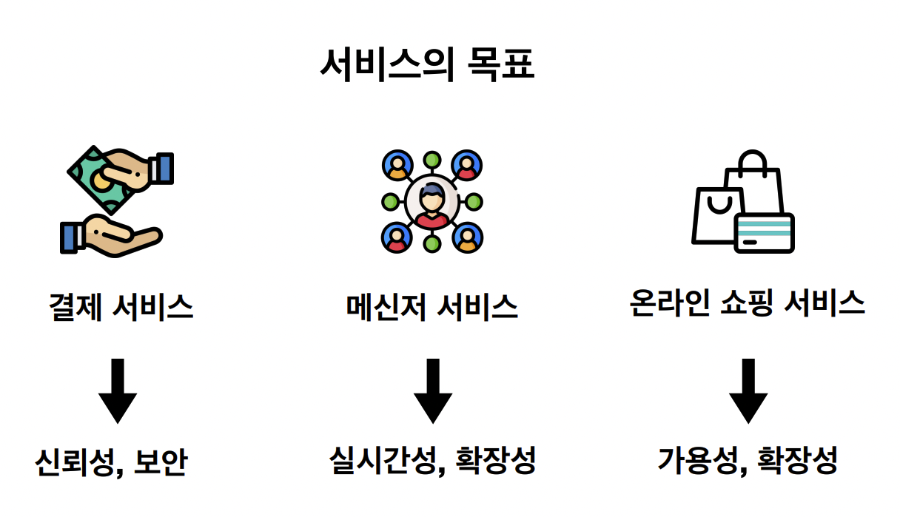
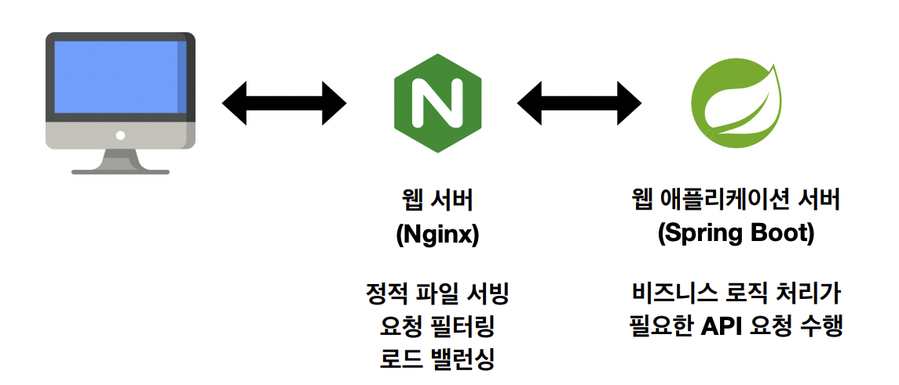
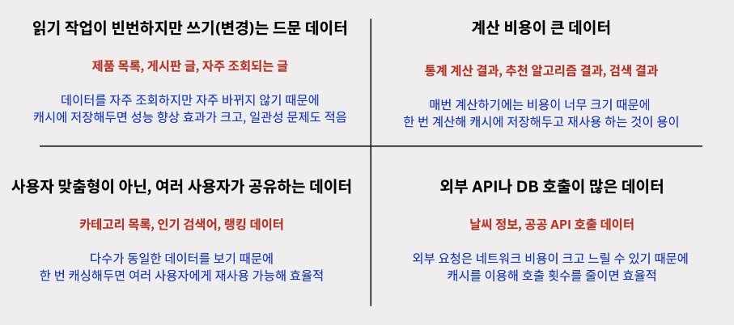
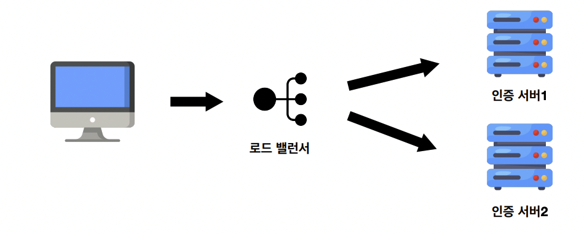
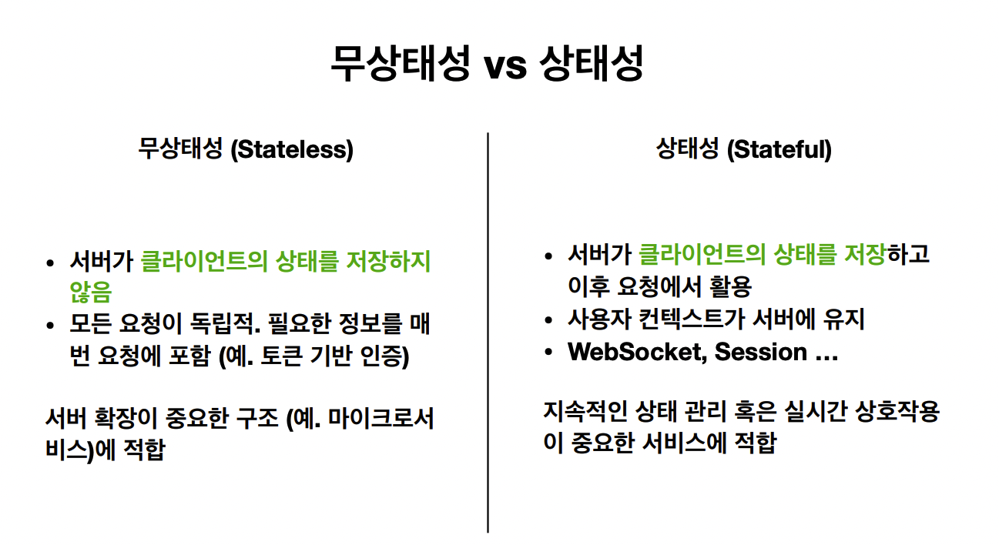
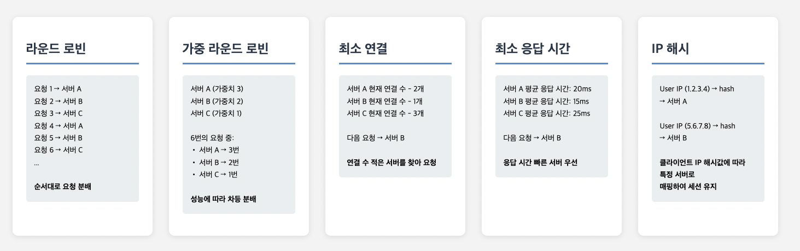

종합 프로젝트에서 웹 기반 백엔드 시스템의 아키텍처를 직접 설계하고 구현해보았다. 시스템 전체를 설계하는 것이 처음이었기 때문에, 당시에는 구조적 선택을 비교하기보다는 서비스가 안정적으로 동작하는지 여부, 즉 가용성을 중심으로 판단하며 작업했던 것 같다.

앞으로 진행할 최종 융합 프로젝트에서는 잘 동작하는 시스템을 만드는 것을 넘어서, 여러 설계 대안을 비교하고 그중 적절한 선택을 의도적으로 할 수 있기를 기대하고 있다. 이를 위해서는 신뢰성, 가용성, 성능, 확장성과 같은 시스템 품질 속성이 각각 어떤 의미를 가지며, 실제 설계에서 어떤 목표를 설정해야하는지를 먼저 정리해보고자 한다.

또한 이번 TIL에서는 웹 기반 백엔드 시스템을 전제로 하여, 시스템 설계에서 반복적으로 등장하는 핵심 개념들을 정리해보려고 한다.

---

## 1. 시스템 품질 목표

백엔드 시스템 설계에서 가장 먼저 정리해야 할 것은 시스템이 어떤 품질을 목표로 하는지에 대한 기준이다. 신뢰성, 가용성, 성능, 확장성은 시스템의 특성을 설명하는 용어로 자주 사용되지만, 설계 관점에서는 각각 서로 다른 목표를 의미한다.

어떤 것을 목표로 하느냐에 따라 trade off가 발생하기 때문에 시스템 목적에 적절한 목표를 설정하는 것이 중요하다.

예를 들어 결제 서비스의 경우에는 데이터의 정확성과 보안이 핵심이 되므로 신뢰성이 가장 중요한 목표가 된다. 반면 메신저 서비스는 사용자 간의 실시간 상호작용이 중심이 되기 때문에 낮은 지연 시간과 높은 확장성이 중요한 설계 목표가 된다. 온라인 쇼핑 서비스처럼 트래픽 변동이 큰 서비스의 경우에는 장애 상황에서도 서비스가 지속될 수 있는 가용성과, 사용자 증가에 대응할 수 있는 확장성이 우선적으로 고려된다.

이처럼 시스템 설계에서 신뢰성, 가용성, 성능, 확장성은 동시에 모두 극대화해야 할 속성이 아니라, 서비스가 달성하고자 하는 목표에 따라 우선순위가 달라지는 기준으로 이해하는 것이 적절하다.

### 1.1 신뢰성 (Reliability)

신뢰성은 시스템이 의도된 동작을 정확하게 수행하는 능력을 의미한다. 이는 시스템이 단순히 동작 중인지 여부와는 구분된다. 신뢰성이 논의되는 지점은 주로 결과의 정확성과 데이터 정합성이다.

신뢰성은 다음과 같은 요소들과 강하게 연결된다.

- 동일한 요청이 반복되더라도 결과가 일관되게 유지되는지 여부
- 부분 실패나 재시도 상황에서 데이터가 훼손되지 않는지 여부
- 중간 상태로 데이터가 저장되거나 불완전한 결과가 노출되지 않는지 여부
- 트랜잭션, 멱등성, 무결성 제약 조건의 적절한 적용 여부

신뢰성 지표는 다음과 같은것이 있다.

- MTBF(Mean Time Between Failures)
- MTTR(Mean Time To Repair)
- 에러율
- 데이터 무결성 검사

### 1.2 가용성 (Availability)

가용성은 시스템이 요청을 처리할 수 있는 상태로 존재하는 비율을 의미한다. 이 개념은 결과의 정확성보다는 응답 가능성에 초점을 둔다.

가용성의 관점에서 중요한 판단 기준은 다음과 같다.

- 일부 기능이 제한된 상태에서도 요청을 받을 수 있는지 여부
- 특정 인스턴스에 장애가 발생해도 전체 서비스가 중단되지 않는지 여부
- 장애 발생 시 빠르게 대체 경로로 요청을 우회할 수 있는지 여부

가용성은 다중 인스턴스 구성, 장애 격리, 로드 밸런싱과 같은 구조적 선택과 밀접하게 관련된다.

가용성을 높이기 위해서는 다음을 고려할 수 있다.

- 이중화
- 재시도 및 실패 대비
- 장애 감지

### 1.3 성능 (Performance)

성능은 단일 요청 또는 일정 시간 동안의 요청을 얼마나 효율적으로 처리할 수 있는지를 나타낸다. 일반적으로 응답 시간과 처리량이 주요 지표로 사용된다.

성능 문제는 주로 다음과 같은 원인에서 발생한다.

- 비효율적인 쿼리나 데이터 접근 패턴
- 과도한 동기 호출로 인한 대기 시간 증가
- 불필요한 네트워크 왕복
- 애플리케이션 내부 로직의 비효율

성능이라는 목표는 단순히 자원을 추가하는 방식으로 달성되지 않으며, 내부 처리 흐름과 구현 효율에 크게 의존한다.

성능을 높이기 위해서는 다음과 같은 방식을 고려할 수 있다.

- 캐싱
  - 자주 조회되는 데이터의 응답 속도를 빠르게 한다.
  - 캐시 무효화, 오래된 데이터 표시 가능성
- 비동기 처리
  - 오래 걸리는 작업의 대기시간을 줄인다.
  - 순서 보장되지 않음, 에러 처리 로직 복잡도 증가
- DB 최적화
  - 쿼리 최적화, 인덱스 추가, Read용 레플리카, 샤딩

### 1.4 확장성 (Scalability)

확장성은 부하 증가 시 자원을 추가함으로써 성능 저하를 억제할 수 있는 능력을 의미한다. 이는 현재 시스템이 빠른지 여부와는 별개의 문제다.

확장성을 판단할 때 고려해야 할 요소는 다음과 같다.

- 애플리케이션 서버가 상태를 내부에 보관하고 있는지 여부
- 서버를 수평으로 추가하는 것이 가능한 구조인지 여부
- 특정 컴포넌트가 병목으로 고정되어 있지 않은지 여부

확장성이라는 목표는 구현 단계에서 보완하기보다, 설계 단계에서의 구조적 선택에 의해 대부분 결정된다.

### 1.5 시스템 품질 목표 관계 정리

각 품질 목표는 시스템 설계 시 서로 다른 질문에 대응한다. 설계 과정에서는 이 목표들 중 무엇을 우선할 것인지, 그리고 어떤 목표를 부분적으로 양보할 것인지를 명확히 인식할 필요가 있다.

- 신뢰성은 결과가 정확한지를 묻는다.
- 가용성은 요청을 받을 수 있는지를 묻는다.
- 성능은 얼마나 빠르게 처리되는지를 묻는다.
- 확장성은 규모가 커져도 유지 가능한지를 묻는다.

이 네 가지는 서로 보완적일 수 있으나, 동일한 개념은 아니다.

## 2. 백엔드 시스템 주요 컴포넌트의 역할

백엔드 시스템은 여러 컴포넌트가 각자의 책임을 나누어 가지는 구조로 구성된다. 각 컴포넌트는 특정 품질 속성을 보완하기 위해 존재한다.

### 2.1 애플리케이션 서버

애플리케이션 서버는 클라이언트 요청을 처리하고 비즈니스 로직을 수행하는 역할을 담당한다. 일반적으로 애플리케이션 서버는 다음 원칙을 따른다.

- 상태를 최소화하여 확장성을 확보한다.
- 요청 수명을 짧게 유지한다.
- 장기 상태는 외부 저장소로 위임한다.

여기서 말하는 애플리케이션 서버는 정적 리소스를 제공하는 웹 서버와 구분되며, 비즈니스 로직과 데이터 접근을 담당하는 서버를 의미한다.

### 2.2 데이터베이스

데이터베이스는 영속 데이터를 저장하며, 시스템의 최종적인 진실 원천으로 취급된다. 데이터베이스는 상대적으로 느릴 수 있으나, 결과의 정확성은 반드시 보장되어야 한다. 이로 인해 데이터베이스는 성능보다 신뢰성과 더 강하게 연결된다.

캐시나 메시지 큐가 데이터베이스 앞단에 배치되는 이유는 데이터베이스의 부담을 줄이기 위함이지, 데이터베이스의 정확성을 대체하기 위함은 아니다.

### 2.3 캐시

캐시는 성능과 확장성을 개선하기 위해 사용된다. 캐시 도입은 최신성이 아닌 데이터를 일정 수준 허용하겠다는 설계적 선택을 포함한다.

캐시 사용 시 고려해야 할 기준은 다음과 같다.

- 데이터의 최신성이 반드시 필요한지 여부
- 일시적인 불일치가 허용 가능한지 여부
- 캐시 무효화 전략을 명확히 정의했는지 여부

캐싱하기 적합한 데이터는 다음과 같이 정리할 수 있다.

### 2.4 메시지 큐

동기 처리에서는 요청을 보낸 쪽이 응답을 받을 때까지 다음 작업을 진행하지 못한다.
반면 비동기 처리에서는 요청을 보낸 이후 응답을 기다리지 않고 다음 작업을 바로 진행하여 대기시간 동안 다른 작업을 이어서 할 수 있다.

순차적으로 처리해야할 필요가 없다면 비동기적으로 처리하는 것이 효율적이라고 볼 수 있다.

메시지 큐는 비동기 처리 수단이자 트래픽 완충 장치다. 즉시 처리할 필요가 없는 작업을 분리함으로써 시스템 전반의 안정성을 높인다.

메시지 큐는 다음 목적에 사용된다.

- 트래픽 급증 시 부하 완화
- 실패 전파 차단
- 처리 책임의 분리

## 3. 로드 밸런싱

가용성과 운영 안정성을 확보하기 위해 서버를 여러 대로 구성하는 경우가 많다. 이때 각 요청은 여러 서버 중 하나에서 처리되며, 클라이언트는 실제로 어떤 서버가 요청을 처리하는지 알 필요가 없다.

요청이 어떤 서버로 전달되느냐에 따라 처리 결과가 달라질 수 있다면, 시스템은 예측하기 어려운 상태가 된다. 특히 서버가 클라이언트의 상태를 내부에 보관하는 구조에서는 요청을 특정 서버로 고정해야 하는 제약이 생길 수 있다.

### 3.1 로드 밸런서의 역할

로드 밸런서는 다음 기능을 수행한다.

- 요청 분산을 통한 부하 완화
- 장애 인스턴스의 격리
- 배포 중 트래픽 제어

이러한 분산 처리 구조에서는, 요청이 어느 서버로 전달되더라도 처리 결과가 달라지지 않아야 한다.

분산 환경에서는 요청이 어느 서버로 전달되든 처리 결과가 달라지지 않아야 한다. 서버 내부에 클라이언트 상태를 보관하면 이 조건을 만족시키기 어렵기 때문에, 애플리케이션 서버는 보통 무상태 구조로 설계된다.

하지만 특정 사용자의 요청을 항상 동일한 서버에서 처리해야 하는 요구가 있다면, 목적에 따라 상태성 구조를 선택할 수도 있다.

### 3.2 헬스 체크의 의미

헬스 체크 실패는 서버가 물리적으로 중단되었음을 의미하지 않는다. 이는 해당 인스턴스가 현재 요청을 처리하기에 적합하지 않다는 판단을 의미한다. 이 메커니즘을 통해 무중단 배포와 부분 장애 격리가 가능해진다.

## 3.3 로드 밸런싱 알고리즘

로드 밸런서는 단순히 요청을 여러 서버로 나누는 장치가 아니다. 어떤 기준으로 요청을 분배하느냐에 따라 성능, 가용성, 그리고 장애 전파 방식이 달라진다. 이를 결정하는 것이 로드 밸런싱 알고리즘이다. 알고리즘은 서버의 상태를 얼마나 고려하는지, 요청의 특성을 반영하는지에 따라 구분된다.

다음 요청을 어떤 서버에 할당할지를 결정하는 알고리즘은 다음과 같다.

### 3.3.1 Round Robin

Round Robin은 가장 단순한 로드 밸런싱 알고리즘이다. 요청을 서버 목록에 순서대로 하나씩 분배한다. 서버 간 성능이나 현재 부하 상태는 고려하지 않는다.

이 방식의 장점은 구현이 단순하고, 서버 간 성능 차이가 거의 없으며 요청 처리 시간이 비교적 균일한 환경에서는 공정한 분배가 가능하다는 점이다. 반면, 서버 성능이 서로 다르거나 특정 요청이 오래 걸리는 경우에는 일부 서버에 부하가 집중될 수 있다. 또한 서버가 느려졌더라도 다음 차례라는 이유만으로 요청이 전달될 수 있어, 상태를 반영하지 못한다는 한계가 있다.

Round Robin은 테스트 환경이나 요청 특성이 매우 단순한 시스템에서 주로 사용된다.

### 3.3.2 Weighted Round Robin

Weighted Round Robin은 Round Robin에 가중치를 추가한 방식이다. 서버마다 처리 능력에 따라 서로 다른 비율로 요청을 분배한다. 예를 들어 성능이 좋은 서버에는 더 많은 요청을, 상대적으로 약한 서버에는 적은 요청을 전달한다.

이 방식은 서버 스펙이 서로 다른 환경에서 비교적 합리적인 분배를 가능하게 한다. 그러나 가중치는 정적으로 설정되는 경우가 많기 때문에, 실행 중 서버 상태 변화나 일시적인 부하 증가는 반영하지 못한다. 따라서 서버의 성능 특성이 고정되어 있고 부하 패턴이 비교적 안정적인 경우에 적합하다.

### 3.3.3 Least Connections

Least Connections 방식은 현재 연결 수가 가장 적은 서버로 요청을 전달한다. 이 알고리즘은 서버의 실시간 부하를 간접적으로 반영한다는 점에서 Round Robin 계열보다 발전된 방식이다.

이 방식의 장점은 요청 처리 시간이 균일하지 않은 환경에서도 상대적으로 균형 잡힌 분배가 가능하다는 점이다. 장시간 유지되는 연결이 많은 경우에도 효과적이다. 그러나 연결 수가 실제 처리 부하를 정확히 반영하지 못하는 경우에는 문제가 발생할 수 있다. 예를 들어 연결 수는 적지만 매우 무거운 작업을 처리 중인 서버가 선택될 가능성도 존재한다.

Least Connections는 웹 애플리케이션이나 API 서버처럼 요청 처리 시간이 가변적인 환경에서 자주 사용된다.

### 3.3.4 Least Response Time

Least Response Time 방식은 현재 응답 시간이 가장 짧은 서버를 선택한다. 이는 연결 수뿐 아니라 서버의 실제 처리 성능을 직접적으로 반영하려는 접근이다.

이 알고리즘은 성능 관점에서 매우 합리적인 선택처럼 보이지만, 구현과 운영 비용이 높다. 응답 시간 측정을 위한 추가 오버헤드가 발생하며, 일시적인 네트워크 지연이나 측정 오차에 민감하게 반응할 수 있다. 또한 응답 시간이 빠른 서버로 트래픽이 몰리면서 역으로 부하가 집중되는 현상이 발생할 수 있다.

따라서 이 방식은 고급 로드 밸런서나 특정 환경에서 제한적으로 사용된다.

### 3.3.5 IP Hash

IP Hash 방식은 클라이언트 IP 주소를 해시하여 특정 서버로 요청을 고정적으로 전달한다. 동일한 클라이언트는 항상 같은 서버로 라우팅된다.

이 방식의 가장 큰 장점은 세션 고정이 필요할 때 별도의 세션 스토리지를 사용하지 않아도 된다는 점이다. 그러나 서버 장애나 스케일 인/아웃이 발생하면 해시 결과가 크게 변하면서 트래픽 분포가 깨질 수 있다. 또한 특정 IP 대역에서 트래픽이 몰리는 경우 서버 간 부하 불균형이 심해질 수 있다.

IP Hash는 세션 상태를 서버 내부에 유지해야 하는 레거시 시스템에서 주로 사용되며, 확장성과는 상충하는 선택이 되는 경우가 많다.

### 3.3.6 알고리즘 선택 시 고려 사항

로드 밸런싱 알고리즘 선택은 단순한 기술 문제가 아니라 설계 판단의 문제다. 다음과 같은 기준을 함께 고려해야 한다.

- 서버 간 성능이 균일한지 여부
- 요청 처리 시간이 일정한지 여부
- 세션 고정이 필요한지 여부
- 실시간 상태 정보를 반영할 필요가 있는지 여부
- 스케일 인·아웃과 장애 발생 빈도

어떤 알고리즘도 모든 상황에서 최선의 선택이 되지는 않는다. 각 알고리즘은 특정 품질 속성을 우선하는 대신 다른 속성을 부분적으로 희생한다는 점을 인식하는 것이 중요하다.

## 4. 정리

백엔드 시스템 설계를 정리하면서, 기술 자체보다 중요한 것은 무엇을 목표로 삼고 어떤 선택을 했는지를 설명할 수 있는 기준이라는 점을 느꼈다. 이전에는 가용성처럼 눈에 보이는 결과에만 집중해 구조를 선택했다면, 이제는 신뢰성, 성능, 확장성과 같은 품질 목표를 기준으로 설계를 바라보게 되었다.

각 컴포넌트와 로드 밸런싱 역시 독립적인 기술 요소가 아니라, 특정 품질 목표를 만족시키기 위한 선택이라는 점이 분명해졌다. 이 기준을 가지고 설계를 바라보면, 구조가 왜 그렇게 구성되었는지, 어떤 제약을 감수한 선택인지가 함께 보이기 시작한다.

아직 모든 설계 판단을 정확히 할 수 있는 단계는 아니지만, 적어도 다음 프로젝트에서는 “왜 이 구조를 선택했는가”를 스스로 설명할 수 있는 상태로 설계를 시작할 수 있을 것 같다.
